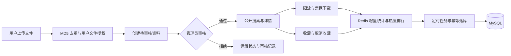

# 校园资料共享与检索平台

**面向 Java 后端实习学习与面试展示的全栈项目：从文件上传、管理员审核，到资料检索、下载收藏和热度排行。**

本项目是由仓库作者 [clear48](https://github.com/clear48) **独立设计与开发的个人项目**。作者负责需求分析、数据库设计、Java 后端实现、配套 Vue 前端、测试验证及项目文档，作为个人学习实践与 Java 后端实习求职的作品展示。


[快速启动](#快速启动) · [后端亮点](#值得阅读的后端实现) · [面试复盘](docs/interview/README.md) · [接口文档](docs/api/api-reference.md) · [项目结构](#项目结构) · [已知边界](#当前边界与后续方向)

课程课件、复习笔记和实验资料容易散落在群聊与个人网盘中。本项目围绕「上传 → 审核 → 公开检索 → 下载 / 收藏」建立完整业务闭环，用具体业务展示 **Spring Boot、MyBatis、MySQL、Redis、JWT、事务与并发控制** 的使用方式，并提供 Vue 演示界面和按模块整理的开发文档。

适合正在准备 Java 实习、希望练习前后端联调，或需要梳理 Redis 与数据库一致性问题的同学。当前以单体后端和本地文件存储为基础，检索采用 **MySQL 多字段模糊查询、条件筛选与排序**，尚未接入 AI、向量检索或 Elasticsearch。

如果源码或面试复盘对你有帮助，欢迎点一个 **Star** 收藏，也欢迎通过 [Issues](https://github.com/clear48/campus-resource-platform/issues) 反馈问题。

## 功能一览

| 模块 | 已实现能力 |
| --- | --- |
| 用户认证 | 注册、登录、个人信息、BCrypt 密码哈希、JWT 鉴权、退出 Token 黑名单 |
| 文件上传 | 大小与扩展名校验、MD5 + 文件大小去重、授权感知的秒传预检、本地文件存储 |
| 资料管理 | 创建待审核资料、公开详情、我的上传、有效状态下的重复提交约束 |
| 管理员审核 | 待审核列表、待审核文件读取、通过 / 拒绝 / 下架、审核流水 |
| 资料搜索 | 关键词、分类、课程、类型、标签筛选，分页、排序白名单、热门搜索词 |
| 下载与收藏 | 用户 / IP 下载限流、一次性下载票据、下载记录、幂等收藏、我的收藏 |
| 排行榜 | 热门资料与热词、下载 / 收藏联动、下载增量同步、热度快照、管理员总榜重建 |
| 演示前端 | 登录注册、搜索、详情、上传、个人中心、管理员审核和榜单管理 |

## 值得阅读的后端实现

| 业务问题 | 当前实现 | 源码入口与可讲解的知识点 |
| --- | --- | --- |
| 相同文件重复占用存储 | `file_md5 + file_size` 唯一约束；用户文件授权；MD5 正缓存、负缓存和未命中三态 | [FileServiceImpl](campus-resource-platform/src/main/java/com/john/campus/service/impl/FileServiceImpl.java)、[FileMd5CacheServiceImpl](campus-resource-platform/src/main/java/com/john/campus/service/impl/FileMd5CacheServiceImpl.java)：去重不等于授权，负缓存用 `SET NX` 避免覆盖并发正值 |
| 并发提交产生重复资料 | 生成列配合唯一索引，仅约束同一用户、同一文件的待审核 / 已通过资料 | [ResourceServiceImpl](campus-resource-platform/src/main/java/com/john/campus/service/impl/ResourceServiceImpl.java)、[SQL 迁移](sql/migrations/20260813_resource_active_duplicate_guard.sql)：前置查重与数据库最终兜底 |
| 审核状态和流水不一致 | 条件更新控制状态流转；事务内写审核记录；提交后触发缓存失效 | [AuditServiceImpl](campus-resource-platform/src/main/java/com/john/campus/service/impl/AuditServiceImpl.java)：状态机、事务回滚、并发审核 |
| 热门详情反复访问数据库 | Cache Aside、30～35 分钟随机 TTL、Redisson 互斥回填、审核失效与回填共享锁 | [ResourceDetailCacheServiceImpl](campus-resource-platform/src/main/java/com/john/campus/service/impl/ResourceDetailCacheServiceImpl.java)：公共缓存隔离用户态、故障回源、一致性边界 |
| 下载请求过多与文件越权访问 | Redis ZSet + Lua 滑动窗口限流；60 秒一次性票据；归属、资料状态与文件路径检查 | [DownloadRateLimiterImpl](campus-resource-platform/src/main/java/com/john/campus/service/impl/DownloadRateLimiterImpl.java)、[DownloadServiceImpl](campus-resource-platform/src/main/java/com/john/campus/service/impl/DownloadServiceImpl.java)：原子限流与两步下载 |
| 下载统计重试导致重复累加 | Redis Hash 增量、UUID 隔离批次、Redisson 看门狗锁；MySQL 批次唯一键与计数累加同事务 | [DownloadDeltaSyncServiceImpl](campus-resource-platform/src/main/java/com/john/campus/service/impl/DownloadDeltaSyncServiceImpl.java)、[DownloadDeltaPersistenceServiceImpl](campus-resource-platform/src/main/java/com/john/campus/service/impl/DownloadDeltaPersistenceServiceImpl.java)：幂等落库与失败重试 |
| 重复收藏与计数偏差 | 用户 / 资料唯一索引、状态条件更新、收藏与计数事务、Redis Set 状态缓存 | [FavoriteServiceImpl](campus-resource-platform/src/main/java/com/john/campus/service/impl/FavoriteServiceImpl.java)：幂等接口与缓存降级 |

这些实现有对应的单元或集成测试与设计说明。Redis 和 MySQL 之间仍有故障窗口，具体限制见[项目局限与演进路线](docs/interview/05-limitations-and-improvement-roadmap.md)，不将其表述为无条件的强一致性。

## 业务与架构



前端通过 `/api/v1` 调用 Spring MVC 接口；后端采用 `Controller → Service → Mapper → MySQL` 分层。Redis 承担缓存、Token 黑名单、限流、排行和临时计数；文件保存在独立的运行时目录中。更多流程图见[总体架构](docs/modules/00-overall-architecture.md)。

| 层次 | 技术 |
| --- | --- |
| 后端 | Java 17、Spring Boot 3.5.16、Spring MVC、Validation、MyBatis 3.0.5 |
| 数据与缓存 | MySQL 8、Spring Data Redis、Redisson 4.6.1 |
| 认证与密码 | JJWT 0.12.6、BCrypt（Spring Security Crypto） |
| 前端 | Vue 3、TypeScript、Vite、Element Plus、Axios、Vue Router |
| 测试 | JUnit 5、Spring Boot Test、Mockito、MyBatis Test、H2、Vitest、Vue Test Utils |
| 构建 | Maven Wrapper、npm 锁文件 |

依赖版本以 [pom.xml](campus-resource-platform/pom.xml)、[package.json](frontend/package.json) 和 [package-lock.json](frontend/package-lock.json) 为准。

## 项目结构

```text
campus-resource-platform/               # Git 仓库根目录
├── campus-resource-platform/           # Spring Boot 子工程，Maven 命令在此执行
│   ├── pom.xml
│   ├── mvnw / mvnw.cmd
│   └── src/
│       ├── main/java/com/john/campus/
│       │   ├── controller/             # HTTP 入口与参数校验
│       │   ├── service/impl/           # 业务接口及实现
│       │   ├── mapper/                 # MyBatis 数据访问接口
│       │   ├── entity/                 # 数据库实体
│       │   ├── dto/                    # 请求对象
│       │   ├── vo/                     # 响应对象
│       │   ├── common/                 # 统一响应、错误码、Redis Key 等
│       │   ├── config/                 # Web、MyBatis、Redis 等配置
│       │   ├── interceptor/            # JWT 鉴权
│       │   ├── exception/              # 业务异常与全局处理
│       │   ├── enums/                  # 业务枚举
│       │   └── task/                   # 定时同步与任务监控
│       ├── main/resources/             # application.yaml 与 mapper XML
│       └── test/                       # 后端单元与集成测试
├── frontend/                           # Vue 演示前端与组件测试
├── sql/                                # 新库初始化和存量迁移
├── scripts/                            # API 驱动的测试数据准备脚本
├── docs/                               # 需求、API、数据库、Redis、面试复盘
├── .codex/ / .claude/                   # 项目协作配置
└── README.md
```

当前结构检查结论及待完善项见[项目结构检查报告](docs/11-project-structure-review.md)。后端与仓库同名属于目录命名选择，启动时注意进入内层工程即可。

## 快速启动

### 1. 准备环境与代码

需要 **JDK 17+、MySQL 8.x、Redis 6+、Node.js 22.x（≥22.18）或 ≥24.11，以及 npm**。Node.js 版本范围依据当前锁定依赖。后端自带 Maven Wrapper，首次执行需要下载 Maven 和依赖。以下主要使用 Windows PowerShell，数据库导入单独标注为 MySQL 客户端命令。

```powershell
git clone --branch dev https://github.com/clear48/campus-resource-platform.git
Set-Location campus-resource-platform
```

`dev` 是当前开发与展示分支；`main` 用于经过验证的稳定版本。macOS / Linux 使用 `cd campus-resource-platform` 进入克隆后的仓库。

### 2. 初始化新数据库

先启动 MySQL 和 Redis。在**仓库根目录**打开 MySQL 客户端：

```powershell
mysql --default-character-set=utf8mb4 -u root -p
```

在 MySQL 提示符中执行：

```sql
-- 仅用于新库初始化；脚本包含建库与建表，不包含演示账号。
SOURCE sql/init.sql;
SHOW TABLES;
exit
```

已有旧数据库请先阅读[数据库变更记录](docs/database/database-change-log.md)，按版本应用 [sql/migrations](sql/migrations) 中的迁移；`CREATE TABLE IF NOT EXISTS` 不会给旧表自动补齐列和索引。下载同步协议升级还有旧批次处理要求，见[运行手册](docs/07-project-runbook.md)。

### 3. 启动后端

在仓库根目录的 PowerShell 中执行，替换本地数据库密码：

```powershell
Set-Location campus-resource-platform
$env:MYSQL_USERNAME = 'root'
$env:MYSQL_PASSWORD = '<你的 MySQL 密码>'
$env:REDIS_HOST = 'localhost'
$env:REDIS_PORT = '6379'
$env:REDIS_PASSWORD = ''
# 随机生成仅供本地会话使用的 JWT 密钥；重启时换密钥会使旧 Token 失效。
$jwtBytes = New-Object byte[] 48
$jwtGenerator = [Security.Cryptography.RandomNumberGenerator]::Create()
$jwtGenerator.GetBytes($jwtBytes)
$jwtGenerator.Dispose()
$env:JWT_SECRET = [Convert]::ToBase64String($jwtBytes)
# 上传目录与源码分离，已在 Git 忽略规则中排除。
$env:APP_UPLOAD_STORAGE_PATH = Join-Path (Get-Location) 'data/user-uploads'
.\mvnw.cmd spring-boot:run
```

`JWT_SECRET` 必须提供至少 32 个 UTF-8 字节的非默认值。数据库地址可通过 `MYSQL_URL` 覆盖，其他配置见 [application.yaml](campus-resource-platform/src/main/resources/application.yaml)。真实密码、Token 和上传文件不应提交到仓库。

另开终端确认进程可访问：

```powershell
Invoke-RestMethod http://127.0.0.1:8080/api/v1/health
```

健康接口返回 `code: 0`、`data.status: UP`，只表示应用进程可响应，不替代 MySQL / Redis 的连通性验证。Redis 可用 `redis-cli ping` 检查，预期返回 `PONG`。

<details>
<summary>macOS / Linux 后端启动示例</summary>

完成相同的 MySQL 初始化后，从仓库根目录执行：

```bash
cd campus-resource-platform
export MYSQL_USERNAME='root'
export MYSQL_PASSWORD='<你的 MySQL 密码>'
export REDIS_HOST='localhost'
export REDIS_PORT='6379'
export REDIS_PASSWORD=''
# 需要本机提供 openssl；不把生成的密钥写入 Git。
export JWT_SECRET="$(openssl rand -base64 48)"
export APP_UPLOAD_STORAGE_PATH='./data/user-uploads'
# 使用 sh 调用，避免克隆后的 Wrapper 没有可执行权限。
sh ./mvnw spring-boot:run
```

</details>

### 4. 启动前端

另开终端，从**仓库根目录**执行：

```powershell
Set-Location frontend
npm ci
Copy-Item .env.example .env.development
npm run dev
```

macOS / Linux 将 `Set-Location frontend` 换成 `cd frontend`，将 `Copy-Item` 换成 `cp`。打开 Vite 输出的地址，默认是 [http://127.0.0.1:5173](http://127.0.0.1:5173)。示例配置使用 `/api/v1`，开发代理指向 `http://127.0.0.1:8080`。

### 5. 准备演示数据并走通业务

初始化脚本只创建表结构。先通过页面注册普通用户，再注册一个专门用于本地演示的管理员候选账号。在**本地演示库**中执行以下 SQL，替换账号占位符：

```sql
USE campus_resource_platform;
-- 仅提升刚刚注册的演示账号，避免无条件更新所有用户。
UPDATE `user` SET role = 2 WHERE username = '<刚注册的管理员演示账号>';
-- 没有启用分类时无法提交资料，先准备一个一级分类。
INSERT INTO category (parent_id, category_name, description, sort_order, status)
SELECT 0, 'Java 学习资料', '用于本地演示', 1, 1
WHERE NOT EXISTS (
    SELECT 1 FROM category WHERE parent_id = 0 AND category_name = 'Java 学习资料'
);
```

管理员账号需要**退出后重新登录**，让新 Token 携带管理员角色。建议使用两个浏览器会话演示：

1. 普通用户上传一份自己有权分享的资料，填写分类等信息后提交。
2. 管理员读取待审核文件，审核通过。
3. 普通用户搜索资料、查看详情、收藏并下载，观察记录和排行榜。
4. 管理员下架该资料，再验证公开入口的状态限制与审核流水。

批量测试数据可参考[数据准备脚本说明](docs/10-bulk-test-data-seeding.md)。更完整的启动和排障说明见[运行手册](docs/07-project-runbook.md)。

## 测试与构建

后端在 `campus-resource-platform/` 子目录执行：

```powershell
.\mvnw.cmd test
.\mvnw.cmd -DskipTests package
```

审核数据库集成测试使用真实 MySQL 独立库，默认库名为 `campus_resource_platform_audit_test`，通过 `MYSQL_TEST_USERNAME`、`MYSQL_TEST_PASSWORD`、`MYSQL_TEST_URL` 覆盖连接；未设置测试用户名 / 密码时会回退到 `MYSQL_USERNAME` / `MYSQL_PASSWORD`。**测试脚本会重建测试表，不要将 `MYSQL_TEST_URL` 指向业务库。** 其他部分数据库测试使用 H2 MySQL 模式；Redis 相关测试主要使用 Mock。

前端在 `frontend/` 子目录执行：

```powershell
npm run test:unit
npm run build
```

测试覆盖接口鉴权、资料提交、审核状态流转与回滚、搜索 SQL、缓存行为、下载票据、排行榜及幂等同步等路径。实际通过数量以本次运行输出为准；历史记录见[项目进度](docs/06-project-progress.md)。

## 文档与面试阅读路线

| 你想了解 | 推荐入口 |
| --- | --- |
| 项目解决什么问题 | [需求](docs/01-requirements.md)、[业务流程](docs/02-business-flow.md) |
| 请求如何走完整个系统 | [架构流程图](docs/modules/00-overall-architecture.md)、[业务模块索引](docs/modules/README.md) |
| 如何设计数据与索引 | [数据库设计](docs/database/database-design.md)、[建表 SQL](sql/init.sql) |
| Redis 为什么这样用 | [Redis 设计](docs/05-redis-design.md)及上方源码入口 |
| 如何调试接口 | [API 参考](docs/api/api-reference.md)、[Postman 集合](docs/api/postman/campus-resource-platform.postman_collection.json) |
| 如何准备项目面试 | [项目背景与价值](docs/interview/01-project-background-and-value.md)、[技术栈复盘](docs/interview/03-technology-stack-review.md)、[高频问答](docs/interview/04-interview-question-bank.md) |
| 当前进度和后续改进 | [当前状态](docs/CURRENT_STATUS.md)、[局限与演进路线](docs/interview/05-limitations-and-improvement-roadmap.md)、[文档总索引](docs/README.md) |

建议先跑通一条上传到下载的链路，再阅读对应的 Controller、Service、Mapper 与测试，最后用自己的语言解释设计取舍。面试中只描述自己理解、验证或改进过的内容，不直接套用未经验证的性能数字。

## 当前边界与后续方向

- 检索尚未实现分词、全文索引、语义检索和搜索建议。
- 文件使用本地存储，尚未接入对象存储、病毒扫描或多实例共享文件。
- 下载统计在创建记录阶段触发，不能等同于文件已完整传输到客户端。
- 周期榜使用固定周期 Key 与 TTL，尚非精确自然日 / 周 / 月切桶。
- Redis 是受保护接口的鉴权依赖；部分缓存可以降级，不代表所有功能都能脱离 Redis 运行。
- 尚无 Docker 一键部署、GitHub Actions CI 或公开压测结论；真实 Redis 故障与并发验证仍可补强。

欢迎围绕这些明确的边界提出改进建议。提交问题时请附复现步骤和脱敏日志；提交代码前请运行相关测试。当前仓库尚未添加 `LICENSE`，README 不声明特定开源许可证。
