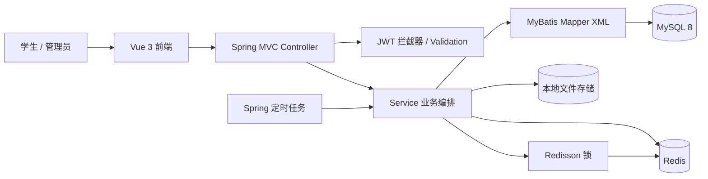
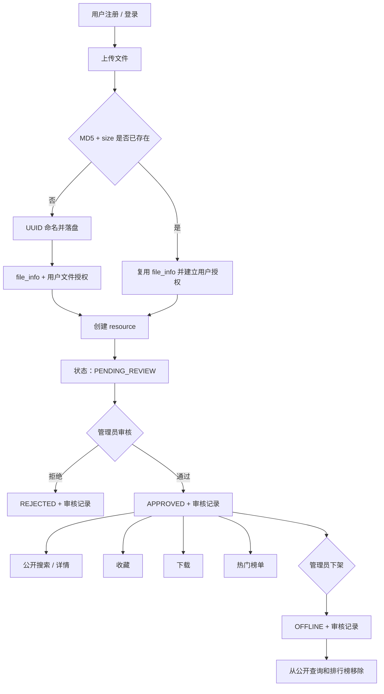
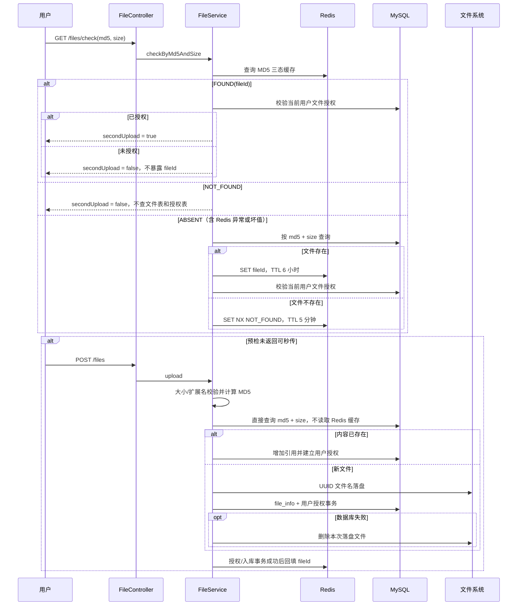
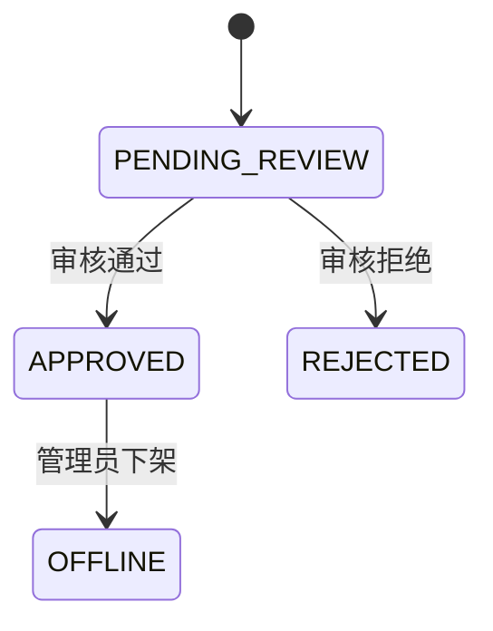
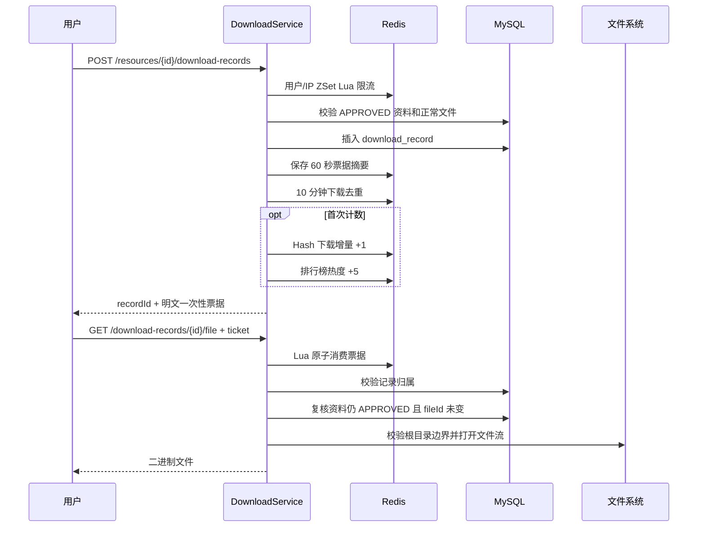
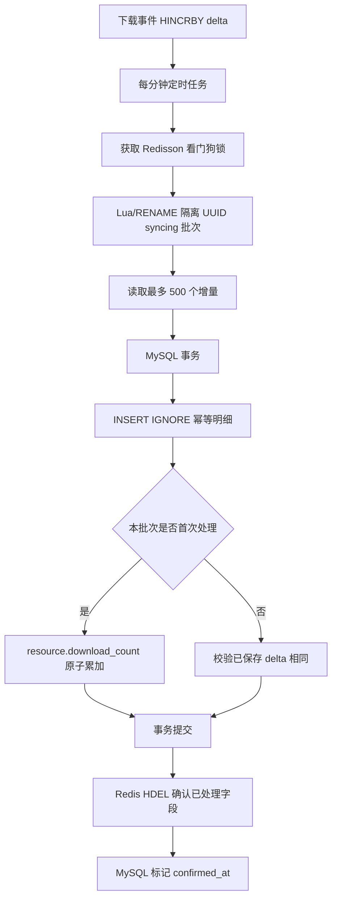

# 模块功能与业务流程

## 1. 整体架构

项目是前后端分离的单体应用。Vue 3 + TypeScript + Vite + Element Plus 前端已覆盖注册登录、搜索详情、上传、个人中心以及审核、下架和榜单运维等主要页面；健康检查和管理员审核文件预览尚未接入页面。Spring Boot 后端负责最终业务规则和权限边界，MySQL 保存权威数据，Redis 处理高频、实时或短生命周期数据，本地目录保存物理文件。



后端遵循：

```text
Controller：接收请求、参数绑定、返回统一响应
→ Service：权限、状态机、事务、幂等、降级
→ Mapper/XML：执行明确 SQL
→ MySQL/Redis/文件系统：数据和资源
```

## 2. 模块总览

| 模块 | 主要能力 | MySQL | Redis | 核心复杂点 |
| --- | --- | --- | --- | --- |
| 认证 | 注册、登录、退出、当前用户 | `user` | JWT 黑名单 | 密码安全、Token 立即失效、ThreadLocal 清理 |
| 分类 | 启用分类查询 | `category` | 无 | 只返回启用分类和稳定排序 |
| 文件 | 上传、MD5 预检、秒传 | `file_info`、`user_file_authorization` | MD5 缓存 | IO 与事务边界、并发去重、用户引用权限 |
| 资料 | 创建、详情、我的上传 | `resource` | 公开详情 JSON 缓存、每资料 Redisson 锁 | 待审核强制状态、归属隔离、缓存击穿收口、审核后失效 |
| 审核 | 待审列表、通过、拒绝、下架、流水、审核文件 | `resource`、`audit_record` | 提交后失效详情缓存；通过/下架联动排行榜 | 状态机、并发条件更新、审计事务、管理员权限 |
| 搜索 | 多条件检索、分页、排序 | `resource` | 热门搜索词 ZSet | 公开状态过滤、动态 SQL、排序白名单 |
| 收藏 | 收藏、取消、状态、列表 | `favorite`、`resource` | 用户收藏 Set、热度 ZSet | 唯一索引、状态条件更新、计数一致性 |
| 下载 | 限流、记录、票据、取流、历史 | `download_record`、`resource`、`file_info` | 限流、票据、去重、下载增量、热度 | 两段式访问、重放防护、最终一致性 |
| 排行榜 | 资料榜、热词榜、总榜重建、快照 | `resource`、`download_delta_sync_item` | 多周期 ZSet、同步 Hash、锁 | 多实例任务、批次幂等、原子替换、降级 |

## 3. 接口总览

### 公开接口

| 方法 | 路径 | 作用 |
| --- | --- | --- |
| `GET` | `/api/v1/health` | 健康检查 |
| `POST` | `/api/v1/auth/register` | 注册 |
| `POST` | `/api/v1/auth/login` | 登录 |
| `GET` | `/api/v1/categories` | 查询启用分类 |
| `GET` | `/api/v1/resources/{resourceId}` | 公开资料详情，仅审核通过 |
| `GET` | `/api/v1/search/resources` | 公开资料搜索 |
| `GET` | `/api/v1/rankings/resources/hot` | 热门资料榜 |
| `GET` | `/api/v1/rankings/search-keywords/hot` | 热门搜索词榜 |

### 登录用户接口

| 方法 | 路径 | 作用 |
| --- | --- | --- |
| `POST` | `/api/v1/auth/logout` | 退出并拉黑当前 Token |
| `GET` | `/api/v1/users/me` | 当前用户 |
| `POST` | `/api/v1/files` | 上传文件 |
| `GET` | `/api/v1/files/check` | MD5 + size 预检 |
| `POST` | `/api/v1/resources` | 创建待审核资料 |
| `GET` | `/api/v1/users/me/resources` | 我的上传 |
| `POST` | `/api/v1/resources/{resourceId}/favorites` | 收藏 |
| `DELETE` | `/api/v1/resources/{resourceId}/favorites` | 取消收藏 |
| `GET` | `/api/v1/resources/{resourceId}/favorite-status` | 收藏状态 |
| `GET` | `/api/v1/users/me/favorites` | 我的收藏 |
| `POST` | `/api/v1/resources/{resourceId}/download-records` | 创建下载记录和一次性票据 |
| `GET` | `/api/v1/download-records/{downloadRecordId}/file` | 消费票据并读取文件 |
| `GET` | `/api/v1/users/me/download-records` | 我的下载记录 |

### 管理员接口

| 方法 | 路径 | 作用 |
| --- | --- | --- |
| `GET` | `/api/v1/admin/resources/pending-reviews` | 待审核列表 |
| `POST` | `/api/v1/admin/resources/{resourceId}/audit-approvals` | 审核通过 |
| `POST` | `/api/v1/admin/resources/{resourceId}/audit-rejections` | 审核拒绝 |
| `POST` | `/api/v1/admin/resources/{resourceId}/offline-records` | 下架 |
| `GET` | `/api/v1/admin/resources/{resourceId}/audit-records` | 审核流水 |
| `GET` | `/api/v1/admin/resources/{resourceId}/review-file` | 读取待审核文件 |
| `POST` | `/api/v1/admin/rankings/resources/hot/rebuild` | 手动重建总榜 |

管理员接口虽然经过登录拦截器，但角色校验仍在 Service 层完成，角色只取自 JWT 上下文，不接受客户端传参。

## 4. 端到端主流程



## 5. 认证流程

### 注册

```text
AuthController.register
→ Validation + Service 兜底 trim
→ UserMapper.selectByUsername 前置检查
→ BCrypt 加密
→ UserMapper.insert
→ 数据库唯一索引兜底并发重复
→ 返回 UserVO，不暴露 passwordHash
```

用户名、邮箱、手机号依赖数据库唯一索引提供最终防重。账号不存在和密码错误使用相同提示，减少账号枚举风险。

### 登录与请求鉴权

```text
登录成功
→ 校验 BCrypt 和账号状态
→ 更新 last_login_at
→ JWT 签发 userId、role、jti

受保护请求
→ JwtAuthenticationInterceptor 解析 Bearer Token
→ 校验签名与过期时间
→ 查询 Redis jti 黑名单
→ 写入 UserContextHolder
→ Controller / Service
→ afterCompletion 清理 ThreadLocal
```

### 退出登录

退出时把 `jti` 写入 `crp:auth:token:blacklist:{jti}`，TTL 等于 Token 剩余寿命。这样不需要永久保存黑名单，也能让尚未自然过期的 JWT 立即失效。

## 6. 文件上传与秒传流程



面试要点：

- MD5 是内容指纹，不信任前端传值，实际上传时由服务端重新计算；
- 唯一键是 `(file_md5, file_size)`，降低单独 MD5 碰撞或错误带来的风险；
- 全局文件存在不等于任何用户都有权引用，因此单独设计授权表；
- `NOT_FOUND` 负缓存只能抑制同一 `MD5 + size` 的重复穿透，不能替代对随机高基数预检的限流；
- 文件 IO 不放进长事务，避免占用数据库连接；失败通过补偿删除处理；
- 当前只对白名单扩展名做主要类型校验，MIME 只记录，尚未做文件内容嗅探。

## 7. 资料创建与审核流程

### 创建资料

```text
ResourceController.create
→ 从 UserContextHolder 取 uploaderId
→ 校验 file_info 正常
→ 校验 user_file_authorization 存在
→ 校验 category 启用
→ 检查同用户同文件是否已有待审核/已通过资料
→ 强制创建 PENDING_REVIEW
```

资料记录与物理文件分离后，同一物理文件可以被不同业务资料复用，审核也不会影响物理文件本身。

### 审核状态机



审核事务包含：

1. Service 校验管理员角色和当前状态；
2. Mapper 执行 `WHERE id = ? AND status = 旧状态` 的条件更新；
3. 检查更新行数，0 行表示被并发请求抢先处理；
4. 在同一事务插入 `audit_record`；
5. 事务提交后失效公开详情缓存；审核通过时初始化热门资料成员，下架时移除成员，拒绝不更新榜单。

“提交后再写 Redis”避免 MySQL 回滚但详情缓存或排行榜已经提前变化。公开详情缓存只保存不含 `favorited` 用户态字段的 `APPROVED` 公共快照，TTL 为 30 分钟加 0～5 分钟抖动；热点未命中使用每资料 Redisson 锁二次检查后回填，Redis/锁异常或 2 秒等待超时时直接回源且不在锁外回填。

## 8. 搜索流程

```text
SearchController
→ 归一化关键词、课程、标签、分类、类型、分页、排序
→ 排序字段白名单
→ ResourceMapper.countApprovedResources
→ MyBatis 动态 SQL 固定 status = APPROVED
→ ResourceMapper.searchApprovedResources
→ 返回 PageResult<SearchResourceVO>
→ 非空关键词旁路写入日/周/月热词 ZSet
```

MyBatis XML 使用 `<if>` 组合可选筛选条件，排序使用 `<choose>` 选择固定列名。用户输入值使用 `#{}` 绑定，不把用户传入的排序列直接放进 `${}`。

搜索热词只是运营派生数据，Redis 异常时记录日志并跳过，不影响搜索结果。

## 9. 收藏流程

```text
收藏
→ 查询资料且必须 APPROVED
→ TransactionTemplate
   → 查询 favorite
   → 首次插入，或从 CANCELED 条件更新为 FAVORITED
   → resource.favorite_count 原子 +1
→ 提交后写 Redis Set
→ 提交后排行榜 +3
```

并发处理：

- `(user_id, resource_id)` 唯一索引防止插入两条关系；
- 重复收藏返回幂等成功，不重复加计数或热度；
- 取消收藏用 `1 -> 0` 条件更新，两个并发取消最多一个成功；
- 收藏数递减 SQL 带 `favorite_count > 0`，防止负数；
- Redis Set 失败只降低命中率，查询可回退 MySQL。

## 10. 两段式下载流程



失败策略不是统一“Redis 挂了都放行”：

- 限流失败：失败关闭，避免绕过风控；
- 票据签发或消费失败：失败关闭，避免退化为长期记录 ID 下载；
- 下载计数或排行榜失败：允许文件下载，跳过派生统计；
- 资料状态或记录归属不合法：直接拒绝。

## 11. 下载增量同步流程



关键故障场景：

- MySQL 失败：事务回滚，Redis `syncing` 批次保留，下次重试；
- MySQL 已提交、Redis `HDEL` 前宕机：下次命中 `(batch_id, resource_id)` 唯一键，不重复累加；
- 多实例同时调度：Redisson 锁只允许一个实例处理；
- 新下载在同步期间到达：继续写原始 `delta`，不会被旧批次确认误删。

## 12. 排行榜流程

热门资料 ZSet 的 member 是 `resourceId`，score 是热度：

```text
有效下载 +5
真实收藏 +3
真实取消收藏 -3
审核通过 ZINCRBY 0 初始化
下架 ZREM
```

当前 `daily/weekly/monthly` 使用固定 Key 并在每次写入时续期 2/14/60 天，并不会在自然日、自然周或自然月边界自动清零。因此准确说法是“不同保留期的周期标签榜”；精确自然周期切桶属于后续优化。

查询时 Redis 只提供候选 ID 和实时分数，MySQL 批量加载详情并再次固定过滤 `APPROVED`。这样即使 Redis 留有脏 member，也不会把待审核或已下架资料公开。

Redis 资料榜不可用时降级到 MySQL `hot_score` 快照。需要诚实说明：MySQL 只保存总榜快照，因此日、周、月榜降级后会退化为总榜语义。

总榜重建先构建临时 ZSet，再用 `RENAME` 原子替换；重建持写锁，实时总榜增量和下架移除持读锁，防止替换操作覆盖并发变化。

## 13. 关键代码入口

| 主题 | 入口 |
| --- | --- |
| JWT | `JwtAuthenticationInterceptor`、`JwtUtils`、`AuthServiceImpl` |
| 文件 | `FileServiceImpl`、`FileMd5CacheServiceImpl`、`FileAuthorizationServiceImpl`、`FileStorageServiceImpl` |
| 资料 | `ResourceServiceImpl`、`ResourceDetailCacheServiceImpl`、`ResourceMapper.xml` |
| 审核 | `AuditServiceImpl`、`AuditRecordMapper.xml` |
| 搜索 | `SearchServiceImpl`、`ResourceMapper.xml` |
| 收藏 | `FavoriteServiceImpl`、`FavoriteMapper.xml` |
| 下载 | `DownloadServiceImpl`、`DownloadRateLimiterImpl` |
| 增量同步 | `DownloadDeltaSyncServiceImpl`、`DownloadDeltaPersistenceServiceImpl` |
| 排行榜 | `RankingServiceImpl`、`HotRankingMaintenanceServiceImpl` |
| Redis Key | `RedisKeyConstants`、`RankingPeriod` |
