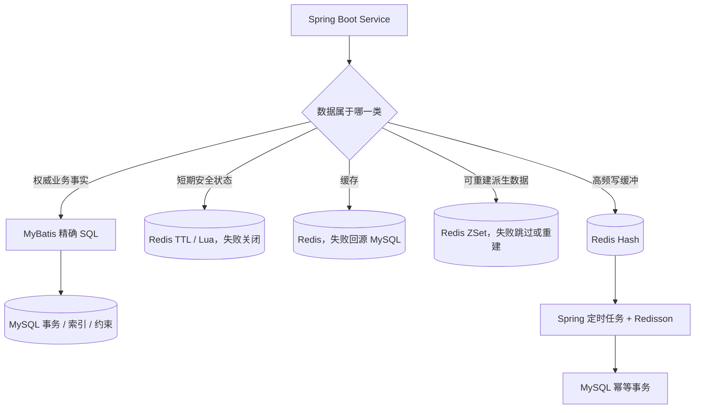

# Spring Boot、MyBatis、Redis、MySQL 技术栈复盘

## 1. 技术栈事实

| 技术 | 当前版本或依赖 | 在项目中的职责 |
| --- | --- | --- |
| Java | 17 | 业务代码、Record、Stream、文件与加密 API |
| Spring Boot | 3.5.16 | 应用装配、MVC、配置、事务、定时任务、测试 |
| Spring MVC | Boot Starter | REST 接口、拦截器、文件流响应、CORS |
| Validation | Boot Starter | DTO 参数校验 |
| MyBatis | `mybatis-spring-boot-starter` 3.0.5 | Mapper 接口、XML SQL、结果映射、动态 SQL |
| MySQL | 8.x | 权威业务数据、事务、索引、约束 |
| Spring Data Redis | Boot Starter | String、Set、Hash、ZSet、Lua |
| Redisson | 4.6.1 | 分布式锁、读写锁、看门狗续期 |
| JJWT | 0.12.6 | JWT 签发、验签和 Claims |
| BCrypt | `spring-security-crypto` | 密码哈希与校验 |
| Maven | Maven Wrapper | 构建与测试 |

项目没有 MyBatis-Plus、Spring Security Filter Chain、Elasticsearch、消息队列、MinIO/OSS。面试时必须以实际依赖为准。

## 2. Spring Boot

### 2.1 为什么使用

项目需要快速组合 Web、参数校验、MyBatis、Redis、事务、调度和测试。Spring Boot 通过自动配置和 Starter 降低基础装配成本，让主要精力放在资料状态机、文件权限和一致性上。

### 2.2 分层

| 层 | 项目职责 | 示例 |
| --- | --- | --- |
| Controller | 接收 HTTP、绑定参数、调用 Service、统一响应 | `ResourceController` |
| Service | 权限、状态机、事务、幂等、缓存与降级 | `AuditServiceImpl` |
| Mapper | 声明数据库操作 | `ResourceMapper` |
| Mapper XML | SQL、动态条件、结果映射 | `ResourceMapper.xml` |
| DTO / VO / Entity | 请求、响应、表映射分离 | `ResourceCreateDTO` / `ResourceDetailVO` / `Resource` |
| Interceptor | JWT 统一鉴权 | `JwtAuthenticationInterceptor` |
| Task | 定时维护 | `RankingSyncTask` |

Entity 不直接返回给前端，避免把 `passwordHash`、存储路径、审核内部字段等数据库细节暴露出去。

### 2.3 统一异常

业务层抛 `BusinessException(ErrorCode)`，由 `GlobalExceptionHandler` 统一转换为 `ApiResponse`。好处是 Controller 不需要重复写 `try/catch`，错误码也能保持稳定。

### 2.4 JWT 拦截器

`WebMvcConfig` 保护 `/api/v1/**`，显式放行注册、登录、健康检查、分类、公开详情、搜索和公开排行榜。

拦截器流程：

1. 提取 `Authorization: Bearer ...`；
2. JJWT 验签并解析 `userId`、`role`、`jti`；
3. 查询 Redis Token 黑名单；
4. 写入 `UserContextHolder`；
5. 请求结束在 `afterCompletion` 清理 ThreadLocal。

ThreadLocal 必须清理，因为 Tomcat 线程会复用；不清理可能让下一个请求读到上一个用户。

### 2.5 事务

项目同时使用声明式 `@Transactional` 和编程式 `TransactionTemplate`：

| 场景 | 事务内容 | 事务外内容 |
| --- | --- | --- |
| 注册 | 用户插入 | 无 |
| 登录 | `last_login_at` 更新 | JWT 生成 |
| 文件首次上传 | `file_info` + 用户文件授权 | MD5 计算和文件 IO |
| 文件内容去重 | 引用计数 + 用户文件授权 | 文件查询 |
| 资料创建 | 校验后的 `resource` 插入 | 无重要外部副作用 |
| 审核 | 资料条件状态更新 + 审核记录 | 提交后更新 Redis 榜单 |
| 收藏 | 收藏关系 + `favorite_count` | 提交后更新缓存和榜单 |
| 下载增量 | 幂等明细 + `download_count` 原子累加 | Redis 批次隔离和确认 |
| 热度快照 | 单批 `hot_score` 更新 | Redis 榜单读取 |

`@Transactional(rollbackFor = Exception.class)` 明确让受检异常也回滚。Spring 官方默认规则是运行时异常和 Error 回滚、受检异常默认不回滚，因此这里显式配置更容易保持一致。

事务方法放在独立 Spring Bean 中，避免同类自调用绕过代理。例如下载同步编排调用独立的 `DownloadDeltaPersistenceService` 完成数据库事务。

### 2.6 定时任务

- 下载增量同步：固定延迟 60 秒；
- 总榜缺失检查与重建：固定延迟 5 分钟；
- 总榜热度快照：固定延迟 5 分钟。

使用固定延迟而不是固定频率，可以避免同一实例上一轮未结束时马上堆积下一轮；多实例之间再由 Redisson 锁协调。

## 3. MyBatis

### 3.1 为什么选择原生 MyBatis

这个项目有较多需要精确控制的 SQL：

- 搜索的可选条件与排序白名单；
- 审核状态机的旧状态条件更新；
- 收藏计数的原子加减和非负条件；
- 排行榜候选批量查询；
- 游标扫描；
- `INSERT IGNORE` 幂等写；
- 下载量原子累加。

原生 MyBatis XML 可以把 SQL 结构、索引匹配和更新行数语义直接展示出来，适合面试解释。代价是 XML 和 Mapper 接口需要人工同步，简单 CRUD 的样板代码也比 MyBatis-Plus 多。

### 3.2 动态 SQL

搜索使用 `<if>` 组合关键词、分类、课程、类型和标签条件，公共 WHERE 片段通过 `<sql>` 和 `<include>` 复用。

排序字段不能使用：

```xml
ORDER BY ${sortBy}
```

因为 `${}` 是原样字符串替换。当前实现先在 Service 校验 `createdAt`、`downloadCount`、`favoriteCount`、`hotScore`，再由 XML `<choose>` 输出固定列名，排序方向也只允许 `asc/desc`。

普通值使用 `#{}`，由 PreparedStatement 参数绑定，降低 SQL 注入风险。

### 3.3 更新行数作为并发信号

审核通过的核心不是“先查状态再无条件更新”，而是：

```sql
UPDATE resource
SET status = 1, approved_at = ?
WHERE id = ?
  AND status = 0;
```

两个管理员同时审核时，两人可能都读到待审核，但只有一个更新能影响 1 行，另一个得到 0 行并返回状态冲突。

收藏取消也使用相同思想：只有 `status = 1` 才能更新为 `0`，保证并发取消最多递减一次计数。

### 3.4 `LIKE` 搜索的边界

当前关键词搜索是：

```sql
title LIKE '%keyword%'
OR description LIKE '%keyword%'
OR course_name LIKE '%keyword%'
OR tags LIKE '%keyword%'
```

优点是依赖少、实现快、适合教学和小数据量。缺点是前导 `%` 通常难以利用普通 B+Tree 索引，也没有中文分词、相关性评分、拼写纠错或高亮。数据量增长后应考虑全文索引或 Elasticsearch，而不是继续为所有文本列盲目加普通索引。

## 4. Redis

### 4.1 Redis Key 与语义

| Key 模板 | 结构 | TTL | 用途 | Redis 失败策略 |
| --- | --- | --- | --- | --- |
| `crp:auth:token:blacklist:{jti}` | String | Token 剩余时间 | 退出后立即失效 | 鉴权关键链路，失败关闭 |
| `crp:cache:file:md5:{md5}:{size}` | String | 6 小时 | MD5 到 fileId 缓存 | 回查 MySQL |
| `crp:user:favorites:{userId}` | Set | 30 分钟 | 收藏状态 | 回查 MySQL |
| `crp:rank:search:keyword:{period}` | ZSet | 2/14/60 天 | 热门搜索词 | 写失败跳过，读失败返回空 |
| `crp:rank:resource:hot:{period}` | ZSet | 2/14/60 天；all 无 TTL | 热门资料 | 写失败跳过，读失败降级 MySQL |
| `crp:rate:download:user:{userId}` | ZSet | 120 秒 | 用户 10 次/60 秒 | 失败关闭 |
| `crp:rate:download:ip:{ip}` | ZSet | 120 秒 | IP 30 次/60 秒 | 失败关闭 |
| `crp:dedup:download:{userId}:{resourceId}` | String | 10 分钟 | 重复下载不重复计数 | 失败时允许下载但跳过计数 |
| `crp:download:ticket:{userId}:{recordId}:{digest}` | String | 60 秒 | 一次性下载票据 | 失败关闭 |
| `crp:stats:resource:download:delta` | Hash | 无 | 待同步下载增量 | 保留到主动确认 |
| `crp:stats:resource:download:syncing:{batchId}` | Hash | 无 | 隔离同步批次 | 失败保留重试 |
| `crp:stats:resource:download:syncing:current` | String | 无 | 当前批次指针 | Lua 比较删除 |
| `crp:lock:sync:download-delta` | Redisson Lock | 看门狗 | 多实例同步互斥 | 抢锁失败跳过本轮 |
| `crp:lock:sync:hot-rank-maintenance` | Redisson ReadWriteLock | 看门狗 | 总榜重建与实时写协调 | 按操作等待或跳过 |

Redis Key 全部集中在 `RedisKeyConstants`，避免业务代码拼错前缀和层级。

表中的 `daily/weekly/monthly` 是当前代码使用的标签，不代表自然周期切桶：Key 固定且每次行为都会续期，持续活跃时会继续累计。精确日榜、周榜、月榜需要把日期/周/月加入 Key 或定时换榜。

### 4.2 为什么使用不同数据结构

| 结构 | 选择原因 |
| --- | --- |
| String | 黑名单、去重和票据只需要“Key 是否存在”和 TTL |
| Set | 收藏状态只需要唯一成员和 `SISMEMBER` |
| Hash | 多个资料的下载增量适合集中按 field 原子累加 |
| ZSet | 排行榜需要按 score 排序；滑动窗口需要按时间戳删除和计数 |

Redis 官方文档也把 ZSet 的典型场景列为排行榜和限流。这里不是为了展示数据结构而使用，而是让结构直接匹配查询方式。

### 4.3 Lua 原子性

下载限流需要连续执行：

```text
删除窗口外成员
→ 统计当前成员
→ 判断是否超限
→ 添加本次请求
→ 刷新 TTL
```

如果这些命令由客户端分开发送，并发请求可能都在计数前通过。Lua 在 Redis 服务端原子执行，将整个判断和写入变成不可被其他命令插入的步骤。

同理，一次性票据使用 Lua 完成“存在则删除”，保证并发重放最多一个请求成功。

### 4.4 限流为什么失败关闭

Redis 在不同场景的重要性不同：

- 搜索热词丢一次只影响运营数据，可以失败开放；
- 收藏缓存失效可以回源 MySQL；
- 下载限流或票据失效如果失败开放，会直接绕过安全闸口。

所以“Redis 挂了怎么办”不能只回答统一降级，需要先按业务风险分级。

### 4.5 Redisson 为什么不只用 SETNX

下载增量同步和总榜重建可能超过固定锁 TTL。简单 `SET key value NX EX 30` 需要自己处理：

- 锁过期续期；
- 只能由持有者解锁；
- 客户端宕机后的释放；
- 多实例等待；
- 排行榜重建的读写互斥。

Redisson `RLock` 提供可重入锁、持有者校验和看门狗自动续期；`RReadWriteLock` 允许实时总榜增量持读锁、重建持写锁。代价是增加 Redisson 依赖和 Redis 可用性要求。

### 4.6 Redis 与 MySQL 一致性分类

| 数据 | 权威源 | 一致性策略 |
| --- | --- | --- |
| 用户收藏关系和计数 | MySQL | MySQL 同事务；提交后更新 Redis，失败时读回源 |
| 审核状态和流水 | MySQL | MySQL 同事务；提交后更新可重建排行榜 |
| 文件去重 | MySQL 唯一索引 | Redis 仅加速候选定位，最终查 MySQL |
| 热门资料 | Redis 实时，MySQL 快照兜底 | 写失败可重建，定时回写快照 |
| 下载量 | Redis 增量 + MySQL 最终值 | 批次隔离、事务幂等、提交后确认 |
| JWT 黑名单 | Redis | 安全关键短期状态，Redis 异常失败关闭 |

项目没有把 Redis 和 MySQL 包在一个分布式事务中，而是区分缓存、派生数据和写缓冲，分别设计回源、重建或幂等重试。

## 5. MySQL

### 5.1 表设计

| 表 | 职责 | 核心约束 |
| --- | --- | --- |
| `user` | 用户与角色 | 用户名、邮箱、手机号唯一 |
| `category` | 层级分类 | 同父节点分类名唯一 |
| `file_info` | 物理文件元数据 | `(file_md5, file_size)` 唯一 |
| `user_file_authorization` | 用户文件引用权 | `(user_id, file_id)` 唯一 |
| `resource` | 资料业务信息和状态 | 状态/类型/计数 CHECK |
| `favorite` | 收藏关系 | `(user_id, resource_id)` 唯一 |
| `download_record` | 下载审计历史 | 用户、资料、时间索引 |
| `download_delta_sync_item` | 下载同步幂等明细 | `(batch_id, resource_id)` 唯一 |
| `audit_record` | 审核流水 | 资料、审核人、动作索引 |

### 5.2 为什么文件和资料分表

`file_info` 描述物理对象：MD5、大小、存储路径、引用数。

`resource` 描述业务内容：标题、课程、分类、标签、上传者、审核状态。

分离后可以：

- 相同物理文件被多条资料复用；
- 审核、下架只改变业务资料，不直接删除文件；
- 以后把本地存储迁移到对象存储时，不影响资料业务字段；
- 文件级权限和资料级公开状态分别控制。

### 5.3 唯一索引不只是性能

| 唯一索引 | 业务作用 |
| --- | --- |
| `uk_file_md5_size` | 并发上传相同文件时最终只保留一条物理记录 |
| `uk_user_file_authorization` | 同一用户文件授权幂等 |
| `uk_favorite_user_resource` | 并发重复收藏不会产生两条关系 |
| `uk_download_delta_sync_batch_resource` | 同一同步批次重试不会重复增加下载量 |

Service 前置查询只能改善错误提示，不能消除“两个请求同时查不到、随后同时插入”的竞态；唯一索引才是数据库层最终兜底。

### 5.4 联合索引

关键联合索引：

- `resource(status, created_at)`：待审核/公开列表；
- `resource(category_id, status, created_at)`：分类下已通过资料；
- `resource(uploader_id, status, created_at)`：我的上传；
- `favorite(user_id, status, created_at)`：我的有效收藏；
- `download_record(user_id, created_at)`：我的下载记录；
- `download_record(user_id, resource_id, created_at)`：同用户同资料下载分析。

MySQL 联合索引遵循最左前缀。索引顺序必须由真实 WHERE 和 ORDER BY 决定，不是把所有字段随意拼在一起。

### 5.5 为什么采用逻辑外键

SQL 没有创建物理外键，关联完整性由 Service 校验。

优点：

- 状态流转和软删除规则可由业务层统一处理；
- 高频写表减少外键检查和级联约束；
- 迁移与批量处理更灵活。

代价：

- 绕过 Service 的脚本可能产生孤儿数据；
- 所有关联写入都必须有明确校验；
- 需要定期完整性巡检。

面试中不应说“物理外键一定不好”，而应说明这是项目的取舍；对小型强完整性系统，物理外键同样合理。

### 5.6 原子计数

收藏数和下载数不使用：

```text
先 SELECT 当前值
→ Java + 1
→ UPDATE 新值
```

因为两个并发请求可能互相覆盖。当前 SQL 直接：

```sql
SET favorite_count = favorite_count + ?
SET download_count = download_count + ?
```

由数据库在一条语句中完成原子累加。

## 6. 四项技术如何配合



最重要的面试结论是：技术选择由数据语义决定。MySQL 负责可审计、需要事务和最终不能丢的业务事实；Redis 负责短期状态、缓存、实时排序和写聚合；Spring 负责业务边界和生命周期；MyBatis 负责可控 SQL。

## 7. 当前技术边界

- 搜索 `%LIKE%` 在大数据量下性能有限；
- 本地文件存储不适合多实例直接共享；
- 资料详情缓存设计存在于文档，但代码尚未实现；
- 浏览量没有真实写入链，热度公式中的浏览权重暂时缺少事件来源；
- Redis 周期榜当前通过 TTL 保留窗口，不是按自然日/自然周精确切桶；
- 下载成功记录在实际文件传输完成前写入，成功时点仍可优化；
- 项目没有生产压测数据，索引和限流阈值是设计值而不是容量结论。

这些边界不会否定现有方案，反而能体现对系统语义和演进成本的理解。

## 8. 官方资料对照

- [Spring Framework `@Transactional` 设置与默认回滚规则](https://docs.spring.io/spring-framework/reference/data-access/transaction/declarative/annotations.html)
- [MyBatis Mapper XML 与 `#{}` / `${}`](https://mybatis.org/mybatis-3/sqlmap-xml.html)
- [MyBatis Dynamic SQL](https://mybatis.org/mybatis-3/dynamic-sql.html)
- [Redis Sorted Sets：排行榜与限流场景](https://redis.io/docs/latest/develop/data-types/sorted-sets/)
- [Redis Lua：服务端原子执行](https://redis.io/docs/latest/develop/programmability/eval-intro/)
- [Redisson 锁与看门狗](https://redisson.pro/docs/data-and-services/locks-and-synchronizers/index.html)
- [MySQL 联合索引与最左前缀](https://dev.mysql.com/doc/refman/8.4/en/multiple-column-indexes.html)
