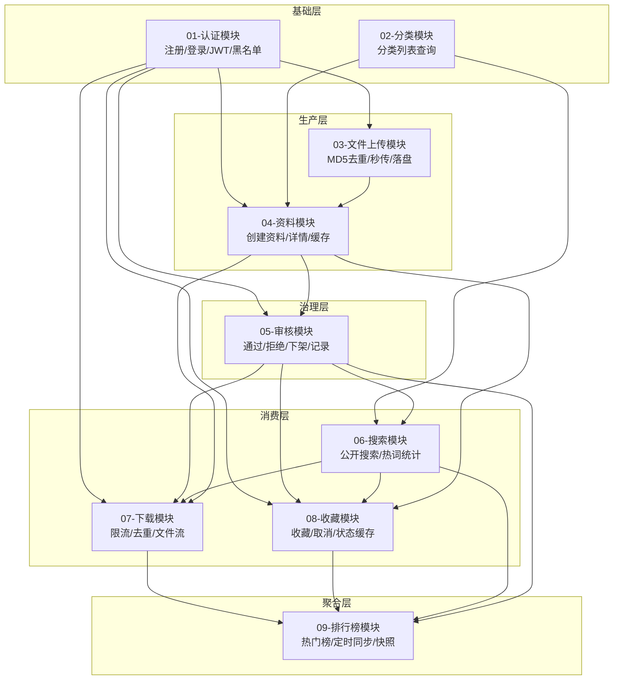
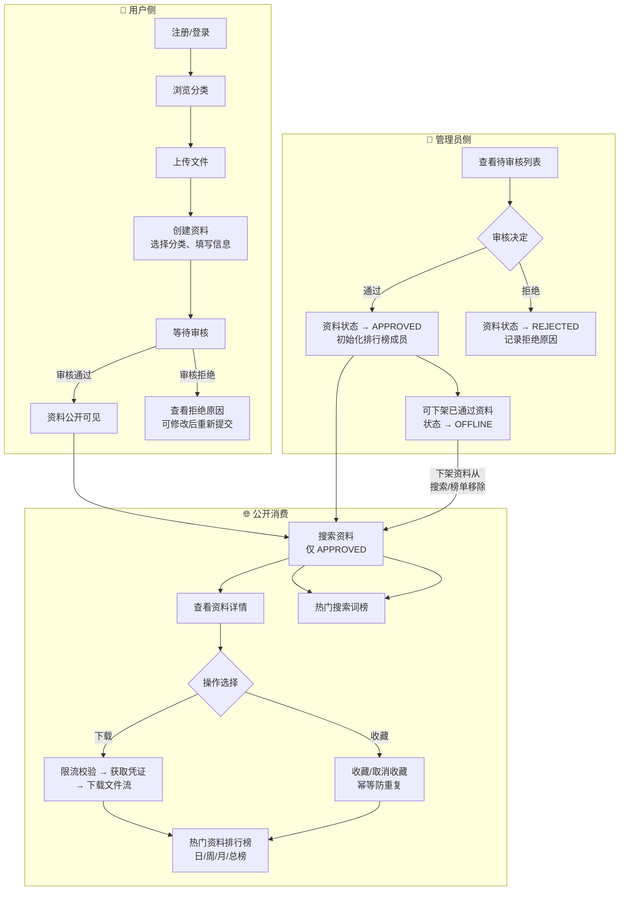
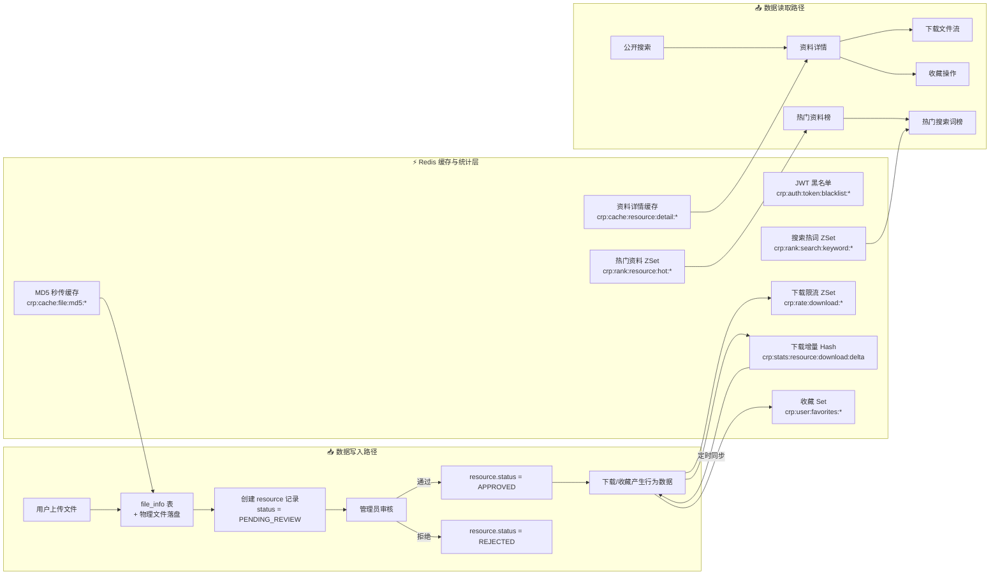
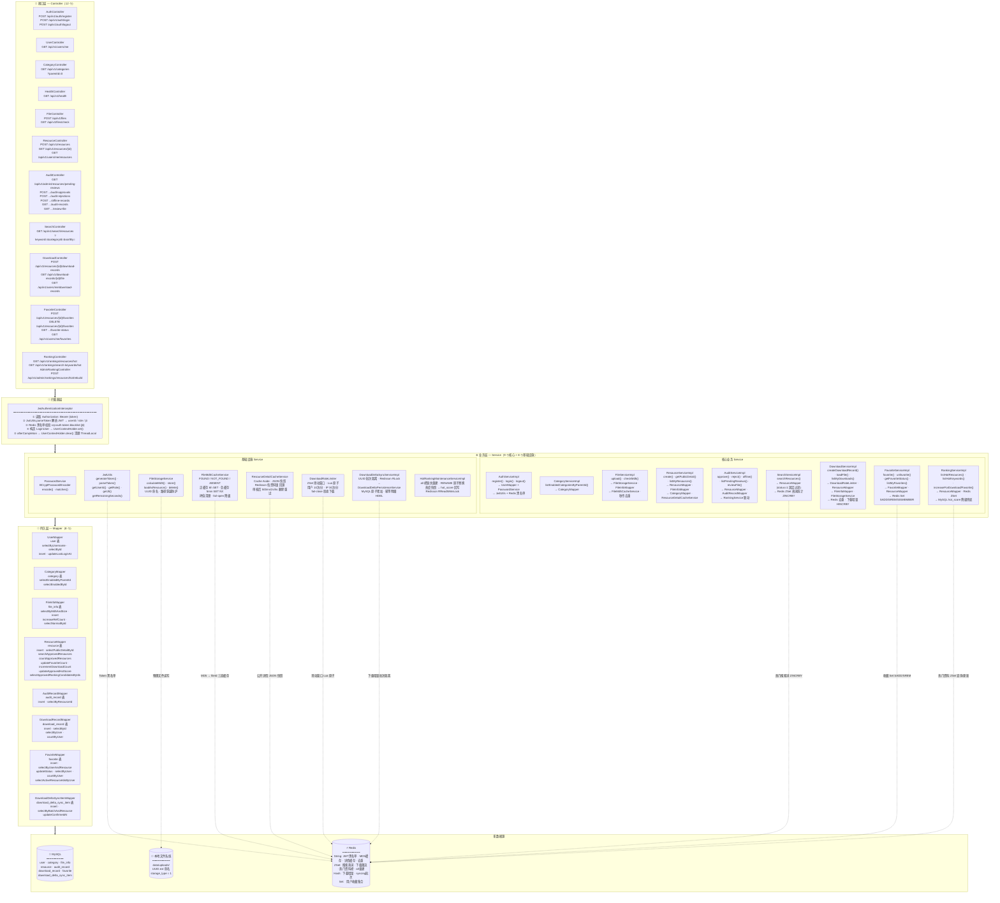
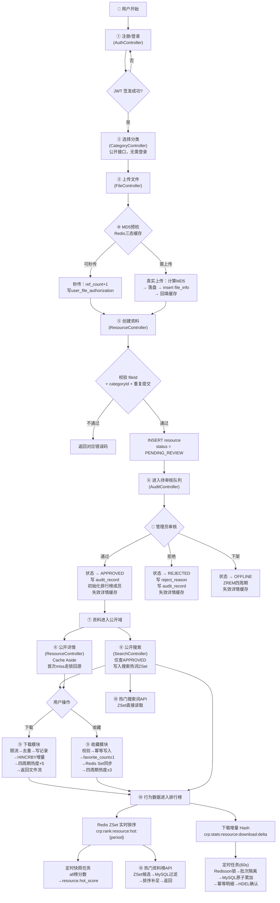
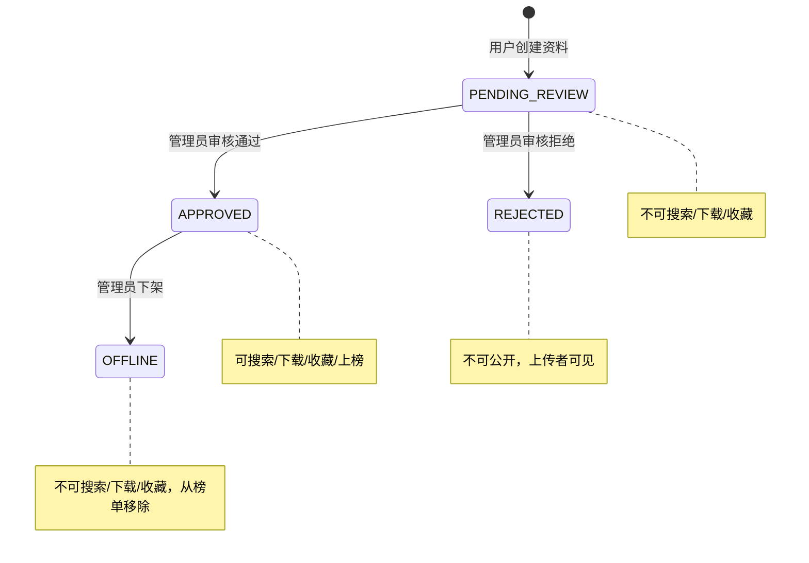

# 校园资源平台 — 总体架构与全局流程图

> 本文档基于 `docs/modules/` 目录下九份模块开发流程文档中的流程图整合而成，反映当前已落地的系统全貌。
> 生成日期：2026-08-08

---

## 1. 系统概述

校园资源平台是一个面向高校学生的课程资料共享平台，核心业务流程为：

**用户注册/登录 → 上传文件 → 创建资料 → 管理员审核 → 公开搜索 → 下载/收藏 → 排行榜展示**

系统共分为 9 个业务模块，模块间通过明确的依赖关系形成一条从"生产"到"消费"的完整链路。

---

## 2. 模块全景图



---

## 3. 全局业务流程图

### 3.1 总流程（用户视角 + 管理员视角）



### 3.2 数据流转全貌



---

## 4. 模块间调用关系矩阵

| | 01认证 | 02分类 | 03文件 | 04资料 | 05审核 | 06搜索 | 07下载 | 08收藏 | 09排行 |
|---|---|---|---|---|---|---|---|---|---|
| **01认证** | — | | | | | | | | |
| **02分类** | | — | | | | | | | |
| **03文件** | ✅ 需登录 | | — | | | | | | |
| **04资料** | ✅ uploaderId | ✅ categoryId | ✅ fileId | — | | | | | |
| **05审核** | ✅ 管理员 | | | ✅ 消费待审 | — | | | | |
| **06搜索** | | ✅ categoryId | | ✅ 读APPROVED | ✅ 隔离未审 | — | | | |
| **07下载** | ✅ 限流/IP | | ✅ 读存储路径 | ✅ 读APPROVED | ✅ 隔离未审 | | — | | |
| **08收藏** | ✅ userId | | | ✅ 读APPROVED | ✅ 隔离未审 | | | — | |
| **09排行** | | | | ✅ 读APPROVED | ✅ 初始/移除 | ✅ 热词ZSet | ✅ 热度联动 | ✅ 热度联动 | — |

> ✅ = 模块对该模块有依赖关系，箭头方向为"依赖于"

---

## 5. 分层架构图



---

## 6. 核心业务流程整合流程图

> 下图将九个模块的流程串联为一条完整的端到端链路。



---

## 7. 状态机总览



**资料状态流转规则（`resource.status`）：**

| 状态 | 值 | 可搜索 | 可下载 | 可收藏 | 可上榜 |
|------|-----|--------|--------|--------|--------|
| PENDING_REVIEW | 0 | ❌ | ❌ | ❌ | ❌ |
| APPROVED | 1 | ✅ | ✅ | ✅ | ✅ |
| REJECTED | 2 | ❌ | ❌ | ❌ | ❌ |
| OFFLINE | 3 | ❌ | ❌ | ❌ | ❌ |
| DELETED | 4 | ❌ | ❌ | ❌ | ❌ |

---

## 8. Redis Key 全景图

| Key 模式 | 类型 | 模块 | 用途 | TTL |
|----------|------|------|------|-----|
| `crp:auth:token:blacklist:{jti}` | String | 认证 | JWT退出登录黑名单 | JWT剩余有效期 |
| `crp:cache:file:md5:{md5}:{size}` | String | 文件 | MD5秒传三态缓存 | 正6h / 负5min |
| `crp:cache:resource:detail:{id}` | String | 资料 | 公开详情JSON快照 | 30min+随机 |
| `crp:lock:cache:resource:detail:{id}` | RLock | 资料 | 详情缓存回源/失效锁 | 看门狗 |
| `crp:rank:search:keyword:daily` | ZSet | 搜索 | 日热门搜索词 | 2天 |
| `crp:rank:search:keyword:weekly` | ZSet | 搜索 | 周热门搜索词 | 14天 |
| `crp:rank:search:keyword:monthly` | ZSet | 搜索 | 月热门搜索词 | 60天 |
| `crp:rate:download:user:{userId}` | ZSet | 下载 | 用户下载限流 | 窗口+60s |
| `crp:rate:download:ip:{ip}` | ZSet | 下载 | IP下载限流 | 窗口+60s |
| `crp:dedup:download:{userId}:{rid}` | String | 下载 | 重复下载去重 | 10-30min |
| `crp:download:ticket:{userId}:{downloadRecordId}:{ticketDigest}` | String | 下载 | 一次性下载凭证 | 5min |
| `crp:stats:resource:download:delta` | Hash | 下载 | 下载量增量 | 不设TTL |
| `crp:stats:resource:download:syncing:{batchId}` | Hash | 排行 | 下载增量同步批次详情 | 按批次清理 |
| `crp:stats:resource:download:syncing:current` | String | 排行 | 当前同步批次ID | 不设TTL |
| `crp:user:favorites:{userId}` | Set | 收藏 | 用户收藏集合缓存 | 30min |
| `crp:rank:resource:hot:daily` | ZSet | 排行 | 日热门资料榜 | 2天 |
| `crp:rank:resource:hot:weekly` | ZSet | 排行 | 周热门资料榜 | 14天 |
| `crp:rank:resource:hot:monthly` | ZSet | 排行 | 月热门资料榜 | 60天 |
| `crp:rank:resource:hot:all` | ZSet | 排行 | 总热门资料榜 | 不设TTL |
| `crp:rank:resource:hot:all:rebuild:{batchId}` | ZSet | 排行 | all榜重建批次（RENAME原子替换） | 重建后清理 |
| `crp:lock:sync:download-delta` | RLock | 排行 | 下载增量同步锁 | 看门狗 |
| `crp:lock:sync:hot-rank-maintenance` | RReadWriteLock | 排行 | 总榜维护读写锁 | 看门狗 |

---

## 9. 模块热度权重

| 行为 | 分数变化 | 作用周期 | 触发模块 |
|------|----------|----------|----------|
| 审核通过 | `ZADD 0` | daily/weekly/monthly/all | 审核模块 |
| 有效下载 | `ZINCRBY +5` | daily/weekly/monthly/all | 下载模块 |
| 收藏成功 | `ZINCRBY +3` | daily/weekly/monthly/all | 收藏模块 |
| 取消收藏 | `ZINCRBY -3` | daily/weekly/monthly/all | 收藏模块 |
| 下架/删除 | `ZREM` | daily/weekly/monthly/all | 审核模块 |

---

## 10. 定时任务一览

| 任务 | 频率 | 锁 | 职责 |
|------|------|-----|------|
| 下载增量同步 | 每60秒 | `crp:lock:sync:download-delta` (RLock) | UUID批次隔离 → MySQL原子累加 → HDEL确认 |
| All榜缺失检查 | 每5分钟 | `crp:lock:sync:hot-rank-maintenance` (写锁) | 检查all Key → 从MySQL重建 → RENAME原子替换 |
| 热度快照 | 每5分钟 | `crp:lock:sync:hot-rank-maintenance` (读锁) | 分批读all ZSet → 回写resource.hot_score |

---

## 11. 关键技术决策说明

### 11.1 物理文件与业务资料解耦

`file_info`（物理文件）与 `resource`（业务资料）分离为两张表，实现：

- 同一文件可被多份资料复用（通过 `ref_count` 引用计数和 `user_file_authorization` 授权）
- MD5 + file_size 唯一索引实现秒传
- 文件存储细节（`storage_path`、`stored_name`）不暴露给业务层

### 11.2 先写 Redis 后同步 MySQL

下载量是高频写场景，采用：

1. 下载成功 → `HINCRBY crp:stats:resource:download:delta +1`
2. 定时任务 → UUID批次原子隔离 → MySQL原子累加 → 幂等明细确认
3. 避免每次下载都 `UPDATE resource SET download_count = download_count + 1`

### 11.3 状态机保证内容安全

所有公开消费入口（搜索、下载、收藏、排行榜）都在 Service/Mapper 层固定过滤 `status = 1 (APPROVED)`，形成多层防御：

- 搜索 Mapper SQL 固定 `WHERE status = 1`
- 下载 Service 校验 `resource.isApproved()`
- 收藏 Service 校验 `resource.isApproved()`
- 排行榜 Mapper SQL 固定 `WHERE status = 1`

### 11.4 Redis 故障降级策略

| 场景 | 降级方式 |
|------|----------|
| 热门资料 Redis 不可用 | 降级 MySQL `hot_score` 查询 |
| 热门搜索词 Redis 不可用 | 返回空列表 |
| 详情缓存 Redis 不可用 | 直接查 MySQL 返回 |
| 下载限流 Redis 不可用 | 失败关闭（拒绝下载） |
| 收藏 Set Redis 不可用 | 降级查 MySQL |
| 热词统计 Redis 不可用 | 记录日志，搜索正常返回 |
| 热度联动 Redis 不可用 | 记录日志，主业务不回滚 |

---

## 12. 项目技术栈总览

| 层次 | 技术 |
|------|------|
| 框架 | Spring Boot 3.x |
| 持久层 | MyBatis + MySQL 8.x |
| 缓存 | Redis (StringRedisTemplate + Redisson) |
| 认证 | JWT + BCrypt + Redis 黑名单 |
| 定时任务 | Spring `@Scheduled` |
| 分布式锁 | Redisson RLock / RReadWriteLock |
| 文件存储 | 本地文件系统 (`data/uploads/`) |
| 测试 | JUnit 5 + MockMvc + H2 MySQL Mode |
| API 文档 | Markdown (Postman Collection) |

---

## 13. 模块依赖链（开发顺序）

```text
01-认证 ──→ 02-分类 ──→ 03-文件上传 ──→ 04-资料 ──→ 05-审核
                                                    │
                    ┌───────────────────────────────┤
                    ▼                               ▼
              06-搜索                          07-下载
                    │                               │
                    └───────────┬───────────────────┘
                                ▼
                          08-收藏
                                │
                                ▼
                          09-排行榜
```

实际开发顺序即按上述编号 01 → 09 推进，每个模块在前置模块完成后才可开发。

---

## 14. 附录：各模块文档索引

| 编号 | 模块 | 文档 |
|------|------|------|
| 01 | 用户认证 | [01-auth-development-process.md](01-auth-development-process.md) |
| 02 | 分类查询 | [02-category-development-process.md](02-category-development-process.md) |
| 03 | 文件上传 | [03-file-upload-development-process.md](03-file-upload-development-process.md) |
| 04 | 资料管理 | [04-resource-development-process.md](04-resource-development-process.md) |
| 05 | 审核管理 | [05-audit-development-process.md](05-audit-development-process.md) |
| 06 | 搜索服务 | [06-search-development-process.md](06-search-development-process.md) |
| 07 | 下载服务 | [07-download-development-process.md](07-download-development-process.md) |
| 08 | 收藏服务 | [08-favorite-development-process.md](08-favorite-development-process.md) |
| 09 | 排行榜与定时任务 | [09-rank-development-process.md](09-rank-development-process.md) |
