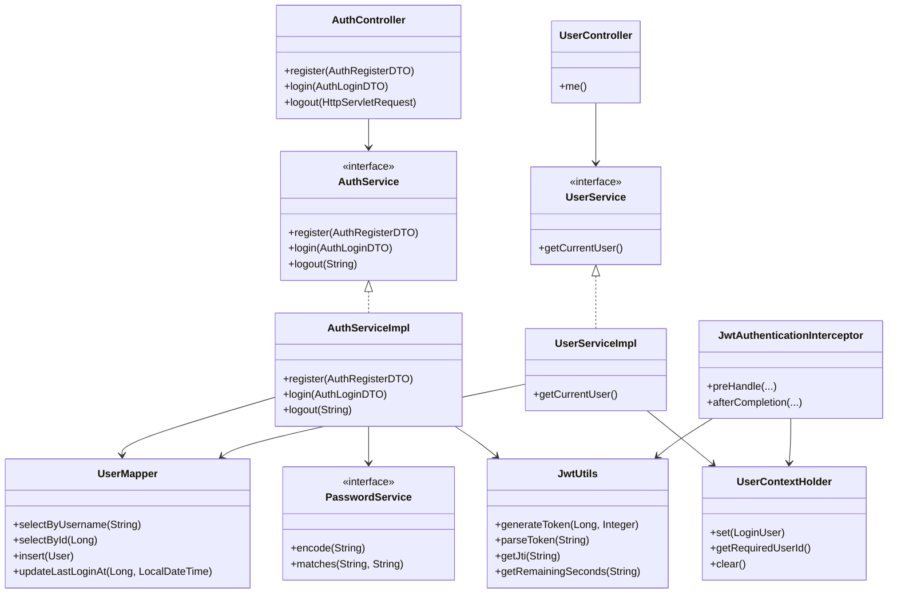
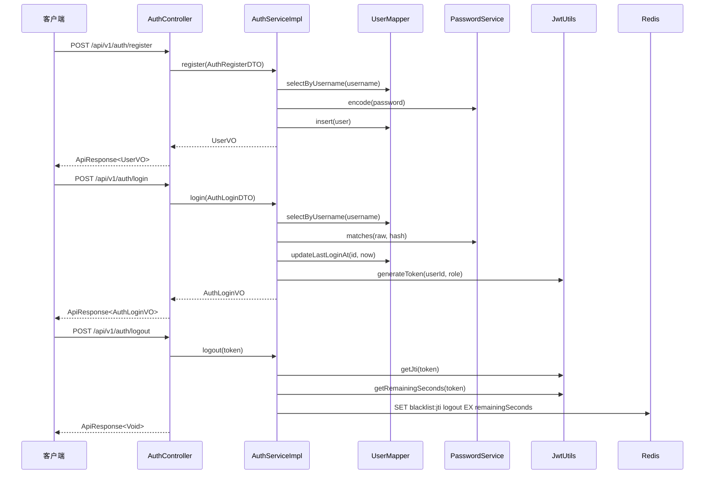
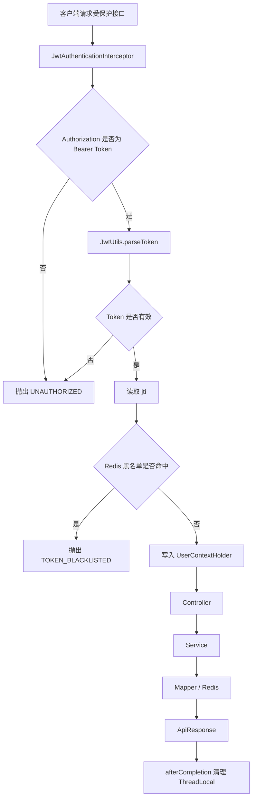
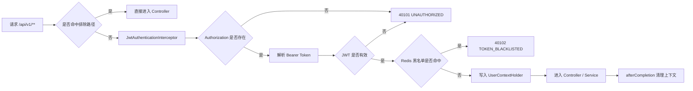

# 用户认证模块开发记录

## 0. 文档范围

本文档记录当前已经落地的“用户认证模块”，对应代码包路径为 `com.john.campus`。

当前模块覆盖注册、登录、退出登录、当前用户查询、JWT 鉴权拦截、密码加密、Redis Token 黑名单。登录限流、验证码、刷新 Token、管理员用户管理、注解式权限控制等能力属于后续优化方向，本模块暂未涉及。

## 1. 模块目标

用户认证模块用于完成平台最基础的身份能力：用户注册、用户登录、JWT 签发、当前用户识别、退出登录和 Token 黑名单校验。

该模块是后续资料上传、下载、收藏、管理员审核等模块的前置基础，后续业务接口可以通过 `UserContextHolder` 获取当前登录用户信息。

## 2. 本次实现功能

- 用户注册：接收用户名、密码、昵称、邮箱、手机号，使用 BCrypt 加密密码后写入 `user` 表。
- 用户登录：按用户名查询用户，校验 BCrypt 密码，校验用户状态，签发 JWT。
- 用户退出登录：解析当前 Token 的 `jti`，写入 Redis 黑名单，并设置 Token 剩余有效期作为 TTL。
- 当前用户查询：通过 JWT 拦截器解析当前用户 ID，再查询 `user` 表返回用户信息。
- JWT 鉴权拦截：解析 `Authorization: Bearer {token}`，提取 `userId`、`role`、`jti`，写入 `UserContextHolder`。
- Redis 黑名单校验：请求进入受保护接口时，如果 `jti` 已存在于黑名单 Key，则返回 Token 已失效。
- 统一异常处理：业务异常、参数校验异常、Token 异常统一返回 `ApiResponse`。

本模块暂未涉及：

- 登录失败次数统计。
- 登录限流。
- 图形验证码或邮箱验证码。
- Refresh Token。
- 管理员禁用用户接口。
- 用户资料修改接口。
- 注解式角色权限控制。
- 登录审计表或登录日志表。

## 3. 涉及接口

| 接口名称 | 方法 | 路径 | 是否登录 | 权限要求 | Controller 方法 |
| --- | --- | --- | --- | --- | --- |
| 用户注册 | `POST` | `/api/v1/auth/register` | 否 | 无 | `AuthController.register` |
| 用户登录 | `POST` | `/api/v1/auth/login` | 否 | 无 | `AuthController.login` |
| 用户退出登录 | `POST` | `/api/v1/auth/logout` | 是 | 学生或管理员 | `AuthController.logout` |
| 获取当前用户 | `GET` | `/api/v1/users/me` | 是 | 学生或管理员 | `UserController.me` |

## 4. 涉及数据库表

### 4.1 `user` 用户表

本模块使用已有 `user` 表，没有新增表或新增索引。

涉及字段：

| 字段 | 使用场景 |
| --- | --- |
| `id` | 用户主键，JWT 中的 `userId` 来源 |
| `username` | 注册唯一性校验、登录查询 |
| `password_hash` | 保存 BCrypt 加密后的密码 |
| `nickname` | 注册和用户信息返回 |
| `email` | 注册和用户信息返回 |
| `phone` | 注册时保存手机号 |
| `role` | JWT 中的角色信息来源 |
| `status` | 登录和当前用户查询时校验账号是否正常 |
| `last_login_at` | 登录成功后更新最近登录时间 |
| `created_at` | 用户创建时间 |
| `updated_at` | 用户更新时间 |

涉及索引：

| 索引 | 使用场景 |
| --- | --- |
| `uk_user_username` | 注册防重复、登录按用户名查询 |
| `uk_user_email` | 数据库层防止邮箱重复 |
| `uk_user_phone` | 数据库层防止手机号重复 |

## 5. 涉及 Redis Key

### 5.1 Token 黑名单

| 项目 | 内容 |
| --- | --- |
| Key 模板 | `crp:auth:token:blacklist:{jti}` |
| 代码常量 | `RedisKeyConstants.TOKEN_BLACKLIST` |
| 数据结构 | String |
| Value | `logout` |
| TTL | JWT 剩余有效期 |
| 写入时机 | 用户调用 `POST /api/v1/auth/logout` |
| 读取时机 | `JwtAuthenticationInterceptor.preHandle` |
| 用途 | 用户退出登录后，让未过期 JWT 立即失效 |

本模块暂未实现 `crp:auth:user:token-version:{userId}`。

### 5.2 Redis 与 MySQL 一致性

- Token 黑名单只用于补足 JWT 退出登录后的服务端失效能力，不回写 MySQL。
- 用户是否可用仍以 MySQL `user.status` 为准，登录和 `GET /api/v1/users/me` 都会校验用户状态。
- 黑名单 Key 的 TTL 使用 JWT 剩余有效期，避免 Token 过期后 Redis 仍长期保留无意义数据。
- 如果退出登录时 Redis 写入失败，当前代码会由 `GlobalExceptionHandler` 统一返回 `50001 SERVER_ERROR`。
- 如果后续实现管理员禁用用户后批量失效 Token，可增加 `crp:auth:user:token-version:{userId}`，当前模块暂未涉及。

## 6. 核心类与方法

### 6.1 代码落点

| 文件 | 说明 |
| --- | --- |
| `campus-resource-platform/src/main/java/com/john/campus/controller/AuthController.java` | 注册、登录、退出登录接口入口 |
| `campus-resource-platform/src/main/java/com/john/campus/controller/UserController.java` | 当前用户查询接口入口 |
| `campus-resource-platform/src/main/java/com/john/campus/service/AuthService.java` | 认证业务接口 |
| `campus-resource-platform/src/main/java/com/john/campus/service/impl/AuthServiceImpl.java` | 注册、登录、退出登录核心业务实现 |
| `campus-resource-platform/src/main/java/com/john/campus/service/UserService.java` | 当前用户业务接口 |
| `campus-resource-platform/src/main/java/com/john/campus/service/impl/UserServiceImpl.java` | 当前用户查询业务实现 |
| `campus-resource-platform/src/main/java/com/john/campus/service/PasswordService.java` | 密码加密与校验接口 |
| `campus-resource-platform/src/main/java/com/john/campus/service/impl/PasswordServiceImpl.java` | BCrypt 密码处理实现 |
| `campus-resource-platform/src/main/java/com/john/campus/mapper/UserMapper.java` | 用户表 MyBatis Mapper 接口 |
| `campus-resource-platform/src/main/resources/mapper/UserMapper.xml` | 用户表 SQL 映射 |
| `campus-resource-platform/src/main/java/com/john/campus/common/JwtUtils.java` | JWT 生成、解析和剩余有效期计算 |
| `campus-resource-platform/src/main/java/com/john/campus/interceptor/JwtAuthenticationInterceptor.java` | JWT 请求拦截器 |
| `campus-resource-platform/src/main/java/com/john/campus/common/UserContextHolder.java` | 当前用户 ThreadLocal 上下文 |
| `campus-resource-platform/src/main/java/com/john/campus/common/RedisKeyConstants.java` | Redis Key 常量 |
| `campus-resource-platform/src/main/java/com/john/campus/exception/GlobalExceptionHandler.java` | 全局异常处理 |

### 6.2 核心方法

| 类 | 方法 | 作用 |
| --- | --- | --- |
| `AuthController` | `register(AuthRegisterDTO)` | 注册接口入口 |
| `AuthController` | `login(AuthLoginDTO)` | 登录接口入口 |
| `AuthController` | `logout(HttpServletRequest)` | 退出登录接口入口 |
| `UserController` | `me()` | 当前用户接口入口 |
| `AuthService` | `register(AuthRegisterDTO)` | 注册业务接口 |
| `AuthService` | `login(AuthLoginDTO)` | 登录业务接口 |
| `AuthService` | `logout(String)` | 退出登录业务接口 |
| `AuthServiceImpl` | `register(AuthRegisterDTO)` | 用户重复校验、密码加密、入库 |
| `AuthServiceImpl` | `login(AuthLoginDTO)` | 用户查询、密码校验、JWT 签发 |
| `AuthServiceImpl` | `logout(String)` | 写入 Redis Token 黑名单 |
| `UserService` | `getCurrentUser()` | 当前用户查询业务接口 |
| `UserServiceImpl` | `getCurrentUser()` | 根据上下文 userId 查询用户 |
| `UserMapper` | `selectByUsername(String)` | 按用户名查询用户 |
| `UserMapper` | `selectById(Long)` | 按 ID 查询用户 |
| `UserMapper` | `insert(User)` | 插入用户并回填自增 ID |
| `UserMapper` | `updateLastLoginAt(Long, LocalDateTime)` | 更新最近登录时间 |
| `PasswordService` | `encode(String)` | BCrypt 加密密码 |
| `PasswordService` | `matches(String, String)` | 校验明文密码和密文是否匹配 |
| `JwtUtils` | `generateToken(Long, Integer)` | 生成 JWT |
| `JwtUtils` | `parseToken(String)` | 解析 JWT |
| `JwtUtils` | `getUserId(String)` | 从 JWT 获取用户 ID |
| `JwtUtils` | `getRole(String)` | 从 JWT 获取角色 |
| `JwtUtils` | `getJti(String)` | 从 JWT 获取 jti |
| `JwtUtils` | `getRemainingSeconds(String)` | 获取 Token 剩余有效期 |
| `JwtAuthenticationInterceptor` | `preHandle(...)` | 解析 Token、校验黑名单、写入上下文 |
| `JwtAuthenticationInterceptor` | `afterCompletion(...)` | 清理 `ThreadLocal` |
| `UserContextHolder` | `set(LoginUser)` | 写入当前用户上下文 |
| `UserContextHolder` | `getRequiredUserId()` | 获取当前登录用户 ID |
| `UserContextHolder` | `clear()` | 清理当前线程用户上下文 |

## 7. 请求处理流程

### 7.1 注册流程

1. `AuthController.register` 接收 `AuthRegisterDTO`。
2. `jakarta.validation` 校验用户名、密码、昵称、邮箱、手机号格式。
3. `AuthServiceImpl.register` 按用户名调用 `UserMapper.selectByUsername` 查询是否重复。
4. 调用 `PasswordService.encode` 使用 BCrypt 加密密码。
5. 构造 `User`，默认设置 `role = User.ROLE_STUDENT`、`status = User.STATUS_NORMAL`。
6. 调用 `UserMapper.insert` 写入 `user` 表。
7. 返回 `UserVO`，不返回密码字段。

### 7.2 登录流程

1. `AuthController.login` 接收 `AuthLoginDTO`。
2. `AuthServiceImpl.login` 调用 `UserMapper.selectByUsername` 查询用户。
3. 调用 `PasswordService.matches` 校验密码。
4. 调用 `user.isNormal()` 校验账号状态。
5. 调用 `UserMapper.updateLastLoginAt` 更新最近登录时间。
6. 调用 `JwtUtils.generateToken` 生成 JWT。
7. 返回 `AuthLoginVO`，包含 `accessToken`、`tokenType`、`expiresIn` 和 `UserVO`。

### 7.3 受保护接口鉴权流程

1. 请求进入 `/api/v1/**`。
2. `WebMvcConfig` 排除登录、注册、健康检查、搜索、排行榜等无需登录路径。
3. `JwtAuthenticationInterceptor.preHandle` 读取 `Authorization` 请求头。
4. 校验请求头格式必须为 `Bearer {token}`。
5. 调用 `JwtUtils.parseToken` 解析 JWT。
6. 使用 `RedisKeyConstants.tokenBlacklist(jti)` 查询 Redis 黑名单。
7. 黑名单命中则抛出 `TOKEN_BLACKLISTED`。
8. 构造 `LoginUser`，写入 `UserContextHolder`。
9. Controller 和 Service 可通过 `UserContextHolder` 获取当前用户。
10. 请求结束后 `afterCompletion` 调用 `UserContextHolder.clear()`。

### 7.4 退出登录流程

1. `JwtAuthenticationInterceptor` 先解析 Token 并将原始 token 写入 request attribute。
2. `AuthController.logout` 从 request attribute 获取 token。
3. `AuthServiceImpl.logout` 调用 `JwtUtils.getJti` 获取 `jti`。
4. 调用 `JwtUtils.getRemainingSeconds` 获取 Token 剩余有效期。
5. 写入 Redis：`crp:auth:token:blacklist:{jti} = logout`。
6. Redis TTL 设置为 Token 剩余秒数。
7. 后续使用该 Token 访问受保护接口时，拦截器返回 `TOKEN_BLACKLISTED`。

### 7.5 当前用户查询流程

1. 客户端携带 `Authorization: Bearer {token}` 请求 `GET /api/v1/users/me`。
2. `JwtAuthenticationInterceptor.preHandle` 解析 Token，校验 Redis 黑名单，并写入 `UserContextHolder`。
3. `UserController.me` 调用 `UserService.getCurrentUser`。
4. `UserServiceImpl.getCurrentUser` 通过 `UserContextHolder.getRequiredUserId()` 获取当前用户 ID。
5. 调用 `UserMapper.selectById` 查询 `user` 表。
6. 用户不存在时抛出 `RESOURCE_NOT_FOUND`。
7. 用户状态不是 `User.STATUS_NORMAL` 时抛出 `FORBIDDEN`。
8. 返回 `UserVO`，不返回 `password_hash`、`phone` 等敏感或非必要字段。

## 8. 模块内部类之间的关系



## 9. 模块核心时序图



## 10. 模块流程图



## 11. 鉴权流程图



## 12. 异常处理

| 异常场景 | 抛出位置 | 错误码 |
| --- | --- | --- |
| 注册用户名已存在 | `AuthServiceImpl.register` | `40002 DATA_DUPLICATE` |
| 用户名、邮箱或手机号数据库唯一约束冲突 | `AuthServiceImpl.register` | `40002 DATA_DUPLICATE` |
| 登录账号或密码错误 | `AuthServiceImpl.login` | `40101 UNAUTHORIZED` |
| 用户被禁用 | `AuthServiceImpl.login`、`UserServiceImpl.getCurrentUser` | `40301 FORBIDDEN` |
| Token 缺失或格式错误 | `JwtAuthenticationInterceptor.preHandle` | `40101 UNAUTHORIZED` |
| Token 无效或过期 | `JwtUtils.parseToken` | `40101 UNAUTHORIZED` |
| Token 已退出登录 | `JwtAuthenticationInterceptor.preHandle` | `40102 TOKEN_BLACKLISTED` |
| 当前用户不存在 | `UserServiceImpl.getCurrentUser` | `40401 RESOURCE_NOT_FOUND` |
| DTO 参数校验失败 | `GlobalExceptionHandler` | `40001 PARAM_ERROR` |

HTTP 状态码由 `GlobalExceptionHandler.resolveHttpStatus` 统一转换：

| 业务错误码 | HTTP 状态 |
| --- | --- |
| `40101 UNAUTHORIZED` | `401 Unauthorized` |
| `40102 TOKEN_BLACKLISTED` | `401 Unauthorized` |
| `40301 FORBIDDEN` | `403 Forbidden` |
| `40401 RESOURCE_NOT_FOUND` | `404 Not Found` |
| `42901 RATE_LIMITED` | `429 Too Many Requests` |
| `50001 SERVER_ERROR` | `500 Internal Server Error` |
| 其他 4xxxx 错误 | `400 Bad Request` |

## 13. 权限控制

- `/api/v1/auth/register`：不需要登录。
- `/api/v1/auth/login`：不需要登录。
- `/api/v1/auth/logout`：需要登录，由 `JwtAuthenticationInterceptor` 校验 Token。
- `/api/v1/users/me`：需要登录，由 `JwtAuthenticationInterceptor` 校验 Token。
- 本模块暂未实现管理员专属接口。
- 本模块暂未实现注解式权限控制。

## 14. 事务处理

| 方法 | 事务注解 | 原因 |
| --- | --- | --- |
| `AuthServiceImpl.register` | `@Transactional(rollbackFor = Exception.class)` | 插入用户时出现异常需要回滚 |
| `AuthServiceImpl.login` | `@Transactional(rollbackFor = Exception.class)` | 登录成功后更新 `last_login_at`，失败时回滚 |
| `AuthServiceImpl.logout` | 本模块暂未涉及数据库事务 | 只写 Redis 黑名单，不操作 MySQL |
| `UserServiceImpl.getCurrentUser` | 本模块暂未涉及事务 | 只读查询 |

说明：

- `register` 先查用户名再插入，但并发注册相同用户名时仍可能同时通过前置查询，因此最终依赖数据库唯一索引 `uk_user_username` 兜底。
- `login` 更新 `last_login_at` 和签发 Token 在同一业务方法内完成，当前事务只覆盖 MySQL 更新，不覆盖 JWT 字符串生成。
- `logout` 只写 Redis，当前模块暂未使用数据库事务或分布式事务。

## 15. 测试用例

### 15.1 已执行验证

| 测试项 | 命令 | 结果 |
| --- | --- | --- |
| 编译验证 | `.\mvnw.cmd -DskipTests compile` | 通过 |
| JWT 密钥启动校验 | `.\mvnw.cmd "-Dtest=JwtUtilsTest,CampusResourcePlatformApplicationTests" test` | 3/3 通过；缺失、过短和历史公开默认密钥均被拒绝 |

### 15.2 建议接口测试用例

| 用例 | 请求 | 预期结果 |
| --- | --- | --- |
| 注册成功 | `POST /api/v1/auth/register`，传入合法用户名、密码、昵称 | 返回 `code = 0`，数据库 `user.password_hash` 为 BCrypt 密文 |
| 重复用户名注册 | 使用相同 `username` 再次注册 | 返回 `40002 DATA_DUPLICATE` |
| 登录成功 | `POST /api/v1/auth/login`，传入正确账号密码 | 返回 `accessToken`、`tokenType = Bearer` |
| 密码错误 | 登录时传入错误密码 | 返回 `40101 UNAUTHORIZED` |
| 查询当前用户成功 | 携带 `Authorization: Bearer {token}` 请求 `GET /api/v1/users/me` | 返回当前用户信息 |
| 未携带 Token 查询当前用户 | 不传 `Authorization` 请求 `GET /api/v1/users/me` | 返回 `40101 UNAUTHORIZED` |
| 退出登录成功 | 携带 Token 请求 `POST /api/v1/auth/logout` | 返回 `code = 0`，Redis 写入黑名单 |
| 退出后再次访问 | 使用退出后的 Token 请求 `GET /api/v1/users/me` | 返回 `40102 TOKEN_BLACKLISTED` |

Postman 测试集合：

- `docs/api/postman/campus-resource-platform.postman_collection.json`
- `docs/api/postman/campus-local.postman_environment.json`

当前已补充 `JwtUtilsTest` 和完整 Spring 上下文启动测试，覆盖 JWT 密钥 fail-fast 与基本签发解析；登录、退出、Redis 黑名单和完整 HTTP 认证链路仍建议继续补齐。

## 16. 面试可讲点

- 密码没有明文存储，而是通过 `BCryptPasswordEncoder` 加密后保存到 `password_hash`。
- JWT 中携带 `userId`、`role`、`jti`，`jti` 用于退出登录后的 Token 黑名单。
- JWT 是无状态认证，但退出登录需要服务端失效能力，因此使用 Redis 黑名单补足。
- Redis 黑名单 TTL 使用 Token 剩余有效期，避免黑名单 Key 长期占用内存。
- `JwtAuthenticationInterceptor` 将用户信息放入 `UserContextHolder`，业务层无需重复解析 Token。
- `afterCompletion` 清理 `ThreadLocal`，避免 Web 容器线程复用导致用户信息串线。
- 注册和登录使用 Service 层事务，避免异常时出现部分更新。
- Controller 不直接访问 Mapper，保持 Controller -> Service -> Mapper 的分层结构。

## 17. 后续优化方向

- 在 `AuthController.logout` 中支持直接读取 `Authorization` 请求头，减少对 request attribute 的依赖。
- 增加 `UserMapper.selectByEmail`、`selectByPhone`，注册前给出更精确的重复提示。
- 增加登录限流，使用 Redis 防止暴力破解。
- 增加验证码或邮箱验证。
- 增加刷新 Token 机制。
- 增加管理员禁用用户后 Token 批量失效机制，例如 `crp:auth:user:token-version:{userId}`。
- 增加注解式权限控制，例如 `@RequireRole(User.ROLE_ADMIN)`。
- 增加认证模块单元测试和集成测试。

## 18. Git Commit Message 建议

```text
feat(auth): implement user authentication module

- add register, login, logout and current user APIs
- add BCrypt password encoding and JWT utilities
- add JWT interceptor with Redis token blacklist support
- add user mapper operations for auth flow
- document auth module implementation and sync API/Redis notes
```
