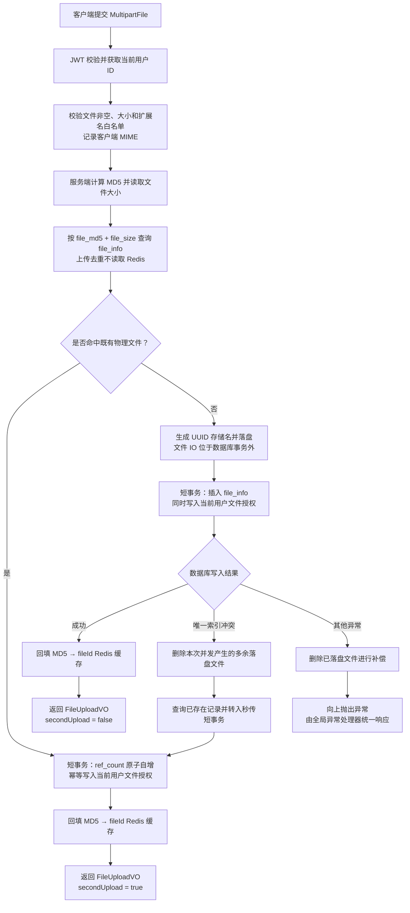
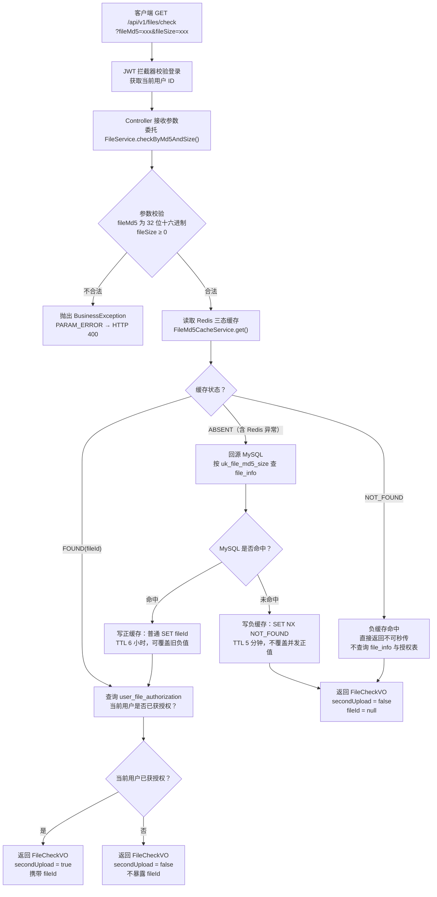

# 文件上传模块开发流程文档

> 本文档遵循 `docs/AGENTS.md` 第 24 节《模块开发流程文档规范》生成。
> 当前状态：**核心功能与 MD5 三态缓存增强已完成，缓存专项自动化测试已通过；完整 T6 仍待补充真实 Redis、并发集成与手工上传验证**。文中标注“已实现/已完成”的内容均已在真实代码中核对。

---

## 1. 模块基本信息

| 项 | 内容 |
| --- | --- |
| 模块名称 | 文件上传模块 |
| 英文标识 | file-upload |
| 文档路径 | `docs/modules/03-file-upload-development-process.md` |
| 建议分支 | `feature/file-upload` |
| 当前状态 | 核心功能与 MD5 三态缓存增强已完成；专项自动化测试通过，完整 T6 待补充 |
| 前置依赖模块 | 用户认证模块（登录态、`uploader_id`） |
| 下游模块 | 资料模块（消费本模块返回的 `fileId`）、下载模块（读取 `file_info.storage_path`） |
| 接口前缀 | `/api/v1/files`（与现有 `AuthController`、`CategoryController` 的 `/api/v1` 前缀保持一致） |

> 一致性说明：`AGENTS.md` 第 8 节示例前缀为 `/api/files`，但真实代码统一使用 `/api/v1/**`。按第 24 节“以代码为准”，本模块采用 `/api/v1/files`。

---

## 2. 模块目标

提供文件上传能力，完成文件校验、基于 MD5 的去重（秒传）、物理落盘与 `file_info` 入库，并返回文件 ID 供后续资料创建模块引用。

核心产出：

- 一个上传接口：接收文件、校验、去重、存储、入库、返回 `fileId`。
- 一个 MD5 预检接口：前端先计算 MD5，提前判断是否可秒传，避免重复上传大文件。
- 物理文件与业务资料解耦：本模块只负责 `file_info`（物理文件），不创建 `resource`（业务资料）。

---

## 3. 需求分析

1. 用户上传课程资料文件（课件、笔记、真题等）。
2. 相同文件不应重复占用存储：以 `file_md5 + file_size` 判定“同一物理文件”，命中则秒传。
3. 文件需做安全校验：大小限制、类型白名单、MIME 校验，防止上传可执行文件或伪造类型。
4. 不能用用户原始文件名作为落盘名，避免覆盖和路径穿越。
5. 上传成功返回 `fileId`，后续“创建资料”步骤据此关联文件。
6. 落盘与入库需保证一致：入库失败要清理已落盘文件，避免孤儿文件。

为什么不是简单 CRUD：涉及 MD5 去重与秒传、引用计数、文件 IO 与事务边界处理、唯一索引兜底并发、缓存加速与降级，属于有工程含量的上传子系统。

---

## 4. 本模块不做什么

- 不创建 `resource` 资料记录（属于**资料模块**）。
- 不做资料审核、搜索、下载、收藏。
- 不实现对象存储（MinIO/OSS），仅实现本地存储（`storage_type = 1`），对象存储为后续优化。
- 不实现分片上传、断点续传。
- 不实现上传频率限流（`crp:rate:*` 属下载/后续增强，本模块先不做，可列后续优化）。

---

## 5. 涉及接口

> 均需登录（`/api/v1/files` 不在 `WebMvcConfig` 排除列表中，默认被 JWT 拦截器保护）。

### 5.1 文件 MD5 预检（秒传判断）

| 项 | 内容 |
| --- | --- |
| 方法 | `GET` |
| 路径 | `/api/v1/files/check` |
| 参数 | `fileMd5`（32 位十六进制）、`fileSize`（字节，≥0） |
| 返回 | 当前用户是否已获授权（可秒传）、已授权命中时的 `fileId` |
| 是否登录 | 是 |

### 5.2 文件上传

| 项 | 内容 |
| --- | --- |
| 方法 | `POST` |
| 路径 | `/api/v1/files` |
| 请求类型 | `multipart/form-data` |
| 参数 | `file`（`MultipartFile`） |
| 返回 | `fileId`、`fileMd5`、`originalName`、`fileSize`、`fileExt`、`secondUpload`（是否秒传命中） |
| 是否登录 | 是 |

响应统一使用 `ApiResponse` 包裹：上传返回 `ApiResponse<FileUploadVO>`，预检返回 `ApiResponse<FileCheckVO>`（`code/message/data/traceId`）。

---

## 6. 涉及数据库表

仅涉及 `file_info` 表（已在 `sql/init.sql` 设计，本模块不新增表结构）。

| 用途 | 说明 |
| --- | --- |
| 查询去重 | 按 `uk_file_md5_size (file_md5, file_size)` 唯一索引查是否已存在 |
| 插入文件 | 新文件写入一行，`ref_count = 1`，`status = 1`，`storage_type = 1` |
| 引用自增 | 秒传命中时对已存在文件 `ref_count + 1`（引用计数） |
| 用户授权 | `user_file_authorization` 记录用户可引用的 `fileId`；物理文件全局存在不等于当前用户可秒传 |

关键字段：`file_md5`、`original_name`、`stored_name`、`file_ext`、`mime_type`、`file_size`、`storage_type`、`storage_path`、`uploader_id`、`ref_count`、`status`。

> `resource` 表本模块**不写**，见第 4 节与第 22 节。

---

## 7. 涉及 Redis Key

| Key | 类型 | 状态 | 用途 | TTL |
| --- | --- | --- | --- | --- |
| `crp:cache:file:md5:{fileMd5}:{fileSize}` | String | 已实现（`RedisKeyConstants.fileMd5Cache`） | 正值为十进制 `fileId`，负值为 `NOT_FOUND`；预检三态读取，上传成功后回填 | 正值 6 小时；负值 5 分钟 |

一致性策略：以 `file_info` 的 `uk_file_md5_size` 唯一索引为**准**，Redis 仅为加速缓存。正缓存用普通 `SET`，在新文件事务、既有文件授权或并发唯一键回退授权成功后无条件覆盖旧负值；负缓存只在数据库确实未命中后用 `SET NX` 写入，不能覆盖并发上传已经提交的正值。非法、非正或溢出值最佳努力删除并回源；Redis 读取异常按缓存无结论降级 MySQL，写入异常只记录告警。

> `FileMd5CacheService` 已提供显式 `evict(md5, size)`，但当前没有文件删除/恢复的真实生命周期入口，尚未形成删除失效闭环；禁止把该能力描述为已完成，接线留给 `BATCH-17`。

---

## 8. 涉及核心类

### 8.1 复用（已存在）

- `common/ApiResponse`：统一响应外壳。
- `common/ErrorCode`：已含 `FILE_TOO_LARGE(41301)`、`FILE_TYPE_NOT_ALLOWED(41501)`、`DATA_DUPLICATE(40002)`、`PARAM_ERROR(40001)`、`SERVER_ERROR(50001)`。
- `exception/BusinessException`、`exception/GlobalExceptionHandler`。
- `common/UserContextHolder`：获取当前登录 `userId` 作为 `uploader_id`。
- `interceptor/JwtAuthenticationInterceptor`：登录校验。
- `entity/BaseEntity`：通用时间字段。
- `common/RedisKeyConstants`、`StringRedisTemplate`：Redis 访问。

### 8.2 本模块产出的类（T1–T5 已创建）

| 类型 | 类 | 职责 |
| --- | --- | --- |
| entity | `FileInfo`（extends `BaseEntity`） | 映射 `file_info` 表 |
| mapper | `FileInfoMapper` + `FileInfoMapper.xml` | `selectByMd5AndSize`、`insert`、`increaseRefCount` |
| service | `FileService` / `FileServiceImpl` | 校验、MD5、去重、落盘、入库编排 |
| controller | `FileController` | `/api/v1/files`、`/api/v1/files/check` |
| vo | `FileUploadVO`、`FileCheckVO` | 上传结果 / 预检结果（均含 `secondUpload` 标志） |
| service | `FileStorageService`（接口）/ `FileStorageServiceImpl`（本地存储实现） | MD5 计算、落盘、生成 `stored_name`、删除补偿 |
| service | `FileMd5CacheService` / `FileMd5CacheServiceImpl` | MD5 缓存三态读取、正负写入、坏值清理、故障降级与显式失效 |
| 常量 | （未单独建类） | 类型白名单、大小上限等内联为 `FileServiceImpl` 私有常量 |

---

## 9. 模块内部调用关系

```text
FileController
  └── FileService (FileServiceImpl)
        ├── 校验（大小 / 扩展名白名单 / MIME）
        ├── MD5 计算（Spring DigestUtils 或自封装工具）
        ├── FileInfoMapper（selectByMd5AndSize / insert / increaseRefCount）
        ├── FileMd5CacheService（三态预检 / 正负缓存 / 坏值清理 / 显式失效）
        │     └── StringRedisTemplate（crp:cache:file:md5:*）
        └── FileStorageService（落盘 / 删除补偿）
```

Controller 只做接收与参数校验，业务编排在 `FileServiceImpl`（遵循 `AGENTS.md` 第 7 节）。

---

## 10. 请求处理流程

### 10.1 上传（`POST /api/v1/files`）

1. JWT 拦截器校验登录，`UserContextHolder` 得到 `uploaderId`。
2. Controller 接收 `MultipartFile`，非空校验。
3. Service 校验：大小、扩展名白名单；记录 MIME。
4. 计算 `fileMd5`，读取 `fileSize`。
5. 去重直接查 `file_info` by `(fileMd5, fileSize)`（上传去重以唯一索引为准，**不读缓存**，因秒传需完整记录组装 VO）。
6. **命中**（服务端已读取真实上传内容并计算 MD5）：在短事务内执行 `ref_count + 1` 并幂等写入 `user_file_authorization`，随后回填 Redis 缓存，返回已存在 `fileId`，`secondUpload = true`，不重复落盘。
7. **未命中**：生成 `stored_name = UUID + "." + ext` → 落盘到 `storage-path` → `insert file_info`（`ref_count = 1`）→ 写 Redis 缓存 → 返回 `fileId`，`secondUpload = false`。
8. 补偿：落盘成功但入库失败时，删除已落盘文件，避免孤儿文件。
9. 并发兜底：`insert` 命中 `uk_file_md5_size` 抛 `DuplicateKeyException` 时，删除多余落盘并改为查已存在记录按秒传返回。

### 10.2 预检（`GET /api/v1/files/check`）

1. 校验登录与参数（`fileMd5`、`fileSize`）。
2. 读取 Redis 三态：`FOUND(fileId)` 继续查当前用户授权；`NOT_FOUND` 直接返回不可秒传，不查文件表和授权表；`ABSENT` 回源 `file_info`。
3. MySQL 命中时写 6 小时正缓存并查询 `user_file_authorization`；MySQL 未命中时用 `SET NX` 写 5 分钟负缓存。
4. 无论候选来自正缓存还是数据库，都只有当前用户已获授权才返回可秒传及 `fileId`，否则返回不可秒传且不暴露 ID。

---

## 11. 数据流转流程



> 图中 Redis 只承担预检加速和上传后的缓存回填，写缓存失败仅记录告警，不影响已成功的数据库主流程；文件去重的最终正确性由 `uk_file_md5_size` 唯一索引保证。

### 预检（`GET /api/v1/files/check`）数据流



> 预检流程的核心设计决策：
> - **Redis 三态**让大部分重复预检直接命中缓存，避免穿透数据库；负缓存用 `SET NX` 且短 TTL（5 分钟），不可覆盖并发上传写入的正值。
> - **授权隔离**：即使全局文件存在，也只在当前用户有 `user_file_authorization` 记录时才返回可秒传，防止未授权用户嗅探 `fileId`。
> - **降级策略**：Redis 读取异常 → 按 `ABSENT` 回源 MySQL；写缓存失败 → 仅告警，不影响预检主流程正确性。
> - **坏值清理**：协议外字符串或非法数值在读取时被最佳努力 `evict` 删除，然后按 `ABSENT` 降级处理。

---

## 12. 权限校验

- 需登录：`/api/v1/files/**` 由 JWT 拦截器保护，无需修改 `WebMvcConfig`（不加入排除列表即可）。
- `uploader_id` 取自 `UserContextHolder` 当前用户，不信任前端传入。
- 无管理员要求：普通学生角色即可上传。

---

## 13. 参数校验

| 场景 | 规则 | 失败错误码 |
| --- | --- | --- |
| 文件为空 | `MultipartFile` 非空且 size > 0 | `PARAM_ERROR` |
| 文件过大 | ≤ multipart 上限（50MB），业务侧二次校验 | `FILE_TOO_LARGE` |
| 扩展名 | 命中白名单（pdf/doc/docx/ppt/pptx/xls/xlsx/zip/rar/7z/txt/md/jpg/jpeg/png），空扩展名视为不允许 | `FILE_TYPE_NOT_ALLOWED` |
| MIME | 记录客户端上报的 MIME（存入 `mime_type`，可为空）；类型校验以扩展名白名单为准，客户端 MIME 可伪造故不单独拦截 | —（严格 MIME 校验列入后续优化） |
| 预检参数 | `fileMd5` 为 32 位十六进制、`fileSize ≥ 0` | `PARAM_ERROR` |

---

## 14. 异常处理

- 统一抛 `BusinessException(ErrorCode)`，由 `GlobalExceptionHandler` 转 `ApiResponse`。
- `GlobalExceptionHandler` 已统一处理：`MaxUploadSizeExceededException`（超大文件 → `FILE_TOO_LARGE` / HTTP 413）、`MissingServletRequestPartException`（缺少 file → `PARAM_ERROR` / 400）、`MissingServletRequestParameterException`（预检缺 `fileMd5`/`fileSize` → `PARAM_ERROR` / 400）。超大文件与缺参不再走兜底 500。
- 存储 IO 异常 → `SERVER_ERROR`，并触发落盘文件补偿删除。
- 并发唯一索引冲突 `DuplicateKeyException` → 转为秒传返回，不对用户报错。

---

## 15. 事务处理

- 遵循 `AGENTS.md` 第 11 节：**不要在事务中执行耗时文件 IO**。
- 落盘在任何数据库写操作之外完成；文件入库 + 首次授权、引用自增 + 幂等授权分别由 `FileAuthorizationServiceImpl` 的代理事务提交，`upload()` 不加事务，避免把耗时文件 IO 卷入事务。
- `FileServiceImpl` 只在事务代理成功返回后写正缓存；Redis 失败不会回滚数据库，Redis 不成为正确性依赖。
- 入库失败（含 `DuplicateKeyException` 之外的异常）→ 手动删除已落盘文件补偿（文件系统操作无法参与数据库事务）。
- 秒传 `ref_count + 1` 使用 `UPDATE ... SET ref_count = ref_count + 1 WHERE id = ?` 的行级原子自增。

---

## 16. 核心实现步骤

1. 建 `FileInfo` 实体与 `FileInfoMapper`（`selectByMd5AndSize`、`insert`、`increaseRefCount`）+ XML。
2. 实现 MD5 计算与本地存储 `FileStorageService`（`UUID + ext` 命名、落盘、删除补偿）。
3. 实现 `FileServiceImpl`：校验 → MD5 → 去重 → 落盘 → 入库 → （可选）写缓存，秒传分支与补偿逻辑。
4. 实现 `FileController`：上传接口 + 预检接口，返回 `FileUploadVO`。
5. 在 `RedisKeyConstants` 新增文件 MD5 缓存 Key 常量；在 `GlobalExceptionHandler` 增加 `MaxUploadSizeExceededException` 处理。
6. 补充测试与文档回填。

---

## 17. 开发任务拆分

| 序号 | 任务 | 产出 |
| --- | --- | --- |
| T1 | 实体 + Mapper | `FileInfo`、`FileInfoMapper`、`FileInfoMapper.xml` |
| T2 | MD5 + 存储工具 | `FileStorageService`、MD5 计算 |
| T3 | 业务编排 | `FileService`、`FileServiceImpl` |
| T4 | 接口层 | `FileController`、`FileUploadVO` |
| T5 | 异常与缓存 | `GlobalExceptionHandler` 增强、`RedisKeyConstants` 常量 |
| T6 | 测试与文档 | 测试用例 + 回填本文档 |

> 进度：T1–T5 已完成并通过编译；T6（测试与最终回填）待办。

---

## 18. 已完成事项

- `file_info` 表已在 `sql/init.sql` 设计（含 `uk_file_md5_size`、`idx_file_uploader_created` 及 `chk_*` 约束）。
- `application.yaml` 已配置 `app.upload.storage-path`（`./data/uploads`）及 multipart 上限（50MB / 60MB）。
- `ErrorCode` 已含文件相关错误码（`FILE_TOO_LARGE`、`FILE_TYPE_NOT_ALLOWED`、`DATA_DUPLICATE`）。
- `crp:cache:file:md5:{fileMd5}:{fileSize}` 已在 `05-redis-design.md` 完成设计。
- 复用的公共能力（`ApiResponse`、`BusinessException`、`GlobalExceptionHandler`、`UserContextHolder`、JWT 拦截器、`BaseEntity`）已具备。
- **（T1 已完成）** `FileInfo` 实体、`FileInfoMapper` 接口及 `FileInfoMapper.xml` 已创建，编译通过：
  - `entity/FileInfo.java`：继承 `BaseEntity`，映射 `file_info` 全部业务字段，含存储类型/状态常量与 `isNormal()`。
  - `mapper/FileInfoMapper.java`：`selectByMd5AndSize`、`insert`、`increaseRefCount`。
  - `resources/mapper/FileInfoMapper.xml`：`selectByMd5AndSize` 走唯一索引查询，`insert` 回填自增主键，`increaseRefCount` 行级原子自增。
- **（T2 已完成）** `service/FileStorageService.java`（接口）与 `service/impl/FileStorageServiceImpl.java`（本地存储实现）已创建，编译通过：MD5 计算、安全扩展名提取、`UUID + 扩展名` 落盘、删除补偿，含路径穿越纵深防御；不做去重与数据库操作。
- **（T3 已完成）** `service/FileService.java`、`service/impl/FileServiceImpl.java` 已创建，编译通过：校验（非空/大小/扩展名白名单）→ MD5 → 去重 → 命中秒传（`ref_count+1`）/未命中落盘入库；`DuplicateKeyException` 转秒传，入库异常补偿删除。
- **（T4 已完成）** `controller/FileController.java`、`vo/FileUploadVO.java`、`vo/FileCheckVO.java` 已创建，编译通过：`POST /api/v1/files` 上传、`GET /api/v1/files/check` 预检；Service 直接返回 VO、Controller 保持瘦身；`uploader_id` 由 Service 从 `UserContextHolder` 获取。
- **（T5 已完成）** 异常与缓存支撑：`GlobalExceptionHandler` 统一处理超大文件（`MaxUploadSizeExceededException` → `FILE_TOO_LARGE`/413）与缺参异常（→ `PARAM_ERROR`/400）；`RedisKeyConstants` 新增 `crp:cache:file:md5:{fileMd5}:{fileSize}` 常量与 `fileMd5Cache(...)`；`FileServiceImpl` 接入 MD5 去重缓存（预检读穿透、上传落库后回填、Redis 故障降级查库）。
- **（MD5 缓存增强已完成）** 新增 `FileMd5CacheService` / `FileMd5CacheServiceImpl`：兼容纯数字 `fileId` 正值，以 `NOT_FOUND` 表示负值，提供 `FOUND` / `NOT_FOUND` / `ABSENT` 三态读取；正值 6 小时普通 `SET`，负值 5 分钟 `SET NX`，坏值最佳努力删除，Redis 异常 fail-open。

## 19. 待完成事项

- [x] `FileInfo` 实体、`FileInfoMapper` + XML。
- [x] `FileStorageService`（落盘、`UUID` 命名、删除补偿）与 MD5 计算。
- [x] `FileService` / `FileServiceImpl`（校验、去重、秒传、补偿）。
- [x] `FileController`（上传 + 预检）与 `FileUploadVO` / `FileCheckVO`。
- [x] `RedisKeyConstants` 新增文件 MD5 缓存常量，并在 `FileServiceImpl` 去重中接入。
- [x] `GlobalExceptionHandler` 新增 `MaxUploadSizeExceededException` 与缺参异常处理。
- [x] MD5 三态缓存、5 分钟负缓存、坏值清理和显式 `evict` 能力。
- [x] MD5 三态缓存与上传缓存写时机专项测试及记录回填。
- [ ] 完整 T6：真实 Redis TTL/NX、数据库/Redis 并发、上传补偿与手工接口验证。
- [ ] `BATCH-17`：在真实文件删除/恢复生命周期入口调用 `evict(md5, size)`；当前不得声称失效闭环已完成。

---

## 20. 测试清单

> 自动化记录：`FileServiceImplTest` 与 `FileMd5CacheServiceImplTest` 专项共 21 项，已分别执行并全部成功；后端全量 `.\mvnw.cmd test` 已通过，173 项全部成功。真实 Redis TTL/NX、数据库/Redis 并发和手工上传仍属于完整 T6 待办。

| 场景 | 预期 |
| --- | --- |
| 正常上传新文件 | 200，`secondUpload = false`，`file_info` 新增一行，磁盘出现文件 |
| 重复上传相同文件 | 200，`secondUpload = true`，`ref_count + 1`，不新增磁盘文件 |
| 空文件 | `PARAM_ERROR` |
| 超过大小上限（>50MB） | `FILE_TOO_LARGE` / HTTP 413（`GlobalExceptionHandler` 已处理 `MaxUploadSizeExceededException`） |
| 缺少 file 表单项 | `PARAM_ERROR` / 400（`MissingServletRequestPartException`） |
| 类型不在白名单 | `FILE_TYPE_NOT_ALLOWED` |
| 未登录上传 | `UNAUTHORIZED` |
| 并发上传相同文件 | 唯一索引兜底，二者最终指向同一 `fileId` |
| 入库失败 | 已落盘文件被补偿删除，无孤儿文件 |
| MD5 预检命中/未命中 | 分别返回可秒传（含 `fileId`）/ 不可秒传 |
| MD5 负缓存命中 | 直接返回不可秒传，不查询 `file_info` 与授权表 |
| MD5 缓存坏值或读取异常 | 清理后或直接按 ABSENT 降级查 MySQL |
| 负缓存与并发上传竞争 | `SET NX` 不覆盖正值，上传成功的普通 `SET` 可覆盖旧负值 |
| 上传后的正缓存写入失败 | 不影响数据库及最终上传正确性；已有或随后写入的负值可能造成最长 5 分钟的预检假阴性 |
| 预检缺 `fileMd5`/`fileSize` | `PARAM_ERROR` / 400 |

测试方式：Postman `multipart/form-data` 或 `curl -F "file=@xxx.pdf" -H "Authorization: Bearer {token}"`；秒传预检用 `GET` 带 `fileMd5`、`fileSize`。

---

## 21. 修改文件记录

> 下表为本模块实际新增/修改的文件（T1–T5，均已编译通过）。

| 类型 | 文件 | 状态 |
| --- | --- | --- |
| 新增 | `entity/FileInfo.java` | 已创建（T1） |
| 新增 | `mapper/FileInfoMapper.java`、`resources/mapper/FileInfoMapper.xml` | 已创建（T1） |
| 新增 | `service/FileService.java`、`service/impl/FileServiceImpl.java` | 已创建（T3） |
| 新增 | `service/FileStorageService.java`（接口）、`service/impl/FileStorageServiceImpl.java`（实现） | 已创建（T2） |
| 新增 | `controller/FileController.java`、`vo/FileUploadVO.java`、`vo/FileCheckVO.java` | 已创建（T4） |
| 修改 | `common/RedisKeyConstants.java`（新增文件缓存常量） | 已修改（T5） |
| 修改 | `service/impl/FileServiceImpl.java`（接入 MD5 去重缓存） | 已修改（T5） |
| 新增 | `service/FileMd5CacheService.java`、`service/impl/FileMd5CacheServiceImpl.java` | 已创建（MD5 缓存增强） |
| 修改 | `exception/GlobalExceptionHandler.java`（超大文件 + 缺参处理） | 已修改（T5） |

---

## 22. 与其他模块的关系

- **依赖 认证模块**：需登录态与当前用户 `uploader_id`。
- **服务于 资料模块**：上传成功返回的 `fileId` 由资料模块创建 `resource` 时引用（`resource.file_id`）。
- **服务于 下载模块**：下载时读取 `file_info.storage_path` 与 `storage_type`。
- **引用计数关系**：`ref_count` 支撑多份资料共享同一物理文件，删除资料时需相应递减（跨模块约定）。

---

## 23. 面试可讲点

1. `file_md5 + file_size` 唯一索引实现去重与秒传，避免重复存储。
2. `file_info` 与 `resource` 分离：物理文件与业务资料解耦，同一文件可被多份资料复用。
3. `ref_count` 引用计数：支持复用与安全删除。
4. 文件 IO 不放事务：先落盘、后短事务入库，失败补偿删除，避免长事务与孤儿文件。
5. 安全：`UUID + ext` 落盘名防覆盖与路径穿越；扩展名白名单 + MIME 双校验防伪造类型。
6. 并发：前置查询 + 唯一索引兜底，`DuplicateKeyException` 转秒传。
7. 缓存加速与降级：Redis 缓存 MD5→fileId，未命中回查数据库，唯一索引是最终一致性来源。
8. 全局异常兜底：超大文件在进入 Controller 前由 multipart 抛异常，统一在 `GlobalExceptionHandler` 映射为 `FILE_TOO_LARGE` 并给出 413 语义，避免暴露 500。
9. 缓存使用的取舍：读缓存只放在高频预检接口（读穿透），上传去重坚持查唯一索引（只写不读），兼顾性能与并发正确性；Redis 读取故障自动降级查库，写入故障不回滚数据库主流程。
10. 防穿透与并发：短 TTL 负缓存用 `SET NX`，上传事务成功后用普通 `SET` 覆盖旧负值，避免数据库旧读覆盖新正值。

---

## 24. 后续优化方向

- 接入对象存储（MinIO/OSS），用 `storage_type` 区分。
- 分片上传 / 断点续传 / 大文件异步 MD5。
- 上传频率限流（`crp:rate:*`）。
- 病毒扫描 / 内容合规校验。
- 孤儿文件与 `ref_count = 0` 文件的定时清理任务。
- `ref_count` 增减的并发原子性与跨模块一致性加固。
- `BATCH-17` 在真实文件删除/恢复入口接入 MD5 缓存 `evict`，补齐生命周期失效闭环。

---

## 25. Git commit message 建议

```text
docs(module): add file-upload module development process draft
feat(file): add FileInfo entity and FileInfoMapper
feat(file): add md5 calc and local file storage service
feat(file): implement file upload service with dedup and second-upload
feat(file): add file upload and md5-check controller
feat(file): handle max upload size exception and add md5 cache key
test(file): add file upload and dedup test cases
docs(module): update file-upload process doc after implementation
```

---

## 26. 分步骤开发提示词（可直接复制给 Agent 使用）

> 遵循 `AGENTS.md` 第 24 节第 7 条：每条提示词对应一个最小可执行任务，可直接复制给 Agent；开发顺序为 实体 → Mapper → 工具 → Service → Controller → 异常/缓存 → 测试 → 文档。

### 分步骤开发提示词

步骤 1：创建实体与 Mapper
提示词：
请为文件上传模块创建 `FileInfo` 实体与 `FileInfoMapper`。
- 只创建 `entity/FileInfo.java`（继承 `BaseEntity`，映射 `file_info` 表全部业务字段）、`mapper/FileInfoMapper.java` 及 `resources/mapper/FileInfoMapper.xml`。
- Mapper 提供 `selectByMd5AndSize(String fileMd5, Long fileSize)`、`insert(FileInfo)`、`increaseRefCount(Long id)`。
- 不实现 Service 和 Controller，不写 `resource` 表。
- 完成后更新本文档第 18/19/21 节。

步骤 2：实现 MD5 与本地存储工具
提示词：
请实现文件 MD5 计算与本地存储 `FileStorageService`。
- 提供计算 `MultipartFile` 的 32 位 MD5、按 `UUID + 扩展名` 生成 `stored_name`、落盘到 `app.upload.storage-path`、以及删除文件（补偿）的方法。
- 禁止使用用户原始文件名作为落盘名，注意路径穿越防护。
- 不做去重判断（下一步做）。
- 完成后更新本文档第 19/21 节。

步骤 3：实现上传业务 Service
提示词：
请实现 `FileService` 与 `FileServiceImpl`。
- 流程：校验（大小/扩展名白名单/MIME）→ 计算 MD5 与 size → 去重查询（先查 `file_info` 唯一索引）→ 命中则 `ref_count+1` 返回既有 fileId（秒传）→ 未命中则落盘并 `insert file_info`（`ref_count=1`）。
- 文件 IO 不放事务；仅入库/自增放短事务；入库失败补偿删除落盘文件；`DuplicateKeyException` 转秒传。
- 异常统一使用 `BusinessException` + 现有 `ErrorCode`。
- 不新增接口。
- 完成后更新本文档第 18/19/21 节。

步骤 4：实现 Controller 与 VO
提示词：
请实现 `FileController` 与 `FileUploadVO`。
- `POST /api/v1/files` 接收 `MultipartFile`，返回 `FileUploadVO`（fileId、fileMd5、originalName、fileSize、fileExt、secondUpload）。
- `GET /api/v1/files/check` 按 `fileMd5`、`fileSize` 返回是否可秒传及 fileId。
- 返回统一使用 `ApiResponse`；`uploader_id` 取自 `UserContextHolder`。
- 完成后更新本文档第 5/18/19/21 节。

步骤 5：异常处理与 Redis 常量
提示词：
请完善文件上传的异常与缓存支撑。
- 在 `GlobalExceptionHandler` 新增 `MaxUploadSizeExceededException` 处理，返回 `FILE_TOO_LARGE`。
- 在 `RedisKeyConstants` 新增 `crp:cache:file:md5:{fileMd5}:{fileSize}` 常量与格式化方法，并在 Service 去重中作为可选加速缓存（未命中回查数据库）。
- 禁止硬编码 Key。
- 完成后更新本文档第 7/14/18/19/21 节。

步骤 6：测试
提示词：
请为文件上传模块补充测试。
- 覆盖：正常上传、秒传命中、空文件、超大文件、类型不允许、未登录、并发相同文件、入库失败补偿、MD5 预检命中/未命中。
- 给出 Postman / curl 的 `multipart/form-data` 示例。
- 完成后把测试记录回填本文档第 20 节。

步骤 7：更新模块开发流程文档
提示词：
请根据当前真实代码更新本文件上传模块开发流程文档，
补全已完成事项、待完成事项、修改文件记录、测试记录和面试可讲点，
文档与代码不一致时以代码为准，并同步更新 `docs/06-project-progress.md` 中文件上传模块的状态。
