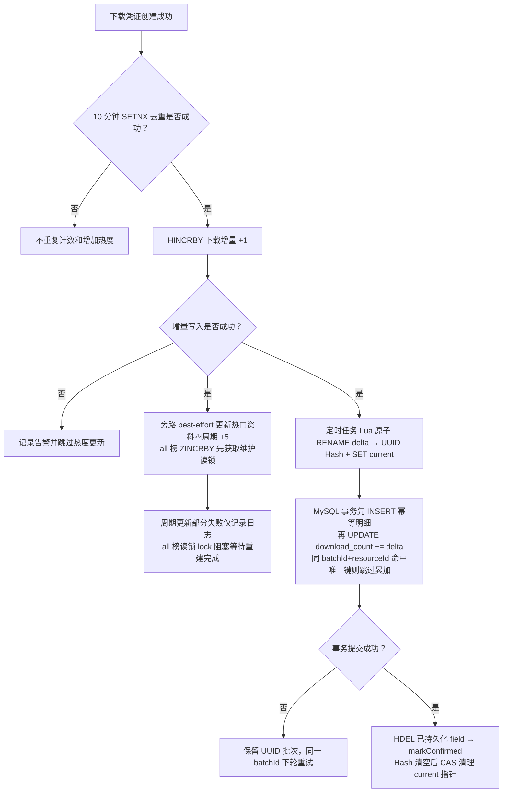
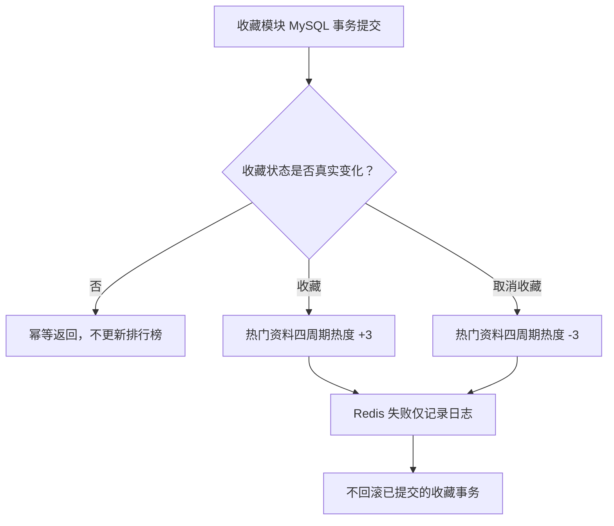
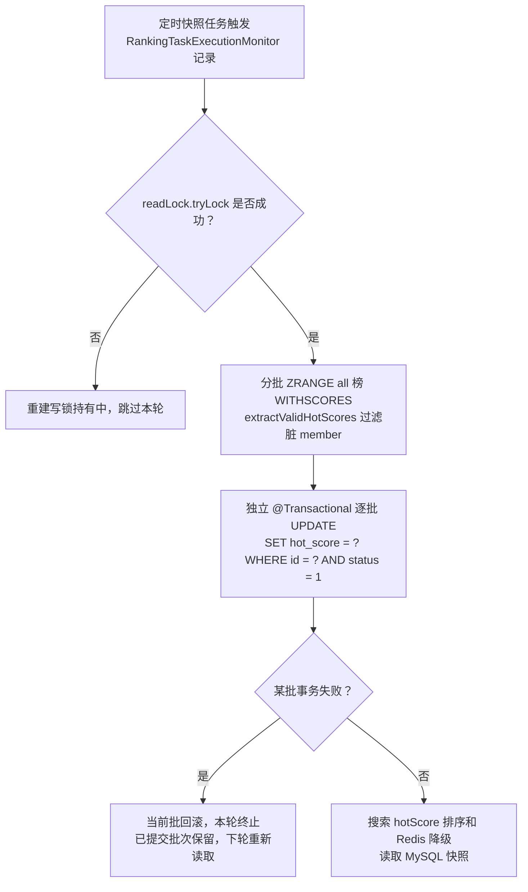
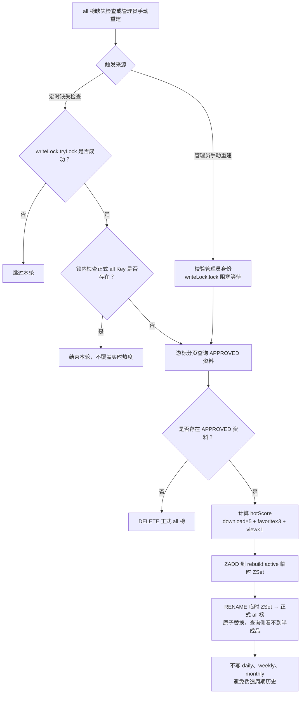

# 排行榜与定时任务模块开发流程文档

> 2026-07-14 补强迭代：先补齐排行榜 Mapper 的 H2 MySQL 模式集成测试，验证公开过滤、Redis 候选补齐、MySQL 热度兜底、主键游标扫描与热度快照写回；本步骤不修改接口、数据库表结构、Redis Key 或依赖。

> 补强 P2 计划：增加进程内任务执行监控，统一记录下载增量同步、all 榜缺失重建和热度快照三个调度入口的最近开始/结束时间、耗时及未捕获异常摘要；不新增 HTTP 接口、数据库表、Redis Key 或依赖。Service 已捕获并自行降级的可恢复异常仍以原有日志为准，监控状态只表示调度委派是否正常返回。

> 补强 P3：将下载增量同步从“至少一次”收敛为同一 Redis 隔离批次内的 MySQL 幂等累加。新增 UUID 批次指针、`download_delta_sync_item` 唯一幂等明细、可重复执行迁移和 H2 集成测试；不新增 HTTP 接口或依赖。升级前遗留 `syncing:active` 缺少历史幂等记录，必须在发布前排空或人工核对，当前版本会保留并停止自动处理以避免重复计数。

> 本文档遵循 `docs/AGENTS.md` 第 24 节《模块开发流程文档规范》生成。
> 当前状态：**步骤 1 至步骤 9、11、12 已完成；步骤 10 按用户要求跳过**。排行榜已具备查询、行为热度联动、下载增量同步、all 总榜缺失重建、热度快照和管理员手动重建能力。
> 补强 P1 已完成真实 Mapper 集成测试；补强 P2 已完成进程内最近任务执行快照与统一日志；补强 P3 已完成下载增量同步幂等化。当前未实现跨实例任务指标聚合、失败告警和幂等明细保留期清理。

---

## 1. 模块基本信息

| 项 | 内容 |
| --- | --- |
| 模块名称 | 排行榜与定时任务模块 |
| 英文标识 | rank |
| 文档路径 | `docs/modules/09-rank-development-process.md` |
| 当前分支 | `dev` |
| 当前状态 | 步骤 1 至 9、11、12 已完成；步骤 10 按用户要求跳过 |
| 前置依赖模块 | 资料、审核、搜索、下载、收藏模块 |
| 下游模块 | 首页热门资料展示、搜索框热门词展示、后台运营统计 |
| 接口前缀 | `/api/v1/rankings` |
| 主要技术 | Spring MVC、MyBatis、Redis ZSet/Hash/String、Spring Scheduling |

> 编号说明：`08-favorite-development-process.md` 已用于收藏模块，因此本模块使用 `09-`。

---

## 2. 模块目标

排行榜与定时任务模块负责把搜索、下载、收藏等高频行为产生的 Redis 数据转换为可查询的实时榜单，并把需要长期保存的统计增量和热度快照安全同步到 MySQL。

首版目标：

- 提供热门资料 Top N 公开查询接口，优先读取 Redis ZSet。
- 提供热门搜索词 Top N 公开查询接口，读取搜索模块已经维护的 Redis ZSet。
- 让有效下载、收藏、取消收藏等行为实时调整资料热度分。
- 使用定时任务把 `crp:stats:resource:download:delta` 中的下载增量批量同步到 `resource.download_count`。
- 定时把总榜热度分快照回写到 `resource.hot_score`，为 Redis 故障降级和搜索排序提供数据。
- 使用带所有权标识的 Redis 分布式锁，避免多实例重复执行同步任务。
- 对 Redis 查询异常提供明确降级，不让热门榜故障扩大到搜索、下载、收藏主流程。

本模块要体现的核心价值：排行榜不是对 MySQL 做一次 `ORDER BY`，而是**Redis ZSet 实时排序 + 行为增量更新 + MySQL 快照兜底 + 定时批量同步 + 分布式锁 + 最终一致性补偿**的组合设计。

---

## 3. 需求分析

1. 搜索模块已在搜索成功后写入 `crp:rank:search:keyword:{period}`，但缺少查询热门搜索词的接口。
2. 下载模块已把去重后的下载次数写入 `crp:stats:resource:download:delta`，并在去重和增量写入成功后为四周期资料榜增加 +5；下载增量尚未同步到 MySQL。
3. 收藏模块已维护 `resource.favorite_count`，并在 MySQL 提交后将真实收藏/取消收藏状态变化同步为四周期资料榜的 +3/-3。
4. `resource` 表已经存在 `download_count`、`favorite_count`、`view_count`、`hot_score` 字段和 `idx_resource_hot` 索引，无需新增表或字段。
5. 热门资料只允许展示 `status = 1` 的审核通过资料；Redis 中的下架、删除或失效成员必须在查询时过滤，并在状态变更时主动移除。
6. 热门资料支持 `daily`、`weekly`、`monthly`、`all` 四个周期；热门搜索词支持 `daily`、`weekly`、`monthly` 三个周期。
7. 热门资料接口支持可选 `categoryId`。当前 ZSet 是全局榜，不按分类拆 Key，因此首版需要从 ZSet 分段取候选 ID，再由 MySQL 校验状态和分类，并保持 Redis 分数顺序。
8. Redis 周期榜只代表模块上线后的行为增量，不能把 MySQL 历史总量伪装成日榜、周榜或月榜。首版只允许根据 MySQL 统计快照重建 `all` 总榜；其他周期榜从新行为开始累计。
9. 下载增量同步必须避免“任务读取 Hash 后、删除字段前又产生新增量”导致计数丢失。首版应先把待同步数据原子隔离到 syncing Key，再执行 MySQL 事务。
10. Redis 不是 MySQL 事务的一部分。同步失败时不能删除待同步批次，必须保留或合并回增量 Key，等待下一轮重试。

为什么不是简单 CRUD：本模块同时处理实时榜单、周期统计、高频计数削峰、分布式任务互斥、跨 Redis/MySQL 的最终一致性、失败补偿和公开数据可见性过滤。

---

## 4. 本模块不做什么

- 首版不新增 Elasticsearch、RocketMQ 等依赖；下载增量同步使用 Redisson `RLock` 看门狗，其他 Redis 读写继续使用 `StringRedisTemplate`。
- 首版不新增排行榜快照表或搜索词快照表，只复用 `resource.hot_score`、`download_count` 等现有字段。
- 首版不实现热门课程榜、热门上传者榜、下载趋势报表等扩展榜单。
- 首版不实现浏览量采集；`view_count` 仅作为总榜重建公式中的已有字段使用。
- 首版不实现复杂时间衰减算法；周期榜通过独立 Key 与 TTL 控制时效，总榜使用行为权重累计。
- 首版不把 MySQL 历史总量写入 `daily`、`weekly`、`monthly` 榜单。
- 管理员手动重建仅针对 `all` 总榜，不提供管理员查询专属榜单，也不改变两个公开查询接口的可访问性。
- 首版不修改数据库表结构或既有接口路径；步骤 8 已按用户要求新增 Redisson 依赖。

---

## 5. 涉及接口

> 以下接口来自 `docs/api/api-reference.md` 第 9 节，均已实现。实际开发时如调整参数或返回结构，必须同步更新 API 文档和本文档。

### 5.1 获取热门资料排行榜

| 项 | 内容 |
| --- | --- |
| 方法 | `GET` |
| 路径 | `/api/v1/rankings/resources/hot` |
| 是否登录 | 否 |
| 权限要求 | 无，只返回审核通过资料 |
| 当前状态 | 已实现 |

查询参数：

| 参数 | 类型 | 必填 | 说明 |
| --- | --- | --- | --- |
| `limit` | int | 否 | 默认 10，范围 1～50 |
| `categoryId` | long | 否 | 分类 ID，必须大于 0 |
| `period` | string | 否 | `daily`、`weekly`、`monthly`、`all`，建议默认 `weekly` |

计划响应字段：

| 字段 | 类型 | 说明 |
| --- | --- | --- |
| `rank` | int | 当前返回结果中的名次，从 1 开始 |
| `resourceId` | long | 资料 ID |
| `title` | string | 资料标题 |
| `courseName` | string | 课程名称 |
| `downloadCount` | long | MySQL 下载总数快照 |
| `favoriteCount` | long | MySQL 收藏总数 |
| `hotScore` | decimal | Redis 实时分数；降级时为 MySQL `hot_score` |

处理约束：

- Redis 查询只提供候选 ID 和分数，资料标题、课程、统计字段仍从 MySQL 批量查询。
- 必须过滤非 `APPROVED` 资料，防止 Redis 脏成员导致下架资料重新公开。
- 有 `categoryId` 时按分类过滤，但最终顺序仍以 Redis 分数为主。
- Redis 不可用时降级查询 MySQL `resource.hot_score`；周期语义会退化为总榜快照，日志中应明确记录降级。

可能错误码：

| 错误码 | 场景 |
| --- | --- |
| `40001` | `limit`、`categoryId` 或 `period` 不合法 |
| `50001` | Redis 查询失败且 MySQL 兜底也失败 |

### 5.2 获取热门搜索词排行榜

| 项 | 内容 |
| --- | --- |
| 方法 | `GET` |
| 路径 | `/api/v1/rankings/search-keywords/hot` |
| 是否登录 | 否 |
| 权限要求 | 无 |
| 当前状态 | 已实现 |

查询参数：

| 参数 | 类型 | 必填 | 说明 |
| --- | --- | --- | --- |
| `limit` | int | 否 | 默认 10，范围 1～50 |
| `period` | string | 否 | `daily`、`weekly`、`monthly`，建议默认 `daily` |

计划响应字段：

| 字段 | 类型 | 说明 |
| --- | --- | --- |
| `rank` | int | 名次，从 1 开始 |
| `keyword` | string | 已归一化的搜索关键词 |
| `searchCount` | long | Redis ZSet 分数转换后的搜索次数 |

处理约束：

- 直接使用 `ZREVRANGE ... WITHSCORES` 获取 Top N。
- 热门搜索词属于可降级运营数据，Redis 不可用时返回空列表，不中断其他业务。
- 当前没有 MySQL 搜索词快照表，因此不得伪造 MySQL 兜底数据。

可能错误码：

| 错误码 | 场景 |
| --- | --- |
| `40001` | `limit` 或 `period` 不合法 |
| `50001` | 仅在项目最终决定不允许空列表降级时使用；实现前需统一 API 文档口径 |

---

## 6. 涉及数据库表

### 6.1 `resource` 资料表（本模块唯一直接使用的表）

本模块不新增、不修改表结构，复用以下真实字段：

| 字段 | 使用方式 |
| --- | --- |
| `id` | Redis ZSet member 与增量 Hash field 对应的资料 ID |
| `title` | 热门资料展示字段 |
| `category_id` | 热门资料分类过滤 |
| `course_name` | 热门资料展示字段 |
| `status` | 固定过滤 `STATUS_APPROVED = 1` |
| `view_count` | 总榜初始化/重建时的可选权重输入 |
| `download_count` | 定时接收 Redis 下载增量；榜单展示快照 |
| `favorite_count` | 热度计算输入；榜单展示快照 |
| `hot_score` | 总榜热度分快照与 Redis 故障兜底 |

已存在索引：

```text
idx_resource_hot (status, hot_score, download_count)
```

该索引支撑 MySQL 兜底查询：先固定 `status = 1`，再按 `hot_score`、`download_count` 排序。

### 6.2 其他表

- `download_record`：下载模块已写入下载记录，本模块首版不读取该表重算周期榜。
- `download_delta_sync_item`：本次新增的下载增量同步幂等明细；唯一键 `(batch_id, resource_id)` 与 `resource.download_count` 原子累加处于同一事务，Redis `HDEL` 失败重试时不重复累计。
- `favorite`：收藏关系由收藏模块维护，本模块首版不扫描该表重算历史周期榜。
- 排行榜快照表、搜索词快照表：本模块暂未涉及。

---

## 7. 涉及 Redis Key

### 7.1 已存在并已使用的 Key

| Key | 结构 | 当前状态 | 本模块用途 |
| --- | --- | --- | --- |
| `crp:rank:search:keyword:{period}` | ZSet | 搜索模块已写入 | 查询热门搜索词 Top N |
| `crp:stats:resource:download:delta` | Hash | 下载模块持续写入，步骤 8 已消费 | 原子隔离后定时同步下载量到 MySQL |

### 7.2 本模块使用的 Key

| Key | 结构 | TTL | 用途 |
| --- | --- | --- | --- |
| `crp:rank:resource:hot:daily` | ZSet | 2 天 | 日榜，实时 ZINCRBY 维护 |
| `crp:rank:resource:hot:weekly` | ZSet | 14 天 | 周榜，实时 ZINCRBY 维护 |
| `crp:rank:resource:hot:monthly` | ZSet | 60 天 | 月榜，实时 ZINCRBY 维护 |
| `crp:rank:resource:hot:all` | ZSet | 不设置 | 总榜，实时 ZINCRBY 维护；缺失时由重建恢复 |
| `crp:lock:sync:download-delta` | Redisson `RLock` | 看门狗自动续期 | 下载增量同步任务互斥锁（tryLock 不传 leaseTime） |
| `crp:stats:resource:download:syncing:{batchId}` | Hash | UUID 批次按 field 删除，失败时保留 | Lua 原子隔离后的待同步批次；旧 `active` 仅人工迁移 |
| `crp:stats:resource:download:syncing:current` | String | 不设置 TTL | 当前 UUID 批次指针，Hash 清空后 CAS 清理 |
| `crp:lock:sync:hot-rank-maintenance` | Redisson `RReadWriteLock` | 看门狗自动续期 | 重建持写锁（独占）；快照和实时 all 榜 ZINCRBY/ZREM 持读锁（共享） |
| `crp:rank:resource:hot:all:rebuild:active` | ZSet | 重建成功后 `RENAME` 为正式 all 榜 | all 总榜原子替换前的临时构建 Key |

> 步骤 2 已在 `RedisKeyConstants` 中补充热门资料榜、同步锁和 syncing 批次常量及格式化方法；补强 P3 已将新批次改为 Lua 原子 `RENAME` delta → UUID Hash + `SET` current 指针。升级前遗留的固定 `syncing:active` 批次因无历史幂等记录，当前版本仅告警保留并要求发布前排空或人工核对。

### 7.3 热度权重与更新时机

首版权重沿用 `docs/05-redis-design.md`：

| 行为 | 分数变化 | 周期 |
| --- | --- | --- |
| 审核通过 | `ZADD 0` | daily / weekly / monthly / all |
| 有效下载（通过 10 分钟去重） | `ZINCRBY +5` | daily / weekly / monthly / all |
| 收藏成功（非幂等重复） | `ZINCRBY +3` | daily / weekly / monthly / all |
| 取消收藏（真实状态 1→0） | `ZINCRBY -3` | daily / weekly / monthly / all |
| 下架或删除 | `ZREM` | daily / weekly / monthly / all |

浏览 `+1` 本模块首版暂未涉及，因为当前资料详情模块尚未实现浏览去重和浏览量统计。

### 7.4 一致性与降级

- 热门资料 ZSet 是实时数据源，`resource.hot_score` 是总榜快照和 MySQL 兜底。
- 热门搜索词只属于运营数据；Redis 丢失不影响搜索主流程。
- 行为热度更新失败时记录日志并降级，不回滚已经成功的下载或收藏主业务。
- 下载增量 Hash 不设置 TTL；只有 MySQL 事务成功后才允许删除对应 syncing 字段。MySQL 中的唯一幂等记录与下载量累加同事务提交，重试同一批次只会确认 Redis。
- 下载增量同步锁由 Redisson `RLock` 管理，获取时不指定 leaseTime 以启用看门狗自动续期；仅持锁线程可调用 `unlock`。

---

## 8. 涉及核心类

### 8.1 复用已存在类（真实存在）

| 类型 | 类 | 作用 |
| --- | --- | --- |
| common | `ApiResponse` | 统一接口响应 |
| common | `ErrorCode` | 使用 `PARAM_ERROR(40001)`、`SERVER_ERROR(50001)` |
| common | `RedisKeyConstants` | 已有热门搜索词、下载增量、热门资料榜、同步锁和 syncing 批次 Key |
| entity | `Resource` | 已含状态、下载数、收藏数、浏览数、热度分字段 |
| mapper | `ResourceMapper` + XML | 已提供候选资料批量查询、MySQL 热度兜底、下载量原子累加和热度快照更新 SQL |
| service/impl | `SearchServiceImpl` | 已写入三周期热门搜索词 ZSet |
| service/impl | `DownloadServiceImpl` | 已完成下载去重和下载增量 `HINCRBY` |
| service/impl | `FavoriteServiceImpl` | 已维护收藏状态和 `favorite_count` |
| service/impl | `AuditServiceImpl` | 已实现审核通过、下架状态流转，后续联动榜单初始化/移除 |
| config | `WebMvcConfig` | 已放行 `/api/v1/rankings/**`，接口可匿名访问 |
| application | `CampusResourcePlatformApplication` | 步骤 8 已启用 `@EnableScheduling` |

### 8.2 本模块新增或计划新增类

以下表格通过“状态”区分真实实现与开发计划；实现时如有调整，必须以真实代码回写本文档。

| 类型 | 类/文件 | 职责 | 状态 |
| --- | --- | --- | --- |
| enums | `RankingPeriod` | 集中定义周期白名单、Key 后缀、TTL 和热词周期边界 | 已实现 |
| dto | `HotResourceRankingQueryDTO` | 接收 `limit`、`categoryId`、`period` | 已实现 |
| dto | `HotSearchKeywordRankingQueryDTO` | 接收 `limit`、`period` | 已实现 |
| vo | `HotResourceRankingVO` | 热门资料榜单项 | 已实现 |
| vo | `HotSearchKeywordRankingVO` | 热门搜索词榜单项 | 已实现 |
| service | `RankingService` | 热门资料、热门搜索词查询及下载/收藏/审核热度行为入口 | 已实现 |
| service/impl | `RankingServiceImpl` | ZSet 查询、MySQL 补齐、公开状态过滤、降级和四周期热度增减 | 已实现 |
| controller | `RankingController` | 两个公开只读接口入口 | 已实现 |
| mapper | `ResourceMapper` + XML | 已新增热门榜候选补齐、MySQL 兜底、下载增量和热度快照更新 SQL | 已实现 |
| service | `DownloadDeltaSyncService` | 定义一次下载增量同步业务 | 已实现 |
| service | `DownloadDeltaPersistenceService` | 定义独立的事务性 MySQL 下载计数持久化业务 | 已实现 |
| mapper | `DownloadDeltaSyncItemMapper` + XML | 写入、校验并确认下载同步幂等明细 | 已实现 |
| service/impl | `DownloadDeltaSyncServiceImpl` | 锁、批次隔离、限批、成功确认和失败保留 | 已实现 |
| service/impl | `DownloadDeltaPersistenceServiceImpl` | 通过 Spring 代理执行 MySQL 原子累加事务 | 已实现 |
| task | `RankingSyncTask` | 按计划触发下载增量同步，不承载锁或事务细节 | 已实现 |
| service | `HotRankingMaintenanceService` | 定义 all 总榜缺失重建、显式重建与热度快照入口 | 已实现 |
| service | `AdminRankingService` | 校验管理员身份后委派 all 总榜手动重建 | 已实现 |
| service | `HotScoreSnapshotPersistenceService` | 定义独立的事务性 `hot_score` 快照持久化边界 | 已实现 |
| service/impl | `HotRankingMaintenanceServiceImpl` | Redisson 锁、游标分页、临时 ZSet 原子替换和分批快照编排 | 已实现 |
| service/impl | `AdminRankingServiceImpl` | 管理员角色校验与重建委派 | 已实现 |
| service/impl | `HotScoreSnapshotPersistenceServiceImpl` | 通过 Spring 代理分批写入 APPROVED 资料热度快照 | 已实现 |
| task | `HotRankingMaintenanceTask` | 定时检查 all 榜缺失并重建，定时触发热度快照 | 已实现 |
| controller | `AdminRankingController` | `POST /api/v1/admin/rankings/resources/hot/rebuild` 管理员手动重建入口 | 已实现 |
| config/application | 启动类、`application.yaml` 与 `RedissonConfig` | 启用 Spring Scheduling，集中配置频率、单批上限与 Redisson 看门狗超时 | 已实现 |
| test | `RankingPeriodTest` | 校验周期 TTL、热词边界与排行榜 Key 格式 | 已实现 |
| test | `RankingControllerTest`、`AdminRankingControllerTest`、`RankingServiceImplTest`、`AdminRankingServiceImplTest`、`DownloadDeltaSyncServiceImplTest`、`DownloadDeltaPersistenceServiceImplTest`、`DownloadDeltaPersistenceDatabaseIntegrationTest`、`HotRankingMaintenanceServiceImplTest`、`HotScoreSnapshotPersistenceServiceImplTest`、`RankingMapperIntegrationTest`、`RankingTaskExecutionMonitorTest`、`HotRankingMaintenanceTaskTest` 等 | 已覆盖接口、管理员权限、热度行为、下载同步 UUID/旧批次兼容、HDEL 失败重试幂等、真实 Mapper SQL、总榜重建、任务委派与最近执行快照 | 已实现 |

> 项目现有约定要求 Spring Service 使用“接口 + 实现”。定时任务只负责触发，带事务的同步逻辑必须放入独立 Service，由 Spring 代理调用，避免同类自调用导致事务失效。

---

## 9. 模块内部调用关系

```text
RankingController
  ├── GET /rankings/resources/hot
  │     └── RankingService.listHotResources(query)
  │           ├── Redis ZREVRANGE crp:rank:resource:hot:{period} WITHSCORES
  │           ├── ResourceMapper 批量查询 APPROVED 候选资料
  │           ├── 按 categoryId 过滤并恢复 Redis 排名顺序
  │           └── Redis 异常时 ResourceMapper 查询 hot_score 兜底
  │
  └── GET /rankings/search-keywords/hot
        └── RankingService.listHotSearchKeywords(query)
              └── Redis ZREVRANGE crp:rank:search:keyword:{period} WITHSCORES

AdminRankingController
  └── POST /admin/rankings/resources/hot/rebuild
        └── AdminRankingService.rebuildAllHotRanking()
              ├── 校验管理员身份（非管理员 → 40301）
              └── HotRankingMaintenanceService.rebuildAllHotRanking()
                    └── 写锁 lock() 阻塞等待 → 无条件执行完整重建

DownloadServiceImpl（有效下载）
  └── RankingService.increaseForDownload(resourceId) → 四周期 ZINCRBY +5
        └── all 榜 ZINCRBY 先获取维护读锁（lock 阻塞等待重建完成）

FavoriteServiceImpl（事务提交成功后）
  ├── RankingService.increaseForFavorite(resourceId) → 四周期 ZINCRBY +3
  │     └── all 榜 ZINCRBY 先获取维护读锁
  └── RankingService.decreaseForFavorite(resourceId) → 四周期 ZINCRBY -3
        └── all 榜 ZINCRBY 先获取维护读锁

AuditServiceImpl（MySQL 状态事务提交后）
  ├── 审核通过 → RankingService.initializeApprovedResource(resourceId)
  └── 下架 → RankingService.removeResource(resourceId)

RankingSyncTask（定时 60s fixed-delay）
  └── DownloadDeltaSyncService.syncDownloadDeltas()
        ├── Redisson RLock.tryLock()（不传 leaseTime，启用看门狗）
        ├── 优先恢复 current 指向的 UUID 批次；否则 Lua 原子 RENAME delta → UUID Hash + SET current
        ├── 检测 legacy syncing:active → 告警保留，不自动处理
        ├── DownloadDeltaPersistenceService.persistDownloadDeltas(batchId, deltas)
        │     ├── 逐条 INSERT 幂等明细 (batchId, resourceId, delta)
        │     └── UPDATE resource SET download_count = download_count + delta
        │     └── 同 batchId + resourceId 命中唯一键 → 校验 delta 一致后跳过累加
        ├── MySQL 事务成功后 HDEL 已持久化 field → markDownloadDeltasConfirmed
        ├── Hash 清空后 CAS 清理 current 指针
        ├── 事务失败 → 保留 UUID 批次，同一 batchId 下轮重试
        └── 仅当前持锁线程调用 Redisson unlock

HotRankingMaintenanceTask（定时 5min fixed-delay）
  ├── HotRankingMaintenanceService.rebuildAllHotRankingIfMissing()
  │     ├── RankingTaskExecutionMonitor 记录执行快照
  │     ├── Redisson RReadWriteLock.writeLock().tryLock()（不等待）
  │     ├── 锁内二次检查 all Key 是否存在
  │     ├── ResourceMapper.selectApprovedResourcesAfterId 主键游标分页
  │     ├── 按 download×5 + favorite×3 + view×1 写入临时 ZSet rebuild:active
  │     └── RENAME 临时 ZSet → 正式 all 榜
  │
  └── HotRankingMaintenanceService.snapshotAllHotScores()
        ├── RankingTaskExecutionMonitor 记录执行快照
        ├── Redisson RReadWriteLock.readLock().tryLock()（不等待；重建持有写锁时跳过）
        ├── 分批 ZRANGE all 榜 WITHSCORES
        ├── extractValidHotScores 过滤脏 member
        └── HotScoreSnapshotPersistenceService.persistApprovedHotScores(map)
              └── @Transactional 逐批 UPDATE resource SET hot_score = ? WHERE id = ? AND status = 1
```

---

## 10. 请求处理流程

### 10.1 热门资料排行榜

1. Controller 绑定并校验 `limit`、`categoryId`、`period`。
2. Service 根据周期生成 `crp:rank:resource:hot:{period}`。
3. 从 ZSet 按分数倒序分段获取候选 `resourceId + score`。
4. 批量查询 MySQL，固定过滤 `status = 1`，可选过滤 `category_id`。
5. 移除不存在、下架、删除或分类不匹配的资料。
6. 按 Redis 候选顺序组装 `HotResourceRankingVO`，直到达到 `limit` 或候选耗尽。
7. Redis 访问失败时调用 MySQL `hot_score` 兜底查询。
8. 返回 `ApiResponse<List<HotResourceRankingVO>>`。

### 10.2 热门搜索词排行榜

1. Controller 校验 `limit`、`period`。
2. Service 读取 `crp:rank:search:keyword:{period}` Top N 和 score。
3. 过滤空白 member，按返回顺序生成名次。
4. Redis 不可用时记录日志并返回空列表。
5. 返回统一响应。

---

## 11. 数据流转流程

### 11.1 下载行为到排行榜



### 11.2 收藏行为到排行榜



### 11.3 热度快照



### 11.4 总榜初始化/重建



> 重建期间实时 all 榜 ZINCRBY/ZREM 通过读锁 `lock()` 阻塞等待；快照通过读锁 `tryLock()` 跳过本轮。重建完成后实时写入和快照立即操作新 Key。

---

## 12. 权限校验

- 两个排行榜接口均为公开只读接口，不要求登录。
- `WebMvcConfig` 当前已放行 `/api/v1/rankings/**`，无需再次修改放行规则，除非真实接口路径发生变化。
- 即使接口公开，Service/Mapper 仍必须固定过滤 `resource.status = 1`，不能依赖前端传状态。
- 定时任务没有 HTTP 入口，不从用户上下文取身份。
- 管理员手动重建接口 `POST /api/v1/admin/rankings/resources/hot/rebuild` 要求管理员权限（`AdminRankingService` 校验 + Controller `@AdminOnly`）。

---

## 13. 参数校验

| 参数 | 规则 |
| --- | --- |
| `limit` | 空值使用默认值；必须在 1～50 之间 |
| `categoryId` | 可空；非空时必须大于 0 |
| 热门资料 `period` | `daily`、`weekly`、`monthly`、`all` |
| 热门搜索词 `period` | `daily`、`weekly`、`monthly`，不允许 `all` |

校验原则：

- DTO 使用 Bean Validation 完成基础校验。
- Service 对默认值和周期白名单进行兜底校验，保证直接调用 Service 时仍安全。
- 周期不能直接拼接任意 Redis Key，必须先映射为 `RankingPeriod` 白名单。
- ZSet member 转换为 `Long resourceId` 失败时视为脏数据，跳过并记录告警，不能导致整个榜单失败。

---

## 14. 异常处理

| 场景 | 处理策略 |
| --- | --- |
| 查询参数非法 | 抛 `BusinessException(ErrorCode.PARAM_ERROR)` |
| 热门资料 Redis 查询失败 | 记录日志，降级 MySQL `hot_score` 查询 |
| 热门资料 Redis 与 MySQL 都失败 | 抛 `BusinessException(ErrorCode.SERVER_ERROR)` 或交全局异常处理 |
| 热门搜索词 Redis 查询失败 | 记录日志，返回空列表 |
| ZSet 存在非法资料 ID | 跳过该 member 并记录告警 |
| ZSet 存在下架/删除资料 | 查询时过滤；异步清理脏 member |
| 行为热度写 Redis 失败 | 记录日志，不中断下载、收藏、审核主流程 |
| 未获取同步锁 | 本轮任务直接跳过，不视为业务异常 |
| 下载增量 MySQL 同步失败 | 事务回滚，保留或恢复 syncing 批次，等待重试 |
| 锁长时间持有或释放失败 | Redisson 看门狗在客户端存活时续期；释放失败记录告警，客户端失活后停止续期并自动过期 |

---

## 15. 事务处理

### 15.1 排行榜查询

只读查询不需要业务事务。

### 15.2 行为热度联动

- 下载、收藏、审核的 MySQL 主事务不能与 Redis 强行组成单体事务。
- 收藏/取消收藏必须在 MySQL 事务真实提交后再更新热度，避免回滚操作污染榜单。
- Redis 更新失败采用最终一致性和后续重建，不回滚用户主操作。

### 15.3 下载增量同步

- `RankingSyncTask` 只触发 `DownloadDeltaSyncService`，事务方法由 Spring 代理调用。
- 单个 syncing 批次内的 MySQL 下载量累加应使用 `@Transactional(rollbackFor = Exception.class)`。
- MySQL 更新使用 `download_count = download_count + delta`，禁止先查后改。
- MySQL 事务提交成功后才能删除 syncing Key。
- MySQL 事务失败时不得删除 UUID syncing Key；下一轮任务先恢复 current 指向的 UUID 批次，再处理新 delta。旧 `syncing:active` 因无法确认历史落库状态，只能发布前排空或人工核对，当前版本不得自动重试。
- Redis 与 MySQL 不具备原子提交能力，因此必须通过批次隔离、幂等边界和失败补偿实现最终一致性。

---

## 16. 核心实现步骤

1. 生成排行榜模块开发流程文档初稿（本步已完成）。
2. 补充排行榜 Redis Key 常量、周期枚举和 TTL 统一定义。
3. 创建排行榜查询 DTO 与 VO。
4. 为 `ResourceMapper` 补充候选资料批量查询、MySQL 兜底、下载量累加和热度快照 SQL。
5. 实现 `RankingService` 与 `RankingServiceImpl`，完成两个榜单查询及 Redis 降级。
6. 实现 `RankingController` 两个公开接口。
7. 接入下载、收藏、审核状态变化的热门资料 ZSet 联动。
8. 实现下载增量 syncing 批次、分布式锁与定时同步。
9. 实现总榜初始化/重建和 `resource.hot_score` 定时快照。
10. 补充 Controller、Service、Mapper、Redis 降级和定时任务测试。
11. 同步 API、Redis、进度、README、数据库变更日志等文档。
12. 根据真实代码更新本开发流程文档。

---

## 17. 开发任务拆分

| 序号 | 任务 | 主要产出 | 状态 |
| --- | --- | --- | --- |
| T1 | 模块文档初稿 | `09-rank-development-process.md` | 已完成 |
| T2 | Redis 常量与周期模型 | `RedisKeyConstants`、`RankingPeriod`、`RankingPeriodTest` | 已完成（`090c58f`） |
| T3 | DTO / VO | 两个查询 DTO、两个榜单 VO、`RankingQueryDTOTest` | 已完成（`d28ecb8`） |
| T4 | Mapper 能力 | 榜单补齐/兜底、下载增量、热度快照 SQL | 已完成（`b4b7bbe`） |
| T5 | 排行榜 Service | 两榜查询、状态过滤、降级、`RankingServiceImplTest` | 已完成（`fc62f5e`） |
| T6 | 排行榜 Controller | 两个公开 GET 接口 | 已完成（`c2ab537`） |
| T7 | 行为热度联动 | 下载 +5、收藏 ±3、审核初始化/下架移除 | 已完成（`295b0db`） |
| T8 | 下载增量定时同步 | syncing 批次、锁、事务、补偿 | 已完成（`1dd8e10`） |
| T9 | 总榜初始化与热度快照 | all 榜重建、`hot_score` 回写 | 已完成（`45c26ca`） |
| T10 | 专项测试 | Controller/Service/Mapper/Task 测试 | 已跳过（用户要求） |
| T11 | 文档同步 | API、Redis、进度、README 等 | 已完成（`6973a59`） |
| T12 | 流程文档回写 | 根据真实实现更新本文档 | 已完成（`7bdb765`） |

每完成一个任务，必须先运行对应测试；通过后立即 `git add`、`git commit`、`git push` 到当前开发分支，并在本文档记录真实 commit id。

---

## 18. 已完成事项

- 已检查当前分支为 `dev`，任务开始时工作区干净并与 `origin/dev` 同步。
- 已阅读根目录 `AGENTS.md` 和 `docs/AGENTS.md`。
- 已读取 `docs/06-project-progress.md`，确认排行榜与定时任务是当前推荐开发模块。
- 已核对 `docs/01-requirements.md`、`docs/02-business-flow.md` 中的排行榜业务目标。
- 已核对 `docs/database/database-design.md` 与 `sql/init.sql`，确认 `resource` 已具备统计和热度字段及兜底索引。
- 已核对 `docs/api/api-reference.md` 第 9 节，确认两个排行榜设计接口。
- 已核对 `docs/05-redis-design.md`，确认热门资料、热门搜索词、下载增量、TTL 与一致性策略。
- 已核对真实代码：搜索热词写入和下载增量写入已实现；热门资料榜、查询接口、定时同步和分布式锁尚未实现。
- 已核对 `WebMvcConfig` 已放行 `/api/v1/rankings/**`，启动类尚未启用调度。
- 【步骤 1】已生成本开发流程文档初稿；未修改任何代码。
- 【步骤 2】已在 `RedisKeyConstants` 新增 `RESOURCE_HOT_RANK`、`DOWNLOAD_DELTA_SYNCING`、`DOWNLOAD_DELTA_SYNC_LOCK` 及对应格式化方法。
- 【步骤 2】已新增 `RankingPeriod`，统一维护 `daily`、`weekly`、`monthly`、`all` 编码、2/14/60 天 TTL 和热门搜索词不支持 `all` 的边界。
- 【步骤 2】已新增 `RankingPeriodTest`，4 个针对性用例全部通过；全量 53 个测试通过。
- 【步骤 2】功能提交为 `090c58f feat(rank): add ranking redis keys and period model`，已推送到 `origin/dev`。
- 按用户要求，工作区原有的 `FavoriteServiceImpl` 事务注释已原样单独提交为 `9d93fbb chore(favorite): clarify duplicate key rollback flow` 并推送。
- 【步骤 3】已新增热门资料、热门搜索词查询 DTO；`limit` 校验为 1～50，热门资料 `categoryId` 非空时必须大于 0。
- 【步骤 3】已新增两个榜单 VO，只包含 API 文档约定的公开展示字段，不返回 `Resource` Entity。
- 【步骤 3】默认 `limit` 和 `period` 白名单未放入 DTO，后续由 `RankingService` 与 `RankingPeriod` 统一兜底。
- 【步骤 3】已新增 `RankingQueryDTOTest`，3 个针对性用例全部通过；全量 56 个测试通过。
- 【步骤 3】功能提交为 `d28ecb8 feat(rank): add ranking query DTOs and VOs`，已推送到 `origin/dev`。
- 【步骤 4】已新增 `selectApprovedRankingCandidatesByIds`：候选 ID 批量查询固定过滤 `status = 1`，并支持可选 `categoryId`；Redis 排名顺序留给后续 Service 恢复。
- 【步骤 4】已新增 `selectHotApprovedResources`：MySQL 兜底固定按 `hot_score DESC, download_count DESC, id DESC` 排序，且不接受前端原始排序字段。
- 【步骤 4】已新增 `incrementDownloadCount` 与 `updateApprovedHotScore` 原子 SQL；热度快照仅写入仍为 APPROVED 的资料。
- 【步骤 4】按用户要求未新增或修改测试代码；既有 `ResourceDatabaseIntegrationTest` 9 个用例和全量 56 个既有用例均通过，新增 SQL 的专项覆盖待后续允许时补充。
- 【步骤 4】功能提交为 `b4b7bbe feat(rank): add ranking and statistics mapper queries`，已推送到 `origin/dev`。
- 【步骤 5】已新增 `RankingService` 与 `RankingServiceImpl`，热门资料默认周榜、热门搜索词默认日榜；Service 对 limit、categoryId 和 period 再次校验，防止绕过 Controller。
- 【步骤 5】热门资料榜从 Redis ZSet 分段扫描候选 ID，批量查 MySQL 后固定过滤 APPROVED 与可选分类，并按 Redis 分数顺序恢复连续名次；最多扫描 500 个候选成员，避免脏数据导致无限扫描。
- 【步骤 5】热门资料 Redis 缺失或异常时降级 MySQL `hot_score` 快照；热门搜索词 Redis 缺失或异常时返回空列表，不中断其他业务。
- 【步骤 5】已新增 `RankingServiceImplTest`，6 个针对性用例覆盖参数校验、顺序恢复、脏成员补足、MySQL 降级和热词异常降级；全量 62 个测试通过。
- 【步骤 5】功能提交为 `fc62f5e feat(rank): implement ranking service`，已推送到 `origin/dev`。
- 【步骤 6】已新增 `RankingController`，提供 `GET /api/v1/rankings/resources/hot` 和 `GET /api/v1/rankings/search-keywords/hot` 两个公开只读接口；Controller 仅负责参数绑定、`@Valid` 校验、调用 `RankingService` 和封装 `ApiResponse`。
- 【步骤 6】复用 `WebMvcConfig` 已存在的 `/api/v1/rankings/**` 匿名放行规则，未新增鉴权、Redis、Mapper 或定时任务逻辑。
- 【步骤 6】已新增 `RankingControllerTest`，4 个针对性用例覆盖匿名访问、查询参数绑定和非法 `limit` 的提前校验；全量 66 个测试通过。
- 【步骤 6】功能提交为 `c2ab537 feat(rank): add ranking query endpoints`，已推送到 `origin/dev`。
- 【步骤 7】`RankingService` 与 `RankingServiceImpl` 已新增下载、收藏、取消收藏、审核通过初始化和下架移除五类热度行为；下载 +5、收藏 ±3 的权重集中维护在排行榜模块，四个周期 ZSet 同步更新。
- 【步骤 7】下载仅在既有 SETNX 去重与下载增量 Hash 写入都成功后增加热度；收藏仅在真实状态变更且 MySQL 事务提交后增加或扣减热度，重复收藏和重复取消均不会重复计分。
- 【步骤 7】审核通过和下架通过 `TransactionSynchronization.afterCommit` 更新排行榜成员，避免 MySQL 回滚时出现错误的 Redis 榜单状态；所有 Redis 热度异常只记录日志，不影响已成功的下载、收藏或审核主流程。
- 【步骤 7】已新增下载、收藏、审核热度联动测试，并扩展排行榜 Service 测试；19 个针对性测试和全量 79 个测试均通过。
- 【步骤 7】功能提交为 `295b0db feat(rank): connect resource behavior heat updates`，已推送到 `origin/dev`。
- 【步骤 8】已新增 `DownloadDeltaSyncService`、`DownloadDeltaPersistenceService` 及其实现；同步任务先处理遗留的 `syncing:active`，否则通过 Redis `RENAME` 将实时 delta 原子隔离为该批次，新下载继续写入新的 delta Hash。
- 【步骤 8】已使用 Redisson `RLock.tryLock()` 防止多实例重复同步；不传 leaseTime 以启用看门狗，避免长批次因固定 TTL 到期而被其他实例并发处理。MySQL 原子累加由独立的 `@Transactional` 持久化 Service 执行，持久化失败时不删除 syncing 批次。
- 【步骤 8】已新增仅负责触发的 `RankingSyncTask`，并在启动类启用 Scheduling；`application.yaml` 已集中配置 60 秒 fixed-delay、每批最多 500 条和 30 秒 Redisson 看门狗超时。新增 Redisson 依赖，不新增接口或表结构。
- 【步骤 8】已新增下载同步、持久化和任务触发测试；8 个步骤 8 针对性测试及全量 87 个测试均通过。功能提交为 `1dd8e10 feat(rank): sync download deltas with distributed lock`，已推送到 `origin/dev`。
- 【步骤 8】已将原生 `SET NX + Lua` 锁替换为 Redisson `RLock`：同步服务调用无 leaseTime 的 `tryLock()` 启用看门狗，持锁客户端存活时自动续期；任务增加 `enabled` 开关，测试环境关闭真实调度以避免连接外部 Redis。重构提交为 `c132d03 refactor(rank): use redisson watchdog for download sync lock`，已推送到 `origin/dev`。
- 【步骤 9】已新增 `HotRankingMaintenanceService`：仅当 all 榜缺失时，按主键游标分批读取 APPROVED 资料，以 `download*5 + favorite*3 + view*1` 计算分数，构建临时 ZSet 后通过 `RENAME` 原子替换正式 all 榜；日、周、月榜不使用历史统计重建。
- 【步骤 9】已新增 `HotScoreSnapshotPersistenceService`：从 Redis all 榜分批读取分数，在独立 `@Transactional` Service 中调用带 `status = 1` 条件的 SQL 回写 `resource.hot_score`；下架或删除资料不会被后台任务重新写入快照。
- 【步骤 9】已新增总榜维护看门狗锁、5 分钟重建检查/快照任务及 7 个针对性测试；专项测试 7 个、全量 94 个测试均通过。功能提交为 `45c26ca feat(rank): rebuild all ranking and persist score snapshots`，已推送到 `origin/dev`。
- 【步骤 10】按用户明确要求跳过；未新增排行榜 Mapper 集成测试或其他测试代码。步骤 9 已完成的 7 个专项测试和全量 94 个测试仍为当前真实验证记录。
- 【步骤 11】已同步 API、Redis、项目进度、README 和数据库变更记录；明确复用既有 `resource` 表，无生产数据库结构变更。提交为 `6973a59 docs(rank): sync ranking module documentation`，已推送到 `origin/dev`。
- 【步骤 12】已基于当前真实代码更新本流程文档的状态、调用关系、事务/一致性边界、测试记录、文件记录、待办事项和提交记录；提交为 `7bdb765 docs(rank): finalize ranking process status`，已推送到 `origin/dev`。
- 【补强 P1】已新增 `RankingMapperIntegrationTest`，在 H2 MySQL 模式执行真实 `ResourceMapper.xml`，覆盖 Redis 候选补齐的 APPROVED/分类过滤、MySQL 热度兜底固定排序、主键游标扫描与仅 APPROVED 资料可写入热度快照。
- 【补强 P2】已新增 `RankingTaskExecutionMonitor`，以进程内不可变快照记录下载增量同步、all 榜缺失重建和热度快照三个调度入口的最近开始/结束时间、耗时与未捕获异常类型，并在任务委派正常返回或异常抛出时输出统一日志。快照仅代表调度层的委派结果；Service 自行捕获并降级的 Redis 等可恢复异常仍以原有业务日志为准。
- 【补强 P3】已新增 `download_delta_sync_item` 表、可重复迁移、`DownloadDeltaSyncItemMapper` 和 H2 集成测试。同步任务以 Lua 原子写入 UUID batch Hash 与 current 指针；同一 `(batchId, resourceId)` 的幂等记录插入与 `resource.download_count` 累加在同一事务中，`HDEL` 失败后重试不重复累计。旧 `syncing:active` 没有历史幂等记录，当前版本将其保留并要求发布前排空或人工核对，不能伪装为可安全自动重试。

---

## 19. 待完成事项

- 已具备单实例最近执行快照和统一耗时/未捕获异常日志；尚未实现跨实例指标聚合、历史持久化、管理员查询接口、失败告警和遗留 `syncing` 批次监控。
- 在实现前统一 `docs/api/api-reference.md` 中 Redis Key 示例的旧前缀写法，最终以 `crp:` 规范和 `RedisKeyConstants` 为准。
- 已实现同一 Redis 隔离批次的 MySQL 幂等累加；幂等明细本次不做自动清理，后续需要基于 `confirmed_at` 设计保留期与归档策略。
- 确定热门搜索词 Redis 故障时“返回空列表”与 API 文档 `50001` 描述的最终口径。

---

## 20. 测试清单

### 20.1 热门资料接口

| 场景 | 预期结果 |
| --- | --- |
| 默认参数查询 | 返回默认周期 Top 10 |
| `daily/weekly/monthly/all` | 读取正确 Key |
| `limit=1/50` | 边界值成功 |
| `limit=0/51` | 返回 `40001` |
| `categoryId` 合法 | 只返回指定分类资料 |
| `categoryId<=0` | 返回 `40001` |
| ZSet 含下架/不存在资料 | 过滤脏成员并补足后续候选 |
| 相同 score | 返回顺序稳定且名次连续 |
| Redis 不可用 | 降级 MySQL `hot_score` 查询 |
| Redis 与 MySQL 都失败 | 返回统一服务端错误 |

### 20.2 热门搜索词接口

| 场景 | 预期结果 |
| --- | --- |
| daily/weekly/monthly | 读取正确热词 Key |
| period=all | 返回 `40001` |
| ZSet 为空 | 返回空列表 |
| 含空白 member | 跳过非法项 |
| Redis 不可用 | 按最终约定返回空列表并记录日志 |

### 20.3 行为热度联动

| 场景 | 预期结果 |
| --- | --- |
| 首次有效下载 | 四周期各 +5 |
| 10 分钟去重期内重复下载 | 不重复增加热度 |
| 新收藏 | 四周期各 +3 |
| 幂等重复收藏 | 不重复增加热度 |
| 取消有效收藏 | 四周期各 -3，不能重复扣减 |
| 审核通过 | 四周期初始化 member |
| 下架资料 | 四周期移除 member |
| Redis 异常 | 主业务成功，记录降级日志 |

### 20.4 下载增量定时同步

| 场景 | 预期结果 |
| --- | --- |
| delta 为空 | 安全结束，不更新 MySQL |
| 正常批次 | `download_count += delta`，成功后删除 syncing |
| 同步期间产生新下载 | 新增量留在 delta，不被旧批次删除 |
| MySQL 中途失败 | 整批事务回滚，syncing 保留/恢复 |
| 未获取锁 | 本实例跳过，不重复同步 |
| 锁过期后被其他实例获取 | 当前实例不能删除新 owner 的锁 |
| 遗留 syncing 批次 | 下一轮优先恢复或继续处理 |

### 20.5 总榜初始化与热度快照

| 场景 | 预期结果 |
| --- | --- |
| all 榜缺失 | 从 APPROVED 资料统计字段重建 |
| 存在下架资料 | 不进入重建结果 |
| 周期榜缺失 | 不用历史总量伪造周期榜 |
| 快照同步成功 | `resource.hot_score` 与 all 榜一致 |
| 快照同步失败 | MySQL 事务回滚，Redis 榜不受影响 |
| 重建与实时 all 榜写入并发 | 重建持写锁；实时 `ZINCRBY`/`ZREM` 持读锁并等待重建 `RENAME` 完成，再操作新总榜 |
| 普通用户调用手动重建 | Service 返回 `40301`，不调用总榜维护服务 |

### 20.6 计划测试命令

```powershell
cd campus-resource-platform
.\mvnw.cmd -DskipTests compile
.\mvnw.cmd -Dtest=RankingControllerTest test
.\mvnw.cmd -Dtest=RankingServiceImplTest test
.\mvnw.cmd -Dtest=RankingServiceDatabaseIntegrationTest test
.\mvnw.cmd -Dtest=DownloadDeltaSyncServiceTest test
.\mvnw.cmd test
```

已执行测试记录：

| 命令 | 结果 |
| --- | --- |
| `.\mvnw.cmd -DskipTests compile` | 通过，94 个主源码文件编译成功 |
| `.\mvnw.cmd -Dtest=RankingPeriodTest test` | 通过，4 个测试，0 失败、0 错误、0 跳过 |
| `.\mvnw.cmd test` | 通过，53 个测试，0 失败、0 错误、0 跳过 |
| `.\mvnw.cmd -Dtest=RankingQueryDTOTest test` | 通过，3 个测试，0 失败、0 错误、0 跳过；主源码编译 98 个文件 |
| `.\mvnw.cmd test`（步骤 3 后） | 通过，56 个测试，0 失败、0 错误、0 跳过 |
| `.\mvnw.cmd -Dtest=ResourceDatabaseIntegrationTest test`（步骤 4） | 通过，既有 9 个测试，0 失败、0 错误、0 跳过；用于验证 Mapper XML 可正常加载 |
| `.\mvnw.cmd test`（步骤 4 后） | 通过，既有 56 个测试，0 失败、0 错误、0 跳过；用户要求未新增专项测试代码 |
| `.\mvnw.cmd -Dtest=RankingServiceImplTest test`（步骤 5） | 通过，6 个测试，0 失败、0 错误、0 跳过；覆盖参数、排序恢复、脏成员与降级 |
| `.\mvnw.cmd test`（步骤 5 后） | 通过，62 个测试，0 失败、0 错误、0 跳过 |
| `.\mvnw.cmd -Dtest=RankingControllerTest test`（步骤 6） | 通过，4 个测试，0 失败、0 错误、0 跳过；覆盖匿名访问、参数绑定与参数校验 |
| `.\mvnw.cmd test`（步骤 6 后） | 通过，66 个测试，0 失败、0 错误、0 跳过 |
| `.\mvnw.cmd clean "-Dtest=RankingServiceImplTest,FavoriteServiceImplTest,DownloadServiceImplTest,AuditServiceImplTest" test`（步骤 7） | 通过，19 个测试，0 失败、0 错误、0 跳过；覆盖四周期热度、重复下载/收藏/取消、审核提交后回调及 Redis 异常降级 |
| `.\mvnw.cmd test`（步骤 7 后） | 通过，79 个测试，0 失败、0 错误、0 跳过 |
| `.\mvnw.cmd clean "-Dtest=DownloadDeltaSyncServiceImplTest,DownloadDeltaPersistenceServiceImplTest,RankingSyncTaskTest" test`（步骤 8） | 通过，8 个测试，0 失败、0 错误、0 跳过；覆盖批次隔离、遗留批次续处理、事务失败保留、锁竞争、限批与任务触发 |
| `.\mvnw.cmd test`（步骤 8 后） | 通过，87 个测试，0 失败、0 错误、0 跳过 |
| `.\mvnw.cmd clean test`（Redisson 看门狗改造后） | 通过，87 个测试，0 失败、0 错误、0 跳过；Spring 上下文测试关闭真实定时同步，Redisson 依赖不要求测试环境连接 Redis |
| `.\mvnw.cmd -Dtest=HotRankingMaintenanceServiceImplTest,HotScoreSnapshotPersistenceServiceImplTest,HotRankingMaintenanceTaskTest test`（步骤 9） | 通过，7 个测试，0 失败、0 错误、0 跳过；覆盖总榜重建、原子替换、锁竞争、脏成员跳过、快照持久化与任务触发 |
| `.\mvnw.cmd test`（步骤 9 后） | 通过，94 个测试，0 失败、0 错误、0 跳过 |
| `.\mvnw.cmd -Dtest=RankingMapperIntegrationTest test`（补强 P1） | 通过，3 个测试，0 失败、0 错误、0 跳过；真实 XML 已覆盖公开过滤、热度兜底、游标扫描和快照更新 SQL |
| `.\mvnw.cmd "-Dtest=RankingTaskExecutionMonitorTest,RankingSyncTaskTest,HotRankingMaintenanceTaskTest" test`（补强 P2） | 通过，4 个测试，0 失败、0 错误、0 跳过；覆盖调度正常完成、异常记录、任务名称映射和三个调度入口的实际委派 |
| `.\mvnw.cmd "-Dtest=DownloadDeltaPersistenceServiceImplTest,DownloadDeltaSyncServiceImplTest,DownloadDeltaPersistenceDatabaseIntegrationTest" test`（补强 P3） | 通过，13 个测试，0 失败、0 错误、0 跳过；覆盖 UUID/current 批次、陈旧指针 CAS 清理、legacy active 安全阻断、HDEL 失败同批次重试、唯一键跳过累加、delta 不一致拒绝和真实 H2 MyBatis 事务 |
| `.\mvnw.cmd "-Dtest=DownloadDeltaPersistenceServiceImplTest,DownloadDeltaSyncServiceImplTest,DownloadDeltaPersistenceDatabaseIntegrationTest,RankingSyncTaskTest,RankingTaskExecutionMonitorTest,RankingMapperIntegrationTest" test`（排行榜关联回归） | 通过，19 个测试，0 失败、0 错误、0 跳过 |
| `.\mvnw.cmd test`（补强 P3 完成后全量回归） | 通过，113 个测试，0 失败、0 错误、0 跳过 |

---

| `mvn test -Dtest=RankingServiceImplTest,HotRankingMaintenanceServiceImplTest,AdminRankingServiceImplTest,AdminRankingControllerTest`（总榜并发修复后） | 通过，21 个测试，0 失败、0 错误、0 跳过；覆盖重建写锁、实时 all 榜读锁顺序和管理员接口权限 |

## 21. 修改文件记录

### 21.1 本次真实修改

| 文件 | 操作 | 说明 |
| --- | --- | --- |
| `campus-resource-platform/src/main/java/com/john/campus/controller/AdminRankingController.java` | 新增 | 提供管理员手动重建 all 总榜 HTTP 入口 |
| `campus-resource-platform/src/main/java/com/john/campus/service/AdminRankingService.java` | 新增 | 定义管理员排行榜运维业务边界 |
| `campus-resource-platform/src/main/java/com/john/campus/service/impl/AdminRankingServiceImpl.java` | 新增 | 校验管理员角色并委派总榜重建 |
| `campus-resource-platform/src/main/java/com/john/campus/service/impl/RankingServiceImpl.java` | 修改 | 实时 all 榜 ZINCRBY/ZREM 使用与重建共享的读锁 |
| `campus-resource-platform/src/main/java/com/john/campus/service/impl/HotRankingMaintenanceServiceImpl.java` | 修改 | 重建改用写锁，快照改用读锁 |
| `campus-resource-platform/src/test/java/com/john/campus/controller/AdminRankingControllerTest.java` | 新增 | 覆盖认证、管理员拒绝和成功路由 |
| `campus-resource-platform/src/test/java/com/john/campus/service/AdminRankingServiceImplTest.java` | 新增 | 覆盖未登录、普通用户和管理员权限边界 |
| `docs/modules/09-rank-development-process.md` | 新增 | 排行榜与定时任务模块开发流程文档初稿 |
| `docs/api/api-reference.md` | 修改 | 校准排行榜查询 Redis Key 与降级口径，并同步下载、收藏热度联动说明 |
| `docs/05-redis-design.md` | 修改 | 记录总榜重建临时 Key、维护锁、批次策略与真实热度快照流程 |
| `docs/06-project-progress.md` | 修改 | 更新排行榜模块完成状态、依赖、测试和后续事项 |
| `README.md` | 修改 | 更新排行榜与定时任务能力、全量测试数量和下一阶段建议 |
| `docs/database/database-change-log.md` | 修改 | 记录排行榜复用 resource 表及无生产数据库结构变更 |
| `campus-resource-platform/src/main/java/com/john/campus/common/RedisKeyConstants.java` | 修改 | 新增热门资料榜、同步锁和 syncing 批次 Key |
| `campus-resource-platform/src/main/java/com/john/campus/enums/RankingPeriod.java` | 新增 | 统一排行榜周期、TTL 和热词支持范围 |
| `campus-resource-platform/src/test/java/com/john/campus/enums/RankingPeriodTest.java` | 新增 | 验证周期规则与 Key 格式 |
| `campus-resource-platform/src/main/java/com/john/campus/dto/HotResourceRankingQueryDTO.java` | 新增 | 热门资料排行榜查询参数及基础校验 |
| `campus-resource-platform/src/main/java/com/john/campus/dto/HotSearchKeywordRankingQueryDTO.java` | 新增 | 热门搜索词排行榜查询参数及基础校验 |
| `campus-resource-platform/src/main/java/com/john/campus/vo/HotResourceRankingVO.java` | 新增 | 热门资料榜单公开响应项 |
| `campus-resource-platform/src/main/java/com/john/campus/vo/HotSearchKeywordRankingVO.java` | 新增 | 热门搜索词榜单公开响应项 |
| `campus-resource-platform/src/test/java/com/john/campus/dto/RankingQueryDTOTest.java` | 新增 | 验证 DTO 参数边界与 Service 分层职责 |
| `campus-resource-platform/src/main/java/com/john/campus/mapper/ResourceMapper.java` | 修改 | 新增排行榜候选/兜底查询和统计快照更新方法 |
| `campus-resource-platform/src/main/resources/mapper/ResourceMapper.xml` | 修改 | 实现 APPROVED 过滤、固定热度排序和原子统计更新 SQL |
| `campus-resource-platform/src/main/java/com/john/campus/service/RankingService.java` | 新增 | 热门资料和热门搜索词查询业务接口 |
| `campus-resource-platform/src/main/java/com/john/campus/service/impl/RankingServiceImpl.java` | 新增 | Redis 排行榜查询、MySQL 兜底、脏成员过滤与参数兜底 |
| `campus-resource-platform/src/test/java/com/john/campus/service/RankingServiceImplTest.java` | 新增 | 验证 Service 参数、排序恢复、分段扫描和降级策略 |
| `campus-resource-platform/src/main/java/com/john/campus/controller/RankingController.java` | 新增 | 两个公开排行榜查询接口，负责参数绑定、校验和统一响应 |
| `campus-resource-platform/src/test/java/com/john/campus/controller/RankingControllerTest.java` | 新增 | 验证排行榜公开访问、参数绑定与非法参数拦截 |
| `campus-resource-platform/src/main/java/com/john/campus/service/impl/DownloadServiceImpl.java` | 修改 | 去重统计成功后调用排行榜下载热度行为 |
| `campus-resource-platform/src/main/java/com/john/campus/service/impl/FavoriteServiceImpl.java` | 修改 | MySQL 收藏事务提交后按真实状态变化调用排行榜热度行为 |
| `campus-resource-platform/src/main/java/com/john/campus/service/impl/AuditServiceImpl.java` | 修改 | 审核通过/下架在事务提交后初始化或移除排行榜成员 |
| `campus-resource-platform/src/main/java/com/john/campus/service/RankingService.java` | 修改 | 新增五类资料热度行为接口 |
| `campus-resource-platform/src/test/java/com/john/campus/service/DownloadServiceImplTest.java` | 新增 | 验证去重下载、重复下载与排行榜异常降级 |
| `campus-resource-platform/src/test/java/com/john/campus/service/FavoriteServiceImplTest.java` | 新增 | 验证收藏/取消状态变更、重复请求和排行榜异常降级 |
| `campus-resource-platform/src/test/java/com/john/campus/service/AuditServiceImplTest.java` | 新增 | 验证审核通过/下架仅在事务提交后联动排行榜 |
| `campus-resource-platform/src/test/java/com/john/campus/service/AuditServiceDatabaseIntegrationTest.java` | 修改 | 装配排行榜 Service，保持审核数据库集成测试覆盖 |
| `campus-resource-platform/src/main/java/com/john/campus/service/impl/FavoriteServiceImpl.java` | 用户注释提交 | 仅增加 DuplicateKeyException 事务回滚说明；不属于排行榜逻辑 |
| `campus-resource-platform/src/main/java/com/john/campus/CampusResourcePlatformApplication.java` | 修改 | 启用 `@EnableScheduling` |
| `campus-resource-platform/src/main/resources/application.yaml` | 修改 | 配置下载增量同步 fixed-delay、单批最大数量和 Redisson 看门狗超时 |
| `campus-resource-platform/pom.xml` | 修改 | 新增 Redisson 依赖，用于步骤八分布式锁及看门狗 |
| `campus-resource-platform/src/main/java/com/john/campus/config/RedissonConfig.java` | 新增 | 复用 Redis 连接参数创建 RedissonClient，并配置锁看门狗超时 |
| `campus-resource-platform/src/main/java/com/john/campus/service/DownloadDeltaSyncService.java` | 新增 | 定义下载增量同步入口 |
| `campus-resource-platform/src/main/java/com/john/campus/service/DownloadDeltaPersistenceService.java` | 新增 | 定义事务性下载增量持久化接口 |
| `campus-resource-platform/src/main/java/com/john/campus/service/impl/DownloadDeltaSyncServiceImpl.java` | 新增 | 实现锁、批次隔离、限批、失败保留和安全解锁 |
| `campus-resource-platform/src/main/java/com/john/campus/service/impl/DownloadDeltaPersistenceServiceImpl.java` | 新增 | 在事务中调用 Mapper 原子累加下载量 |
| `campus-resource-platform/src/main/java/com/john/campus/task/RankingSyncTask.java` | 新增 | 按固定延迟触发下载增量同步 |
| `campus-resource-platform/src/test/java/com/john/campus/service/DownloadDeltaSyncServiceImplTest.java` | 新增 | 覆盖批次、失败、锁竞争和限批 |
| `campus-resource-platform/src/test/java/com/john/campus/service/DownloadDeltaPersistenceServiceImplTest.java` | 新增 | 覆盖事务性持久化成功和异常 |
| `campus-resource-platform/src/test/java/com/john/campus/task/RankingSyncTaskTest.java` | 新增 | 覆盖任务委托调用 |
| `campus-resource-platform/src/test/resources/application.properties` | 新增 | 测试环境关闭下载增量定时任务，避免连接真实 Redis |
| `campus-resource-platform/src/main/java/com/john/campus/common/RedisKeyConstants.java` | 修改 | 新增总榜维护锁和 all 榜重建临时 Key |
| `campus-resource-platform/src/main/java/com/john/campus/mapper/ResourceMapper.java` | 修改 | 新增 APPROVED 资料主键游标分页查询 |
| `campus-resource-platform/src/main/resources/mapper/ResourceMapper.xml` | 修改 | 实现 APPROVED 固定过滤和主键游标分页 SQL |
| `campus-resource-platform/src/main/java/com/john/campus/service/HotRankingMaintenanceService.java` | 新增 | 定义 all 榜缺失重建、显式重建和快照入口 |
| `campus-resource-platform/src/main/java/com/john/campus/service/HotScoreSnapshotPersistenceService.java` | 新增 | 定义事务性热度快照持久化边界 |
| `campus-resource-platform/src/main/java/com/john/campus/service/impl/HotRankingMaintenanceServiceImpl.java` | 新增 | 实现总榜重建、临时 ZSet 原子替换、看门狗锁和分批快照 |
| `campus-resource-platform/src/main/java/com/john/campus/service/impl/HotScoreSnapshotPersistenceServiceImpl.java` | 新增 | 在事务中回写 APPROVED 资料热度快照 |
| `campus-resource-platform/src/main/java/com/john/campus/task/HotRankingMaintenanceTask.java` | 新增 | 定时触发总榜缺失重建和快照 |
| `campus-resource-platform/src/test/java/com/john/campus/service/HotRankingMaintenanceServiceImplTest.java` | 新增 | 覆盖重建、公式、锁竞争、原子替换和脏成员 |
| `campus-resource-platform/src/test/java/com/john/campus/service/HotScoreSnapshotPersistenceServiceImplTest.java` | 新增 | 覆盖快照 Mapper 写入及异常传播 |
| `campus-resource-platform/src/test/java/com/john/campus/task/HotRankingMaintenanceTaskTest.java` | 新增 | 覆盖总榜维护任务委托调用 |
| `campus-resource-platform/src/test/java/com/john/campus/mapper/RankingMapperIntegrationTest.java` | 新增 | 使用 H2 MySQL 模式验证排行榜 Mapper 的公开过滤、固定排序、主键游标扫描和热度快照更新 |
| `campus-resource-platform/src/main/java/com/john/campus/task/TaskExecutionStatus.java` | 新增 | 定义调度入口的运行中、完成和未捕获异常三种最近执行状态 |
| `campus-resource-platform/src/main/java/com/john/campus/task/TaskExecutionSnapshot.java` | 新增 | 定义仅保存在当前应用实例内的任务最近执行不可变快照 |
| `campus-resource-platform/src/main/java/com/john/campus/task/RankingTaskExecutionMonitor.java` | 新增 | 统一记录三个排行榜调度入口的开始/结束时间、耗时、异常类型与日志 |
| `campus-resource-platform/src/main/java/com/john/campus/task/RankingSyncTask.java` | 修改 | 将下载增量同步委派纳入统一任务执行监控 |
| `campus-resource-platform/src/main/java/com/john/campus/task/HotRankingMaintenanceTask.java` | 修改 | 将 all 榜重建和热度快照委派纳入统一任务执行监控 |
| `campus-resource-platform/src/test/java/com/john/campus/task/RankingTaskExecutionMonitorTest.java` | 新增 | 覆盖正常完成快照、异常快照和异常继续向调度框架传播 |
| `campus-resource-platform/src/test/java/com/john/campus/task/RankingSyncTaskTest.java` | 修改 | 覆盖下载增量同步任务委派已纳入统一监控 |
| `campus-resource-platform/src/test/java/com/john/campus/task/HotRankingMaintenanceTaskTest.java` | 修改 | 覆盖 all 榜重建与热度快照任务委派已纳入统一监控 |
| `campus-resource-platform/src/main/java/com/john/campus/mapper/DownloadDeltaSyncItemMapper.java` | 新增 | 定义下载同步幂等明细的插入、回读和确认 Mapper 方法 |
| `campus-resource-platform/src/main/resources/mapper/DownloadDeltaSyncItemMapper.xml` | 新增 | 实现 MySQL 幂等唯一键写入、delta 校验查询和确认时间更新 SQL |
| `campus-resource-platform/src/main/java/com/john/campus/common/RedisKeyConstants.java` | 修改 | 新增下载同步 current UUID 批次指针 Key |
| `campus-resource-platform/src/main/java/com/john/campus/service/DownloadDeltaPersistenceService.java` | 修改 | 将 UUID batchId 与 Redis 确认记录纳入事务 Service 边界 |
| `campus-resource-platform/src/main/java/com/john/campus/service/impl/DownloadDeltaPersistenceServiceImpl.java` | 修改 | 先写唯一幂等记录、后原子累加，重复批次校验 delta 后跳过累加 |
| `campus-resource-platform/src/main/java/com/john/campus/service/impl/DownloadDeltaSyncServiceImpl.java` | 修改 | Lua 原子隔离 UUID 批次、恢复 current 批次、CAS 清理陈旧指针，并在 HDEL 后确认；legacy active 安全阻断 |
| `sql/init.sql` | 修改 | 新增 `download_delta_sync_item` 表、唯一键、确认索引与正增量约束 |
| `sql/migrations/20260714_download_delta_sync_idempotency.sql` | 新增 | 为已有数据库提供可重复执行的幂等表迁移 |
| `campus-resource-platform/src/test/resources/sql/resource-db-test-schema.sql` | 修改 | 在 H2 MySQL 模式创建幂等明细表 |
| `campus-resource-platform/src/test/java/com/john/campus/service/DownloadDeltaPersistenceServiceImplTest.java` | 修改 | 覆盖首次累加、重复跳过、delta 不一致和资料不存在 |
| `campus-resource-platform/src/test/java/com/john/campus/service/DownloadDeltaSyncServiceImplTest.java` | 修改 | 覆盖 UUID/current、陈旧指针 CAS、HDEL 失败重试和 legacy active 安全阻断 |
| `campus-resource-platform/src/test/java/com/john/campus/service/DownloadDeltaPersistenceDatabaseIntegrationTest.java` | 新增 | 使用真实 H2 Mapper 验证同批次只累加一次与 confirmed_at 回写 |

### 21.2 步骤 2、3、4、5、6、7、8 明确未修改或未涉及

- 除补强 P3 的 `sql/init.sql` 与 `sql/migrations/20260714_download_delta_sync_idempotency.sql` 外，未修改其他 SQL。
- 数据库配置、表结构和 HTTP 接口
- 步骤 4 未修改 `src/test/**`（用户要求）；步骤 5、6、7 均已补充对应的 Service 或 Controller 测试

### 21.3 后续计划修改（尚未发生）

- 跨实例任务指标聚合、历史持久化、管理员查询接口、失败告警和遗留 `syncing` 批次监控。
- 热度时间衰减策略。

---

## 22. 与其他模块的关系

| 模块 | 关系 |
| --- | --- |
| 资料模块 | 提供资料状态和展示字段；只有 APPROVED 资料可进入榜单 |
| 审核模块 | 审核通过初始化榜单成员，下架时移除榜单成员 |
| 搜索模块 | 生产热门搜索词 ZSet；`hot_score` 快照也用于搜索排序 |
| 下载模块 | 生产下载增量 Hash和去重结果；有效下载贡献 +5 热度 |
| 收藏模块 | 维护收藏数；真实收藏/取消贡献 +3/-3 热度 |
| Redis 设计 | 规定 Key、数据结构、TTL 和降级策略 |
| MySQL `resource` | 保存下载总数、收藏总数和热度分快照 |
| 认证模块 | 排行榜查询公开，不依赖登录；管理员手动重建接口需要管理员权限（`AdminRankingController` + `AdminRankingService`） |

---

## 23. 面试可讲点

1. 为什么排行榜选择 ZSet：`ZINCRBY` 原子累分，`ZREVRANGE` 高效获取 Top N。
2. 为什么不直接 `ORDER BY download_count`：高频行为实时写 MySQL 会放大锁和 IO 压力，榜单实时性也较差。
3. 为什么下载量使用 Hash：一个 Key 聚合多个资源增量，便于原子累加和定时批处理。
4. 如何避免同步时丢增量：先把 delta 原子隔离为 syncing 批次，新请求继续写新 delta；MySQL 成功后才清理旧批次。
5. 为什么仅有分布式锁还不够：锁只能防重复执行，不能解决“读取后又新增、随后 HDEL”造成的并发丢数。
6. 如何安全释放分布式锁：Redisson `RLock` 只允许持锁线程解锁；不指定 leaseTime 时看门狗会在客户端存活期间续期，避免固定 TTL 误过期。
7. Redis 与 MySQL 如何保证一致：不追求强事务，通过批次隔离、MySQL 事务、成功后确认、失败保留重试实现最终一致。
8. 如何防止下架资料出现在榜单：状态变更时主动 `ZREM`，查询时再由 MySQL 固定过滤 `status = 1` 双重兜底。
9. 为什么周期榜不能直接从总量重建：总量没有事件时间信息，把历史累计值写入日榜会破坏周期语义。
10. Redis 故障如何降级：热门资料降级 MySQL `hot_score`，热门搜索词返回空列表，用户核心搜索/下载/收藏流程继续可用。
11. 分类榜如何在不扩增 Redis Key 的情况下实现：从全局 ZSet 分段取候选，MySQL 批量校验分类并保持 Redis 顺序；流量上升后再评估分类维度 Key。
12. 定时任务事务为什么放 Service：`@Scheduled` 只负责触发，事务方法通过 Spring 代理调用，避免同类自调用事务失效。
13. 为什么总榜维护用读写锁而不是互斥锁：重建（写锁）和实时 ZINCRBY（读锁）是读者-写者关系——重建需要独占以安全 RENAME 替换 Key，但实时热度写入必须在重建完成后立即拿到锁操作新 Key，否则增量丢失。读锁之间不互斥，快照和实时写入可并发。
14. 为什么快照用 tryLock 而实时写入用 lock：快照跳过一轮无感（5 分钟后重试），但用户的下载 +5 不能被阻塞跳过——实时写入用 lock 阻塞等待重建完成，保证增量不丢。
15. 为什么热度快照 SQL 带 status=1：双重保险——Redis 中可能存在下架资料的残留 member，但快照不会把过期热度写回 MySQL 公开字段。

---

## 24. 后续优化方向

- 使用 Lua 将热度四周期更新与 TTL 设置合并为原子操作。
- 使用 Redis Pipeline 批量查询/更新，减少网络往返。
- 对大规模下载增量分批处理，限制单次事务时长。
- 引入可靠事件或消息队列补偿 Redis 热度更新失败，但首版不新增 RocketMQ。
- 增加排行榜快照表，支持历史趋势、昨日榜和运营报表。
- 根据访问量增加分类榜、课程榜等独立 Key，避免全局榜分段过滤。
- 引入可配置权重和时间衰减，避免老资料长期占据总榜。
- 增加任务执行指标、批次大小、失败次数、遗留 syncing Key 监控和告警。
- 使用 Redis Cluster 时，为需要原子操作的相关 Key 设计一致的 hash tag，并将 RedissonClient 改为对应集群配置。
- 补充管理员手动重建的审计日志保护。

---

## 25. Git commit message 建议

| 步骤 | 建议 Message |
| --- | --- |
| T1 | `docs(rank): add ranking module development process` |
| T2 | `feat(rank): add ranking redis keys and period model`（已使用，commit `090c58f`） |
| T3 | `feat(rank): add ranking query DTOs and VOs`（已使用，commit `d28ecb8`） |
| T4 | `feat(rank): add ranking and statistics mapper queries`（已使用，commit `b4b7bbe`） |
| T5 | `feat(rank): implement ranking service`（已使用，commit `fc62f5e`） |
| T6 | `feat(rank): add ranking query endpoints`（已使用，commit `c2ab537`） |
| T7 | `feat(rank): connect resource behavior heat updates`（已使用，commit `295b0db`） |
| T8 | `feat(rank): sync download deltas with distributed lock`（已使用，commit `1dd8e10`） |
| T9 | `feat(rank): rebuild hot ranking and persist score snapshots`（已使用，commit `45c26ca`） |
| T10 | 已跳过（用户明确要求不执行） |
| T11 | `docs(rank): sync ranking module documentation`（已使用，commit `6973a59`） |

---

## 26. 分步骤开发提示词

> 使用说明：以下每条提示词都是一个最小可执行任务。一次只执行一步，先核对真实代码，再修改；完成对应测试后立即提交并推送当前开发分支。每一步都必须更新本文档的“已完成事项、待完成事项、修改文件记录、测试记录和真实 commit id”。

| 步骤 | 内容 | 当前状态 |
| --- | --- | --- |
| 步骤 1 | 创建排行榜模块开发流程文档初稿 | ✅ 已完成 |
| 步骤 2 | 补充 Redis Key 常量与周期模型 | ✅ 已完成（`090c58f`） |
| 步骤 3 | 创建排行榜 DTO 与 VO | ✅ 已完成（`d28ecb8`） |
| 步骤 4 | 补充 ResourceMapper 排行榜与同步 SQL | ✅ 已完成（`b4b7bbe`；未新增测试代码） |
| 步骤 5 | 实现排行榜 Service | ✅ 已完成（`fc62f5e`） |
| 步骤 6 | 实现排行榜 Controller | ✅ 已完成（`c2ab537`） |
| 步骤 7 | 接入下载/收藏/审核热度联动 | ✅ 已完成（`295b0db`） |
| 步骤 8 | 实现下载增量定时同步 | ✅ 已完成（`1dd8e10`） |
| 步骤 9 | 实现总榜重建与热度快照 | ✅ 已完成（`45c26ca`） |
| 步骤 10 | 补充排行榜模块测试 | ⏭️ 已跳过（用户要求） |
| 步骤 11 | 同步排行榜相关文档 | ✅ 已完成（`6973a59`） |
| 步骤 12 | 更新本模块开发流程文档 | ✅ 已完成（`7bdb765`） |

### 步骤 2：补充 Redis Key 常量与周期模型

```text
请为排行榜与定时任务模块补充 Redis Key 常量和周期模型。

本步目标：
- 先读取 `docs/modules/09-rank-development-process.md`、`docs/05-redis-design.md` 和当前 `RedisKeyConstants`。
- 在 `RedisKeyConstants` 中补充热门资料榜、下载同步锁、syncing 批次 Key 模板及格式化方法。
- 创建 `RankingPeriod` 枚举，集中维护 daily/weekly/monthly/all 白名单和 TTL；热门搜索词不允许 all。
- 保留所有已有常量和方法签名不变。

完成标准：
- 业务代码无需硬编码完整 Redis Key。
- 周期和 TTL 与 `docs/05-redis-design.md` 一致。
- 关键常量、方法和周期限制有简洁中文注释。
- 运行针对性编译/测试，通过后提交并推送当前开发分支。
- 更新本流程文档的真实修改、测试、commit id 和状态。

本步不做什么：
- 不实现 Service、Controller、Mapper 或定时任务。
- 不新增第三方依赖。
- 不修改数据库结构。
```

### 步骤 3：创建排行榜 DTO 与 VO

```text
请创建排行榜模块的查询 DTO 与响应 VO。

本步目标：
- 创建热门资料查询 DTO：limit、categoryId、period。
- 创建热门搜索词查询 DTO：limit、period。
- 创建热门资料 VO：rank、resourceId、title、courseName、downloadCount、favoriteCount、hotScore。
- 创建热门搜索词 VO：rank、keyword、searchCount。
- 使用 Bean Validation 覆盖 limit 1～50、categoryId > 0 等基础规则。

完成标准：
- DTO 只接收请求参数，VO 不暴露 Entity。
- 字段与 `docs/api/api-reference.md` 第 9 节一致。
- 默认值和 period 业务白名单留给 Service 兜底处理。
- 编译/测试通过后提交并推送，并更新流程文档。

本步不做什么：
- 不实现 Controller、Service 或 Redis 查询。
- 不修改接口文档口径。
```

### 步骤 4：补充 ResourceMapper 排行榜与同步 SQL

```text
请为排行榜与定时任务模块补充 ResourceMapper 接口和 XML。

本步目标：
- 新增按候选 ID 批量查询审核通过资料的方法，可选 categoryId 过滤。
- 新增 MySQL 热门资料兜底查询：固定 status=APPROVED，按 hot_score DESC、download_count DESC、id DESC，支持 categoryId 和 limit。
- 新增 download_count 原子累加方法，使用 `download_count = download_count + delta`。
- 新增 hot_score 快照更新方法。
- 如需要批量 SQL，确保空集合由 Service 短路，所有参数通过 MyBatis 绑定。

完成标准：
- 查询不泄露非 APPROVED 资料。
- 不把前端参数直接拼进 SQL。
- 更新统计字段使用原子 SQL，不采用 SELECT 后 UPDATE。
- 补充 Mapper 数据库集成测试；通过后提交并推送。
- 更新流程文档。

本步不做什么：
- 不实现 Redis、Service、Controller 或定时调度。
- 不修改 `resource` 表结构和 `sql/init.sql`。
```

### 步骤 5：实现排行榜 Service

```text
请实现 RankingService 与 RankingServiceImpl，当前只完成排行榜查询能力。

本步目标：
- 实现热门资料查询：校验参数、读取 ZSet、批量补齐 MySQL、过滤状态/分类、保持 Redis 顺序。
- 候选中存在脏成员时继续分段读取，尽量补足 limit，设置合理扫描上限。
- Redis 热门资料查询失败时降级 MySQL hot_score。
- 实现热门搜索词查询：读取 ZSet WITHSCORES，Redis 异常返回空列表并记录日志。
- 使用 ObjectProvider 或等价方式保证测试切片未装配 Redis 时可降级。

完成标准：
- Service 接口与实现分离。
- period 只能通过 RankingPeriod 白名单生成 Key。
- 不直接返回 Resource Entity。
- 补充 Service 单测，覆盖参数、排序、过滤和降级；通过后提交并推送。
- 更新流程文档。

本步不做什么：
- 不实现行为热度更新、定时任务或 Controller。
- 不修改下载、收藏、审核模块。
```

### 步骤 6：实现排行榜 Controller

```text
请实现 RankingController 的两个公开只读接口。

本步目标：
- GET `/api/v1/rankings/resources/hot`。
- GET `/api/v1/rankings/search-keywords/hot`。
- Controller 只做参数绑定、Bean Validation、调用 RankingService 和返回 ApiResponse。
- 核对 WebMvcConfig 已放行 `/api/v1/rankings/**`；如路径不变，不重复修改配置。

完成标准：
- 接口路径、参数、响应与 API 文档一致。
- 未登录可访问，非法参数返回 `40001`。
- 新增 RankingControllerTest；通过后提交并推送。
- 更新流程文档。

本步不做什么：
- 不在 Controller 写 Redis 或 Mapper 逻辑。
- 不实现管理员接口或定时任务。
```

### 步骤 7：接入下载、收藏、审核热度联动

```text
请把现有下载、收藏、审核业务与热门资料 ZSet 联动，小步修改且保持主业务可用。

本步目标：
- 为 RankingService 增加资料热度行为方法。
- 下载只有在现有 SETNX 去重成功且下载增量计数成功时，四周期各 +5。
- 收藏仅在真实状态变化为已收藏后四周期各 +3；幂等重复收藏不加分。
- 取消收藏仅在真实状态 1→0 后四周期各 -3；重复取消不扣分。
- 审核通过后初始化四周期 member，下架后从四周期移除。
- Redis 异常只记录日志，不回滚下载、收藏、审核的 MySQL 主业务。

完成标准：
- 不改变已有接口响应和权限边界。
- 热度更新发生在正确的事务提交边界之后。
- 覆盖重复下载、重复收藏、重复取消、下架清理和 Redis 异常测试。
- 全量测试通过后提交并推送，并更新流程文档。

本步不做什么：
- 不实现浏览量热度。
- 不改变现有下载去重 TTL、收藏唯一索引或审核状态机。
```

### 步骤 8：实现下载增量定时同步

```text
请实现下载增量 Redis→MySQL 的安全定时同步。

本步目标：
- 创建 DownloadDeltaSyncService 接口与实现，事务方法由 Spring 代理调用。
- 创建 RankingSyncTask，只负责按计划触发 Service。
- 使用 Redisson `RLock` 获取 `crp:lock:sync:download-delta`；调用 `tryLock()` 时不传 leaseTime，启用看门狗自动续期。
- 使用 Lua 或等价原子操作把 delta 隔离为 syncing 批次，避免并发 HINCRBY 被 HDEL 丢失。
- 在 MySQL 事务中原子累加 download_count。
- 提交成功后删除 syncing；失败时保留或安全合并回 delta。
- 仅在当前线程持有 Redisson 锁时调用 `unlock`。
- 启用 Spring Scheduling，并新增 Redisson 依赖及可配置的看门狗超时。

完成标准：
- 覆盖空批次、正常同步、同步期间新增量、事务失败、锁竞争、锁过期和遗留批次。
- 明确任务频率、看门狗超时、批次上限和配置来源。
- 针对性测试及全量测试通过后提交并推送。
- 更新流程文档。

本步不做什么：
- 不新增消息队列或数据库表。
- 不把事务逻辑写在 @Scheduled 方法内。
```

### 步骤 9：实现总榜重建与热度快照

```text
请实现热门资料 all 总榜初始化/重建和 hot_score 定时快照。

本步目标：
- all 榜缺失或管理员内部任务触发时，从 APPROVED 资料统计字段计算初始热度。
- 公式首版使用 downloadCount*5 + favoriteCount*3 + viewCount*1，不引入未实现的时间衰减。
- 只重建 all 总榜，不把历史总量写入 daily/weekly/monthly。
- 定时把 all 榜分数写入 resource.hot_score，供搜索排序和 MySQL 降级。
- 下架/删除资料不得写入榜单或快照更新候选。

完成标准：
- 重建过程可重复执行，结果稳定。
- 批量处理避免一次加载无限数据。
- 补充重建、过滤、快照事务失败测试。
- 测试通过后提交并推送，并更新流程文档。

本步不做什么：
- 不新增排行榜快照表。
- 不实现复杂时间衰减或历史周期回放。
```

### 步骤 10：补充排行榜模块测试

```text
请根据当前真实实现补充排行榜与定时任务模块专项测试。

本步目标：
- 补齐 RankingControllerTest、扩展 RankingServiceImplTest、Mapper 数据库集成测试和 DownloadDeltaSyncService/Task 测试。
- 覆盖本文档第 20 节的正常、边界、降级、并发和失败补偿场景。
- 如测试需要真实 Redis，明确区分单元测试与本地集成测试，不把环境依赖伪装成已通过。
- 运行模块针对性测试和 `mvnw.cmd test` 全量回归。

完成标准：
- 测试失败时先修复，不跳过关键一致性场景。
- 记录真实命令、用例数、结果和环境限制。
- 测试通过后提交并推送，并更新流程文档。

本步不做什么：
- 不借测试任务重构无关模块。
- 不删除或禁用已有测试。
```

### 步骤 11：同步排行榜相关文档

```text
请根据当前真实代码同步排行榜与定时任务相关文档。

本步目标：
- 更新 `docs/api/api-reference.md`，校准两个排行榜接口和错误降级口径。
- 更新 `docs/05-redis-design.md`，记录真实 Key、TTL、锁、syncing 批次和实现状态。
- 更新 `docs/06-project-progress.md`，记录已完成能力、测试结果和剩余事项。
- 更新 `README.md`、`docs/database/database-change-log.md`；若没有表结构变化，要明确“复用现有 resource 表，无数据库结构变更”。
- 如接口集合维护在 Postman，同步对应公开请求。

完成标准：
- 文档、代码、RedisKeyConstants、Mapper SQL 完全一致。
- 未实现能力不能写成已完成。
- 写清测试命令、结果、commit id 和推送状态。
- 文档校验后提交并推送。

本步不做什么：
- 不修改 Java 业务代码。
- 不新增数据库结构或依赖。
```

### 步骤 12：更新本模块开发流程文档

```text
请根据排行榜与定时任务模块当前真实代码更新开发流程文档。

本步目标：
- 更新 `docs/modules/09-rank-development-process.md`。
- 补全当前状态、已完成事项、待完成事项、测试清单、修改文件记录、调用关系、事务与补偿、面试可讲点、真实 commit id 和推送结果。
- 如类名、方法名、Key、任务频率、锁策略或接口字段与初稿不同，以真实实现为准修正文档。
- 保留并校准“分步骤开发提示词”。

完成标准：
- 文档能够回答业务问题、接口、调用链、表、Redis、权限、事务、一致性、测试、模块依赖和优化方向。
- 不存在“规划内容伪装为已完成”的描述。
- 文档只记录真实执行过的测试和真实提交。
- 校验后提交并推送当前开发分支。

本步不做什么：
- 不修改业务代码。
- 不扩展热门课程、趋势报表等新模块。
- 不删除已有文档章节。
```
